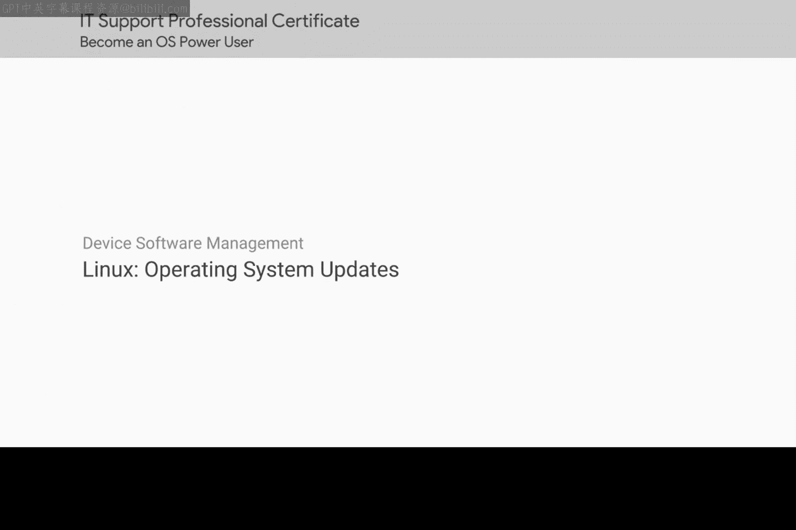
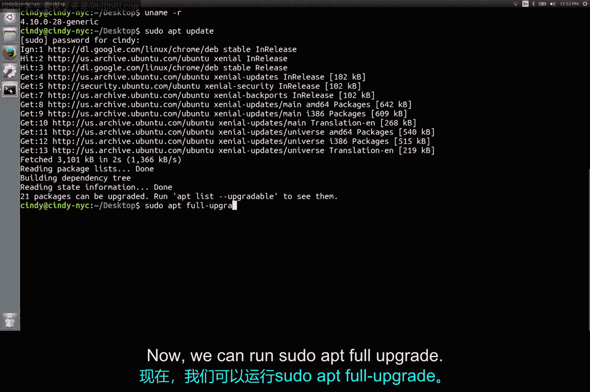

Linux操作系统更新：第2、3课：核心系统与内核升级指南



在本节课中，我们将学习如何在Linux操作系统中更新核心组件，特别是内核。你将了解内核的作用、如何查看当前内核版本，以及执行完整系统升级的步骤。

---

在Linux系统中，你已经学习了如何使用 `apt update` 和 `apt upgrade` 命令来更新和升级机器上的软件。这些命令可能会自动为你安装安全更新，但当你运行 `apt upgrade` 时，它并不会升级核心操作系统。

在Windows中，我们的操作系统包是Windows 10。而在Linux中，核心是**内核**以及其他相关软件包。内核控制着我们操作系统的核心组件。

就像我们的文字处理器一样，内核本身也只是一个软件包。内核开发者会定期在更新中包含安全补丁、新功能以及错误修复。如果你想获得所有这些更新，就应该运行新版本的内核。

首先，我们需要查看当前使用的内核版本。我们将学习一个名为 `uname` 的新命令。

`uname` 命令为我们提供系统信息。如果你使用 `-r` 参数来查看内核发布版本，你将看到当前的内核版本。例如，你可能会看到类似 `4.1` 的版本号。

为了更新内核和其他软件包，我们使用熟悉的 `apt` 命令，并加上 `full-upgrade` 选项。在运行此命令之前，请记得使用 `apt update` 来更新你的软件源列表。

以下是完整的更新流程：



1.  更新软件源列表：
    ```bash
    sudo apt update
    ```
2.  执行完整系统升级（包括内核）：
    ```bash
    sudo apt full-upgrade
    ```

如果有可用的新内核版本，该命令会为我们安装它。安装完成后，你需要重启计算机才能开始使用新内核。

你可以再次使用 `uname -r` 命令来验证系统是否正在使用最新的内核。

关于内核安装和安全更新，我们省略了一些细节，但这是更新你系统的一个良好开端。如果你对学习内核和Linux更新的复杂细节感到好奇，可以查阅补充阅读材料。

---

本节课中，我们一起学习了软件安装和维护的所有要点。你掌握了如何安装独立软件包、使用包管理器、处理归档文件、设备驱动程序以及核心操作系统更新。这些技能对于一名IT支持专家来说将非常有用。

接下来，我们将再次测试你在Bash和Windows环境下的知识。完成后，我们下一个模块再见。