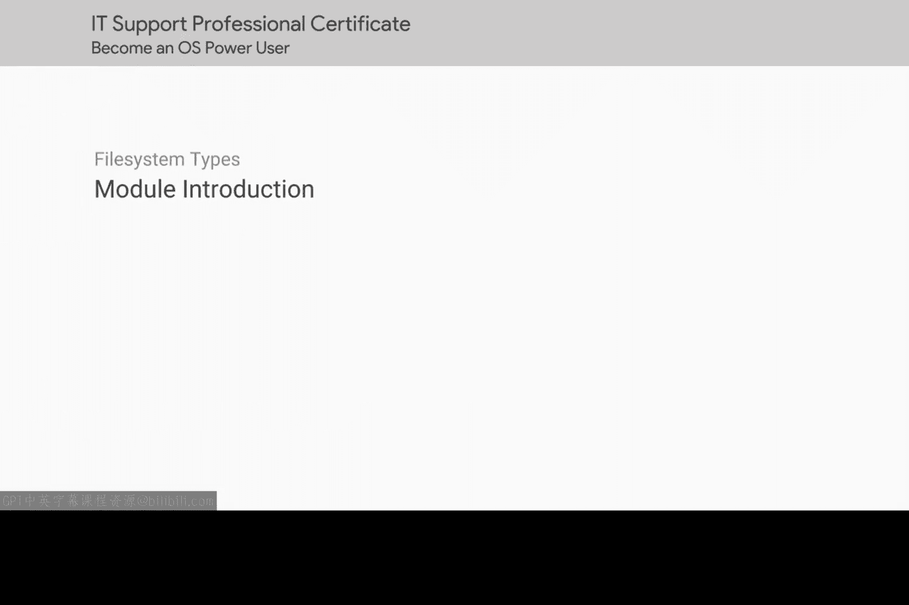

# 158：磁盘管理模块介绍 💾

在本节课中，我们将学习如何使计算机磁盘变得可用。我们将介绍磁盘管理的基本概念和所需工具。

上一节课中，我们学习了如何在Windows和Linux操作系统中安装、卸载和维护软件。这些是IT支持专家需要反复执行的任务。

本节中，我们将探讨IT支持专家的另一个重要功能：处理磁盘。在我们的第一门课程《技术支持基础》中，我们了解了硬盘驱动器（HDD）和固态硬盘（SSD）等物理磁盘。

本节课中，我们将在此基础上展开，讨论使磁盘在计算机中可用所需的工具。

以下是本模块将涵盖的主要内容：

*   磁盘分区的基本概念
*   文件系统的类型与作用
*   在不同操作系统中格式化磁盘的工具
*   磁盘挂载与管理的实践步骤

准备好，让我们开始吧。

本节课中，我们一起学习了磁盘管理模块的概述。我们了解到，在掌握软件管理之后，IT支持专家还需掌握配置和管理物理磁盘的技能，这是确保计算机存储系统正常工作的基础。