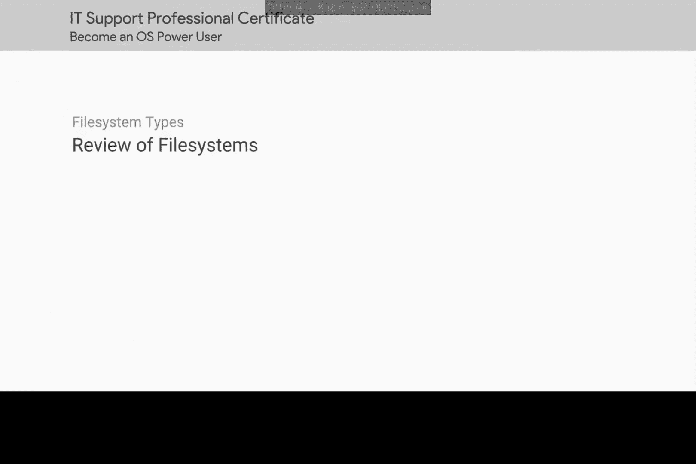
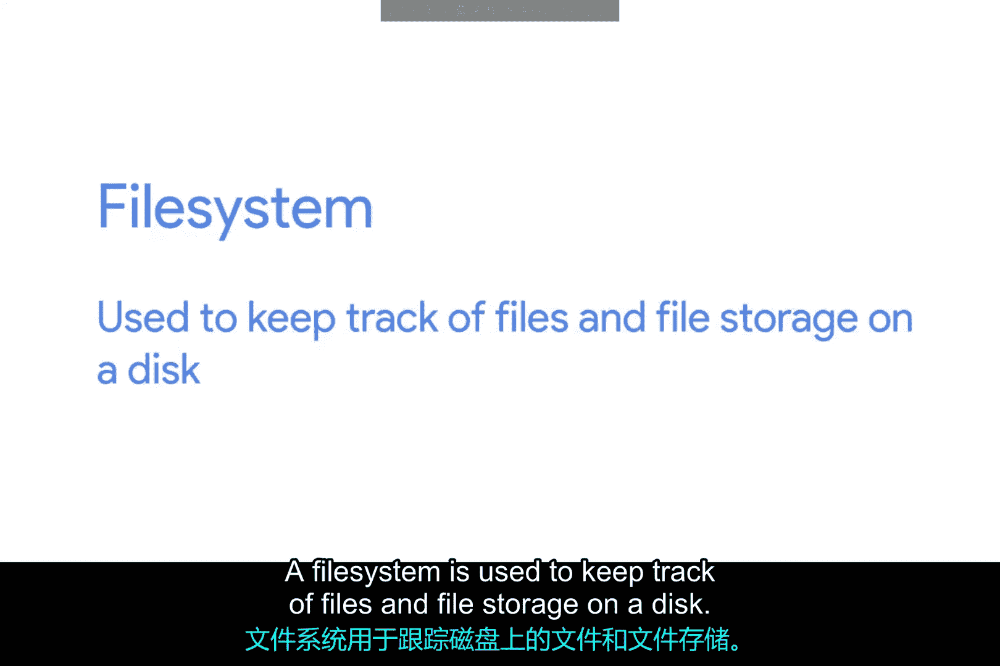
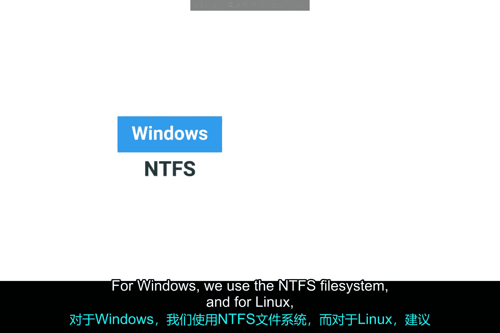
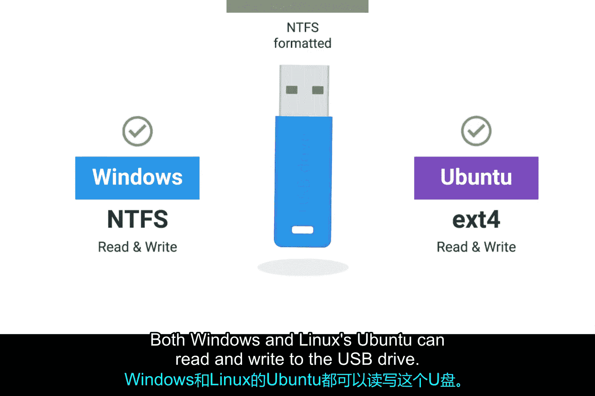
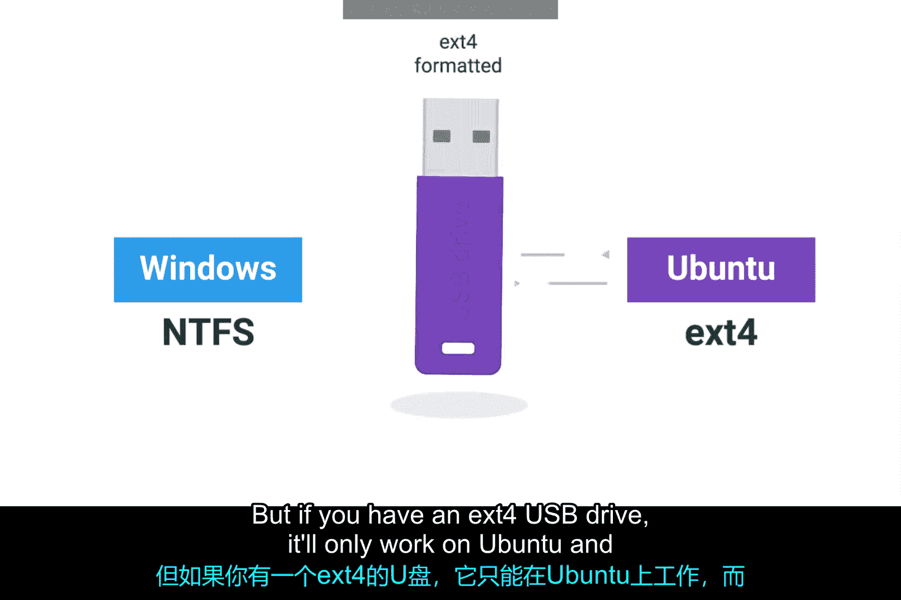
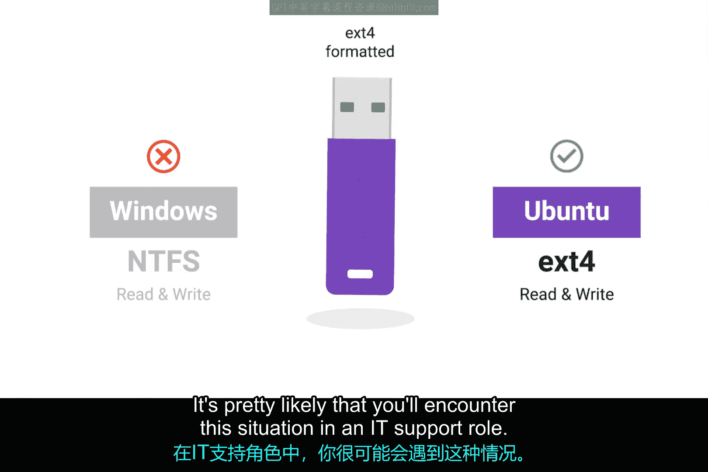
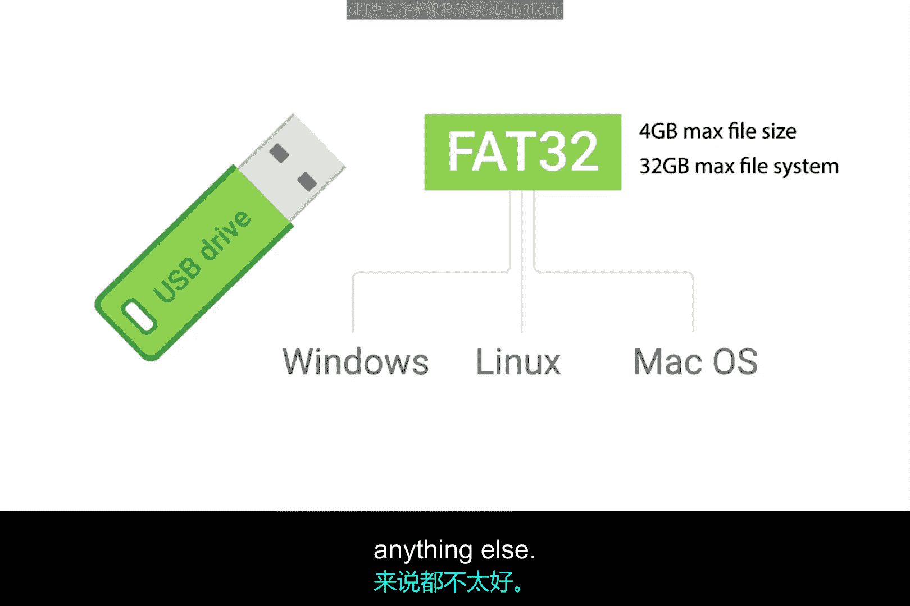

# 159：文件系统回顾 💾

在本节课中，我们将回顾文件系统的核心概念，了解不同操作系统使用的默认文件系统，并探讨跨平台文件共享的解决方案。

## 概述

你可能记得，我们在《技术支持基础》课程中介绍过文件系统的概念。文件系统用于跟踪磁盘上的文件和存储。没有文件系统，操作系统将无法知道如何组织文件。

因此，当你有一个全新的磁盘或任何类型的存储设备（如U盘）时，你需要为其添加一个文件系统。市面上存在许多文件系统，但本课程将讨论被推荐为Windows和Linux默认文件系统的两种。

## 主流操作系统默认文件系统

以下是Windows和Linux操作系统推荐的默认文件系统：

*   **Windows**：我们使用**NTFS**文件系统。
*   **Linux**：推荐使用**EXT4**文件系统。

## 文件系统的兼容性挑战

文件系统与不同操作系统的兼容性各不相同。大多数情况下，跨操作系统的支持非常有限。

例如，假设你有一个使用NTFS文件系统的U盘。Windows和Linux（如Ubuntu）都可以对该U盘进行读写操作。

但是，如果你有一个EXT4格式的U盘，它将只能在Linux系统上工作，而无法在Windows上直接使用（至少在没有第三方工具的帮助下）。

## 跨平台文件共享的解决方案

在IT支持工作中，你很可能会遇到这种情况：假设你想将同一个U盘上的重要文件复制到Windows、Linux和Mac操作系统上。你应该怎么做？

这是一个相当常见的情况。你必须重新格式化或擦除U盘，并添加一个与所有三种操作系统都兼容的文件系统。

幸运的是，存在像**FAT32**这样的文件系统，它支持在所有三种主流操作系统上读写数据。然而，FAT32有一些缺点：它不支持大于4GB的单个文件，并且文件系统的总容量不能超过32GB。

这对于一个小容量的U盘来说可能足够了，但对于其他用途来说并不理想。

你可以在接下来的补充阅读中了解更多关于FAT32的信息。但这仍然引出一个问题：如果你想在多个操作系统之间共享文件，又不想受限于文件系统的种种限制，该怎么办？

别担心，我们有解决方案。在下一门关于系统管理和IT基础设施服务的课程中，我们将讨论另一种称为**网络文件系统**的文件系统类型，它正好解决了这个问题。

## 总结

本节课中，我们一起回顾了文件系统的基础知识，了解了NTFS和EXT4分别是Windows和Linux的默认选择，并认识到不同文件系统在跨平台兼容性上的限制。我们还简要介绍了FAT32作为通用解决方案的优缺点，并预告了更强大的网络文件系统将在后续课程中讲解。接下来，我们将花几节课的时间讨论如何实际设置这些文件系统。