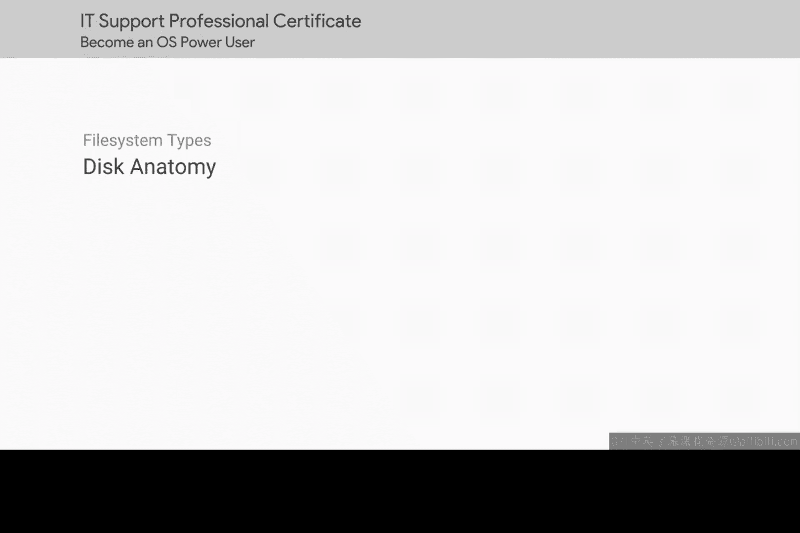
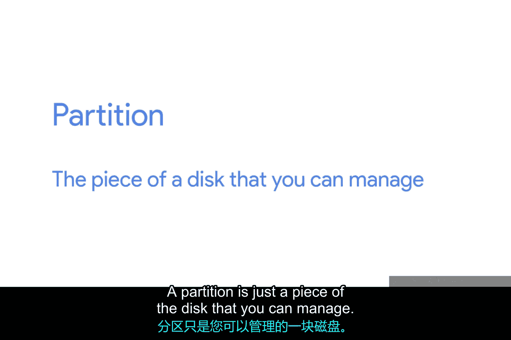
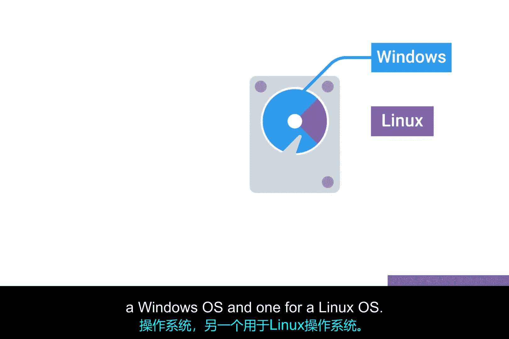
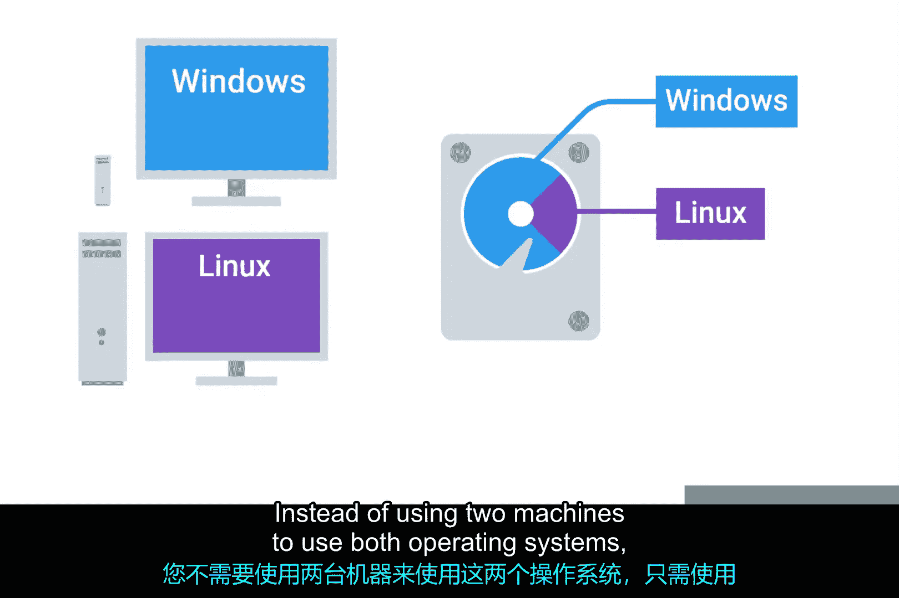
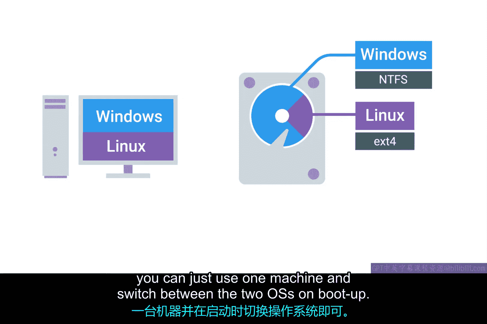
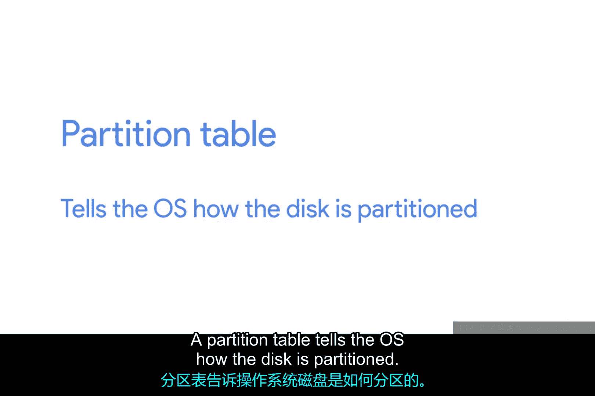
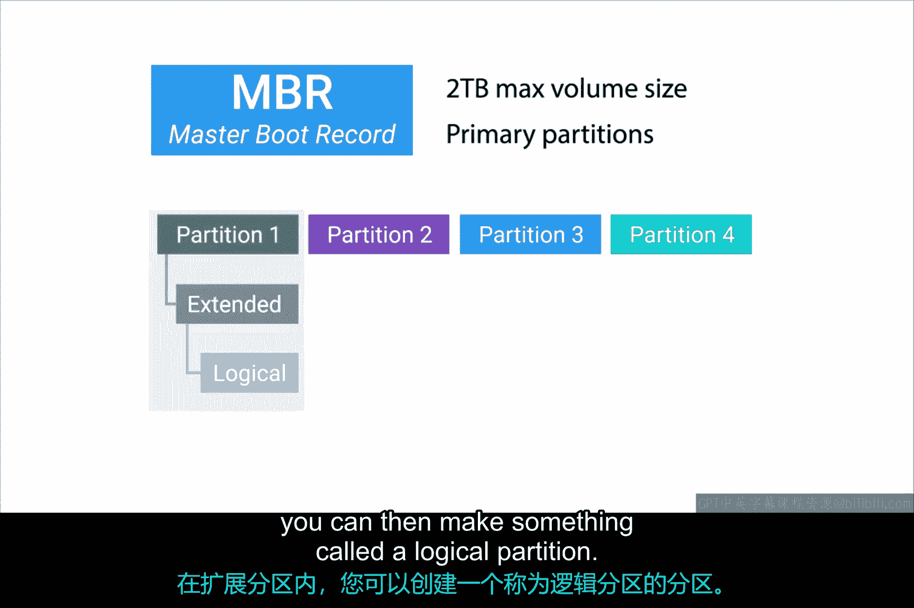
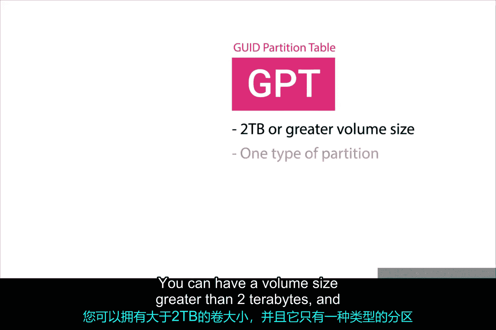
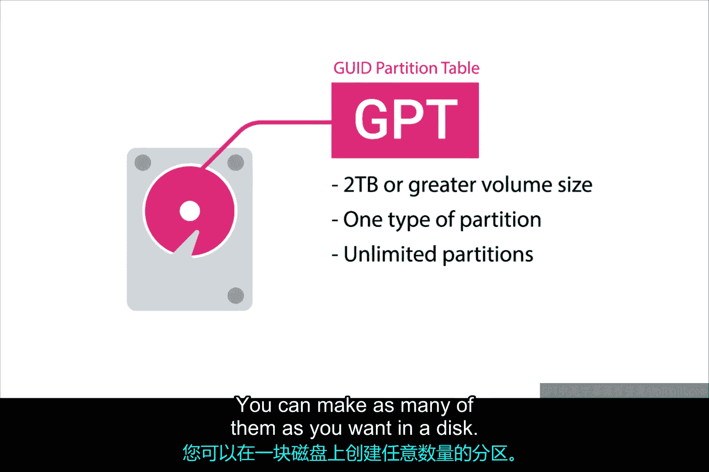

# 160：磁盘结构 💾

在本节课中，我们将学习磁盘的基本结构，了解分区、分区表等核心概念，为后续学习文件系统打下基础。

---

在开始为磁盘添加文件系统之前，我们先来梳理一下磁盘的组成部分，这些部分使你能够存储和检索文件。

一个存储磁盘可以被划分为多个**分区**。分区只是磁盘中你可以管理的一部分。

当你创建多个分区时，会给你一种错觉，仿佛你正在物理上将一块磁盘分割成多个独立的磁盘。要为磁盘添加文件系统，首先需要创建一个分区。通常，我们的操作系统只使用一个分区，但为不同用途设置多个分区也并不少见。

例如，你可能想在一块磁盘上创建两个分区，一个用于安装Windows操作系统，另一个用于安装Linux操作系统。这样，你无需使用两台机器，只需在一台机器上启动时选择不同的操作系统即可。

你还可以在同一块磁盘的不同分区上添加不同的文件系统。

分区本质上充当着各自独立的“子磁盘”，但它们都使用同一块物理磁盘。需要指出的一点是，当你在一个分区上格式化文件系统后，它就变成了一个**卷**。卷和分区有时会被错误地当作同义词使用，但我们希望确保你理解其中的区别。

---

上一节我们介绍了分区和卷的概念，本节中我们来看看磁盘的另一个重要组件：**分区表**。

分区表告诉操作系统磁盘是如何被分区的。这张表会告诉你可以从哪个分区启动、每个分区分配了多少空间等信息。

目前主要使用两种分区表方案：**MBR**（主引导记录）和**GPT**（GUID分区表）。这些方案决定了分区信息的结构方式。

MBR是一种传统的分区表，主要在Windows操作系统中使用。MBR只允许你创建最大2TB的卷。它还使用一种叫做**主分区**的概念。一块磁盘上最多只能有四个主分区。如果你想要更多分区，必须将一个主分区转换为**扩展分区**。

在扩展分区内部，你可以再创建**逻辑分区**。

初次接触可能觉得有点奇怪，但这正是分区表最初被设计成的方式。MBR是一个旧标准，正逐渐被我们接下来要讨论的分区表方案所取代。

GPT正成为磁盘的新标准。使用GPT，你可以创建大于2TB的卷，并且它只有一种分区类型。你可以在一个磁盘上创建任意数量的GPT分区。

在之前的课程中，我们学习了一个新的BIOS标准叫做**UEFI**，它已成为新系统的默认BIOS。要使用UEFI启动，你的磁盘必须使用GPT分区表。

---

现在你已经了解了创建分区需要做什么，接下来我们将在实际的磁盘上进行分区操作。

在接下来的几节课中，我们将学习如何为各自的操作系统分区和格式化一个USB驱动器。

---

**总结**

本节课中我们一起学习了磁盘的核心结构。我们了解了**分区**是磁盘的逻辑划分，格式化后成为**卷**。我们还探讨了两种主要的分区表方案：传统的**MBR**（限制较多）和现代的**GPT**（功能更强大，支持UEFI启动）。理解这些基础知识是管理存储设备和安装操作系统的关键。