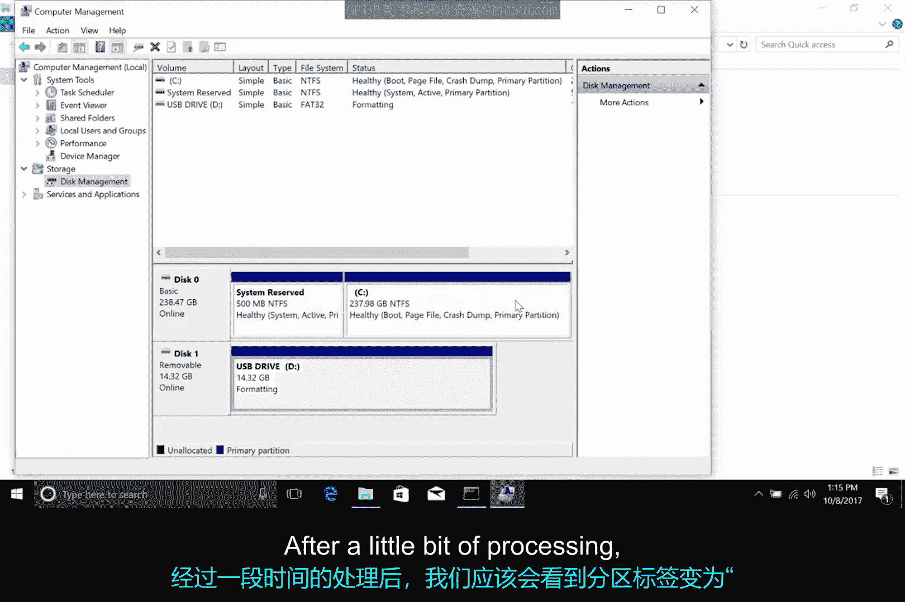
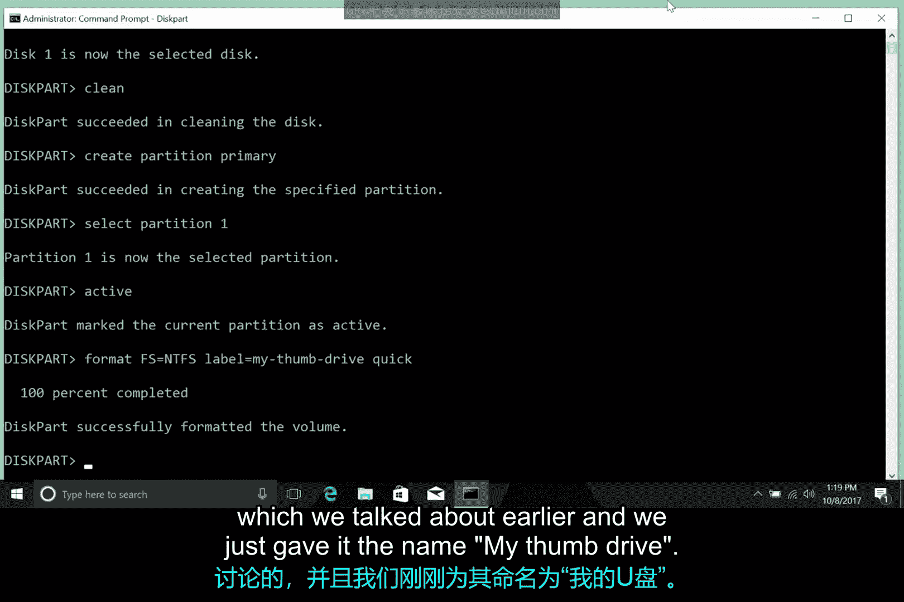

# 161：Windows磁盘分区与文件系统格式化 💾

在本节课中，我们将学习如何在Windows操作系统中对磁盘进行分区，以及如何格式化文件系统。我们将介绍两种主要方法：使用图形用户界面（GUI）的磁盘管理工具，以及使用命令行的`diskpart`工具。

上一节我们介绍了磁盘分区和文件系统的基本理论，本节中我们来看看如何在Windows中实际操作。

## 使用磁盘管理工具（GUI）

Windows自带一个名为“磁盘管理”的强大原生工具，无需借助第三方软件即可完成分区和格式化工作。

有多种方法可以打开磁盘管理工具。我们将通过右键点击“此电脑”，选择“管理”选项，然后在“存储”分组下点击“磁盘管理”控制台来启动它。

在磁盘管理控制台中，我们可以看到所有磁盘和分区的显示，以及它们所格式化的文件系统类型信息。

以下是磁盘管理控制台显示的一些关键信息：
*   磁盘和分区的总容量与可用容量。
*   分区使用的文件系统类型（如NTFS、FAT32）。
*   分区的状态（如“健康”）。

磁盘管理控制台的一个关键特性是，你可以从这里直接修改计算机上的磁盘和分区。

为了演示分区和格式化的功能，我们最好避免操作安装有Windows操作系统的分区。因此，我们使用一个USB闪存驱动器来代替。

将USB驱动器插入电脑后，即插即用服务会自动为其安装驱动程序，你应该能在磁盘管理中看到它作为一个额外的磁盘出现。

目前，这个USB驱动器使用的是FAT32文件系统。我们现在将其重新格式化为NTFS文件系统。

以下是格式化USB驱动器的步骤：
1.  右键点击USB驱动器对应的分区，选择“格式化”。
2.  在弹出的窗口中，可以设置卷标（即磁盘名称）。我们保留“USB驱动器”。
3.  指定文件系统，将其更改为**NTFS**。
4.  设置“分配单元大小”。这个选项决定了格式化分区时使用的块大小。换句话说，这是分区将被划分成的“块”的尺寸。如果你存储大量小文件，较小的块大小能减少空间浪费；如果你存储大文件，较大的块大小意味着读取更少的块来组装文件。我们选择默认值，这在大多数情况下是合适的。
5.  选择是否执行“快速格式化”。完整格式化与快速格式化的区别在于，完整格式化时，Windows会额外扫描磁盘（本例中是USB驱动器）以查找错误或坏扇区。这会使格式化过程耗时更长。我们选择“快速格式化”。
6.  决定是否“启用文件和文件夹压缩”。启用压缩可以减少文件和文件夹占用的磁盘空间，但打开压缩文件时需要进行解压，这会增加处理器的额外工作。我们暂不启用此功能。
7.  点击“确定”开始格式化。Windows会警告格式化将擦除磁盘上的所有数据，确认后，格式化过程开始。

经过短暂的处理，分区标签会变为“状态良好”，表示格式化已完成。

## 使用命令行工具（Diskpart）

使用图形界面非常直观，但也可以通过命令行完成相同的任务。这在需要自动化磁盘分区时非常有用。

要从命令行操作磁盘，我们需要使用一个名为`diskpart`的工具。`diskpart`是一个基于终端的工具，专为从命令行管理磁盘而设计。

让我们再次格式化我们的U盘，但这次使用`diskpart`而不是图形界面。

以下是使用`diskpart`格式化U盘的步骤：
1.  插入U盘。
2.  打开命令提示符（例如，运行`cmd`），输入命令`diskpart`并按回车。这将打开一个新的`diskpart`终端窗口。
3.  输入命令`list disk`来列出系统上的当前磁盘。
4.  根据磁盘大小（U盘通常小得多）识别出要格式化的磁盘（例如`Disk 1`）。
5.  输入命令`select disk 1`来选择该磁盘。
6.  输入命令`clean`来清除磁盘。此命令将移除磁盘上所有分区和卷的格式。
7.  输入命令`create partition primary`来创建一个主分区。
8.  输入命令`select partition 1`来选择我们刚创建的分区。
9.  输入命令`active`将其标记为活动分区。
10. 输入命令`format fs=ntfs label="My Thumb Drive" quick`来格式化磁盘。这条命令的含义是：`format`（格式化），`fs=ntfs`（文件系统为NTFS），`label="My Thumb Drive"`（卷标为“My Thumb Drive”），`quick`（快速格式化模式）。

恭喜！你已成功通过命令行格式化了USB驱动器。如果你想了解更多关于`diskpart`的选项和功能，可以查看本视频后附带的补充阅读材料中的链接。

## 总结

本节课中我们一起学习了在Windows操作系统中格式化磁盘的两种方法。我们首先使用图形界面的磁盘管理工具，通过一系列直观的步骤完成了对USB驱动器的NTFS格式化。接着，我们探索了命令行的`diskpart`工具，通过输入一系列命令，同样实现了磁盘的清除、分区创建和NTFS格式化。这两种方法各有优势，图形界面适合手动操作，而命令行则便于自动化和批量处理。