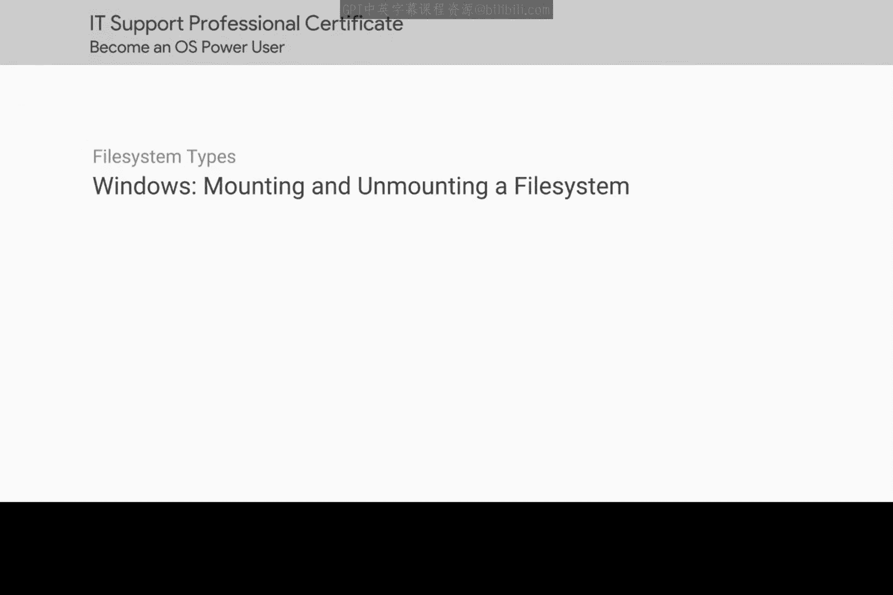
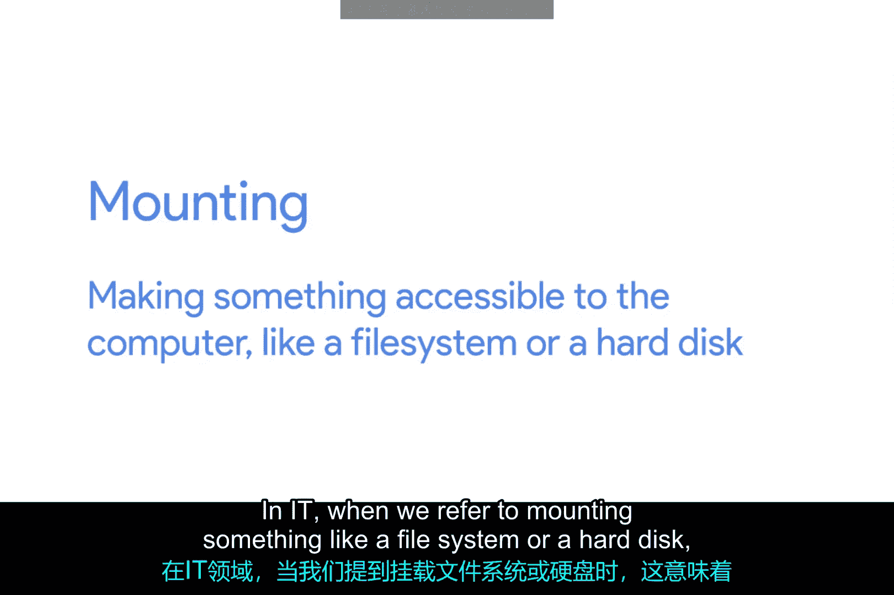

# 162：Windows挂载与卸载文件系统

在本节课中，我们将要学习文件系统在Windows操作系统中的挂载与卸载过程。理解这一概念对于管理存储设备和确保数据安全至关重要。

## 概述

上一节我们介绍了如何格式化一个新的文件系统。格式化完成后，还需要执行一个关键步骤：将文件系统挂载到计算机的一个驱动器上。

## 什么是挂载？

当我们提到挂载一个文件系统或硬盘时，指的是让计算机能够访问该设备。在本例中，我们希望USB驱动器变得可访问，因此需要将其文件系统挂载到一个驱动器上。

## Windows中的自动挂载

Windows操作系统通常会为我们自动完成挂载过程。如果你曾插入过USB驱动器，可能已经注意到它会自动出现在驱动器列表中，之后便可以立即开始使用它。

## 安全卸载（卸载）驱动器

当你使用完驱动器后，需要安全地弹出它。这本质上就是卸载驱动器的过程。

以下是安全卸载驱动器的步骤：
1.  在文件资源管理器或桌面上找到代表该驱动器的图标。
2.  右键点击该驱动器图标。
3.  从弹出的上下文菜单中选择“弹出”选项。

## 安全卸载的重要性

我们将在后续课程中详细讨论为什么安全卸载（即正确卸载）是一个非常重要的操作。这主要关系到防止数据损坏和确保设备可以安全地从计算机上移除。

## 总结

本节课中我们一起学习了Windows系统中文件系统的挂载与卸载。我们了解到，挂载是使存储设备可访问的过程，而卸载则是安全断开连接的必要步骤。Windows通常能自动处理挂载，但用户需要手动执行安全卸载以保护数据。