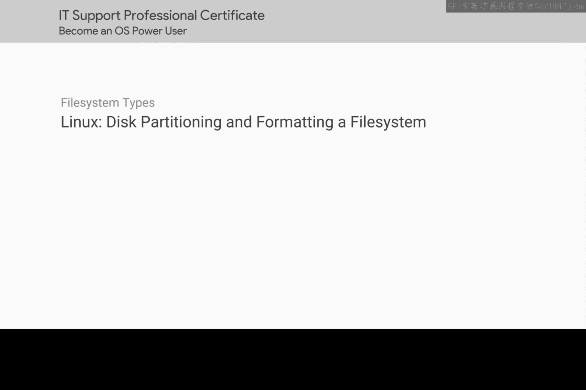
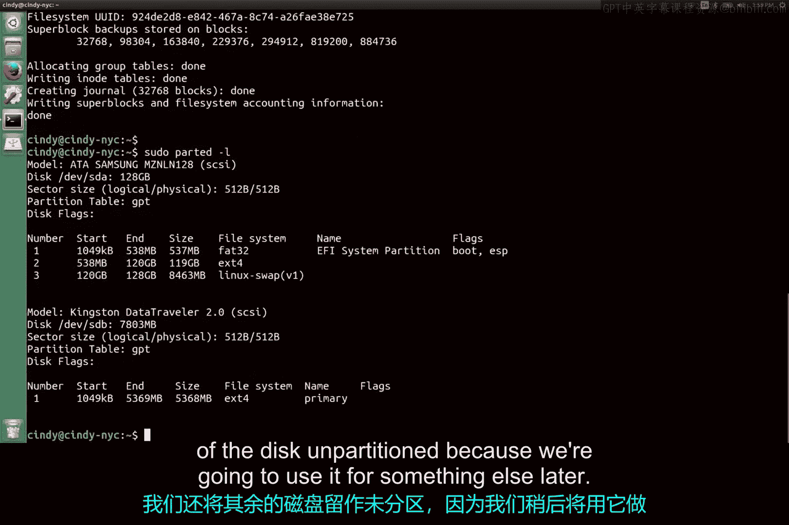

# 163：磁盘分区与文件系统格式化




在本节课中，我们将学习如何在Linux系统中使用命令行工具对磁盘进行分区，并为分区创建文件系统。我们将重点介绍`parted`工具的使用方法，涵盖交互模式和命令行模式，并演示从查看磁盘到完成格式化的完整流程。

## 查看已连接的磁盘

在开始分区之前，我们需要先了解系统中有哪些磁盘。我们可以使用`parted`的命令行模式来列出所有磁盘。

以下是查看磁盘列表的命令：
```bash
sudo parted -l
```
运行此命令后，系统会列出所有已连接的磁盘及其信息。例如，你可能会看到类似`/dev/sda`（128GB）和`/dev/sdb`（8GB USB驱动器）的磁盘。输出信息包括分区表类型（如GPT）、分区数量、每个分区的起始位置、大小、文件系统类型、名称和标志。

## 进入交互模式并选择磁盘

上一节我们查看了磁盘信息，本节中我们来看看如何对特定磁盘进行操作。我们将使用`parted`的交互模式，这能让我们在一个独立的环境中执行一系列分区命令。

要进入交互模式并操作特定磁盘（例如USB驱动器`/dev/sdb`），请运行：
```bash
sudo parted /dev/sdb
```
此时，你将进入`parted`工具的命令提示符。在此模式下，你可以运行各种分区命令。若要退出并返回Shell，只需输入`quit`命令。

## 创建磁盘标签（分区表）

进入交互模式后，我们首先需要为磁盘创建一个分区表（也称为磁盘标签）。这对于新磁盘或需要重新分区的磁盘是必要步骤。

如果运行`print`命令后显示“unrecognized disk label”，则说明磁盘没有有效的分区表。我们需要使用`mklabel`命令来创建一个。由于我们希望使用更现代的GPT分区表，我们将执行以下命令：
```bash
mklabel gpt
```
创建完成后，再次运行`print`命令，确认磁盘信息中已显示“Partition Table: gpt”。

## 创建磁盘分区

现在我们已经准备好了分区表，接下来可以开始创建分区了。我们将把`/dev/sdb`磁盘分成两个分区，并先创建第一个分区。

在`parted`交互模式中，使用`mkpart`命令来创建分区。该命令需要指定分区类型、文件系统（此处的文件系统参数仅作提示，实际格式化在后续步骤完成）、起始点和结束点。

以下是创建第一个分区的命令示例：
```bash
mkpart primary ext4 1MiB 5GiB
```
**参数解释**：
*   `primary`：分区类型。对于GPT分区表，此参数意义不大，通常使用`primary`即可。
*   `ext4`：计划在该分区上使用的文件系统类型。
*   `1MiB`：分区的起始位置。我们从1 MiB开始，为磁盘头部留出空间。
*   `5GiB`：分区的结束位置。这将创建一个大约5 GiB大小的分区。

**关于容量单位的说明**：在存储领域，我们使用精确的二进制单位以避免空间浪费。1 MiB (Mebibyte) = 1024 KiB， 1 GiB (Gibibyte) = 1024 MiB。这与十进制单位的MB和GB（1 MB = 1000 KB）不同。

## 格式化分区为文件系统

分区创建完成后，它只是一个空的容器。要能存储文件，我们需要在分区上创建一个文件系统，这个过程称为格式化。

首先，输入`quit`命令退出`parted`交互模式，返回Shell。然后，使用`mkfs`（make filesystem）命令来格式化我们刚刚创建的分区（`/dev/sdb1`）。

以下是格式化为ext4文件系统的命令：
```bash
sudo mkfs -t ext4 /dev/sdb1
```
此命令将在`/dev/sdb1`分区上建立ext4文件系统的结构。至此，我们已经成功创建了一个分区并为其格式化了文件系统。磁盘的剩余空间我们暂时保留，以备后续使用。



## 重要安全提醒与后续步骤

记住，使用`parted`这类磁盘工具时必须格外小心。它功能强大，但如果操作了错误的磁盘，可能会导致严重的数据丢失。


尽管我们已经完成了分区和文件系统格式化，但目前还不能直接向这个磁盘读写文件。在Linux中，要使用一个磁盘，还有最后关键一步：**挂载（Mount）**。我们需要将文件系统关联（挂载）到目录树中的一个目录上，才能通过Shell访问其中的内容。

你将在下一个视频中学习如何挂载文件系统。

## 课程总结

本节课中我们一起学习了Linux下磁盘管理的核心操作。我们使用`parted`工具查看了磁盘信息，进入了交互模式，为磁盘创建了GPT分区表，并使用`mkpart`命令划分了分区。随后，我们退出交互模式，使用`mkfs`命令为分区格式化了ext4文件系统。最后，我们强调了操作磁盘的安全重要性，并指出了下一步需要学习的挂载操作。