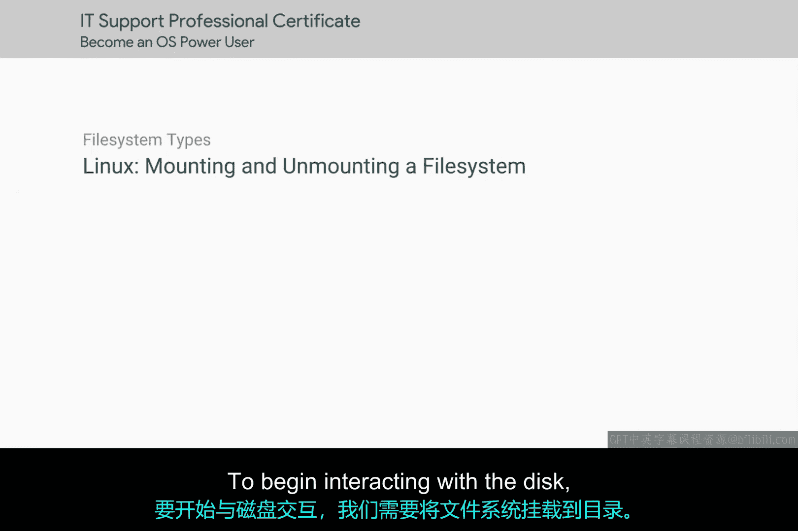
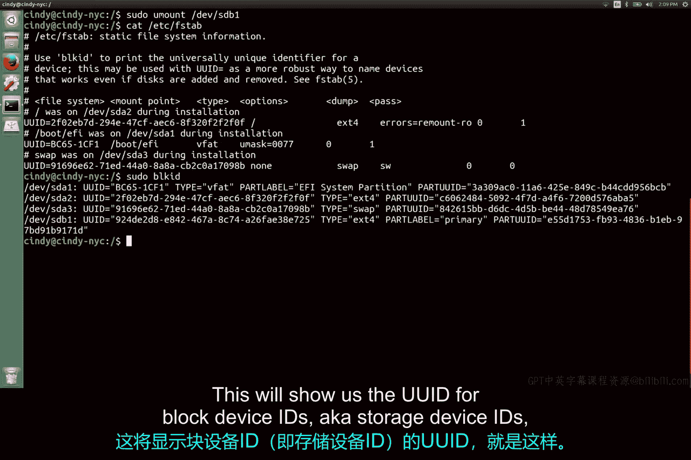

# 164：挂载与卸载文件系统 🖥️💾

在本节课中，我们将要学习如何与磁盘设备进行交互，核心是理解并实践文件系统的**挂载**与**卸载**操作。这是管理存储设备（如USB驱动器）的基础技能。

## 概述

为了开始与磁盘交互，我们需要将文件系统**挂载**到一个目录上。

你可能会想，为什么我们不能直接进入 `/dev/sdb` 这个磁盘设备呢？它确实是磁盘设备。但如果我们尝试像这样进入 `/dev/sdb`，我们会得到一个错误，提示该设备不是一个目录，这是正确的。

为了解决这个问题，我们需要在计算机上创建一个目录，然后将USB驱动器的文件系统挂载到这个目录上。

## 挂载文件系统

以下是挂载文件系统的步骤：

1.  **确定分区位置**：首先，我们需要找到要访问的分区。可以使用命令 `sudo parted -l` 来查看。假设我们找到的目标分区是 `/dev/sdb1`。
2.  **创建挂载点**：创建一个目录作为挂载点。例如，我们可以在根目录下创建一个名为 `MyUSB` 的目录。
3.  **执行挂载**：使用 `mount` 命令将分区挂载到目录。命令格式为：`sudo mount /dev/sdb1 /MyUSB`。

现在，如果我们进入 `/MyUSB` 目录，就可以开始读写新文件系统上的文件了。

实际上，我们并不总是需要显式地使用 `mount` 命令。大多数操作系统在插入像USB驱动器这样的设备时，会自动为我们完成挂载。但无论如何，文件系统都必须以某种方式挂载，因为我们需要告诉操作系统如何与设备交互。

## 卸载文件系统

我们可以用类似的方式，使用 `umount` 命令来**卸载**文件系统。卸载是挂载磁盘的逆操作。

现在让我们卸载文件系统。我可以使用以下任一命令：
*   `sudo umount /MyUSB`
*   `sudo umount /dev/sdb1`

两者都可以成功卸载文件系统。

当你关闭计算机时，手动挂载的磁盘会自动被卸载。但在某些情况下，比如我们正在使用USB驱动器，我们可能希望在不关闭电脑的情况下仅卸载USB驱动器的文件系统。

**务必在物理断开驱动器之前，先卸载其文件系统。** 对于USB驱动器，如果不这样做，可能会遇到一些有趣的文件系统错误。我们将在后续课程中详细讨论这一点。

另外请注意，当我们使用 `mount` 命令将文件系统挂载到一个目录时，一旦我们关闭计算机，这个挂载点就会消失。

## 永久挂载磁盘

不过，如果我们需要磁盘在计算机启动时自动加载，可以永久挂载一个磁盘。为此，我们需要修改一个名为 `/etc/fstab` 的文件。

如果我们现在打开这个文件，会看到一个列表，包含唯一设备ID、它们的挂载点、文件系统类型以及更多信息。如果我们想在计算机启动时自动挂载文件系统，只需添加一个与这里所列类似的条目。

让我们快速操作一下。我们需要为 `/etc/fstab` 添加的第一个字段是USB驱动器的 **UUID**（通用唯一标识符）。要获取我们设备的UUID，可以使用这个命令：`sudo blkid`。这将显示块设备ID（即存储设备ID）的UUID。

## 总结

本节课中我们一起学习了磁盘管理的核心操作。到目前为止，我们已经实践了**分区磁盘**、**添加文件系统**以及**挂载它以供使用**。如果你好奇并想了解更多关于 `/etc/fstab` 文件及其选项的信息，可以查看下一篇补充阅读材料。否则，让我们继续前进。