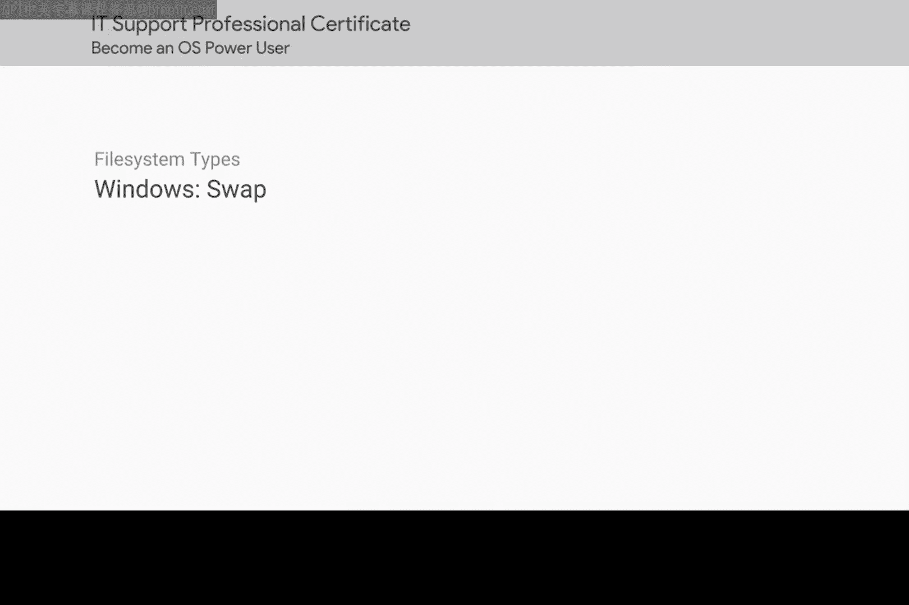
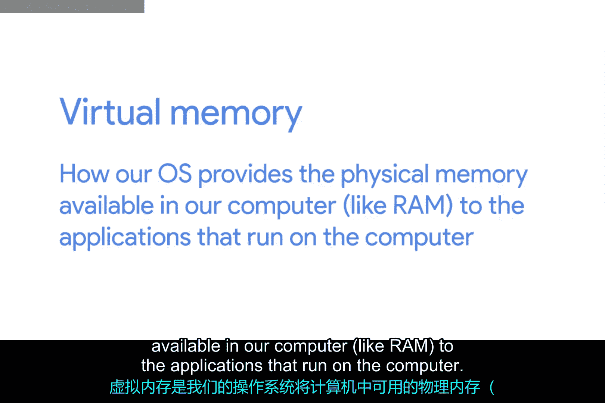
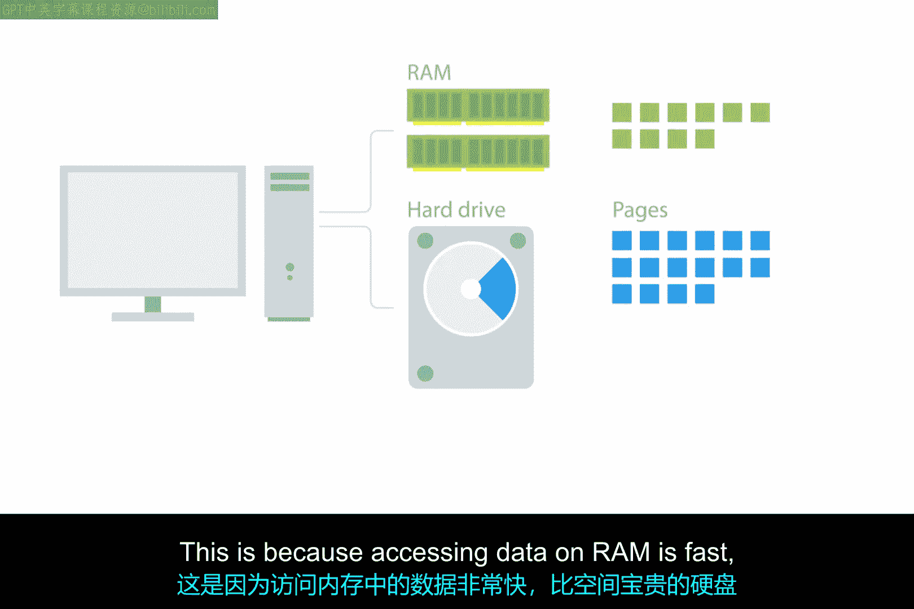
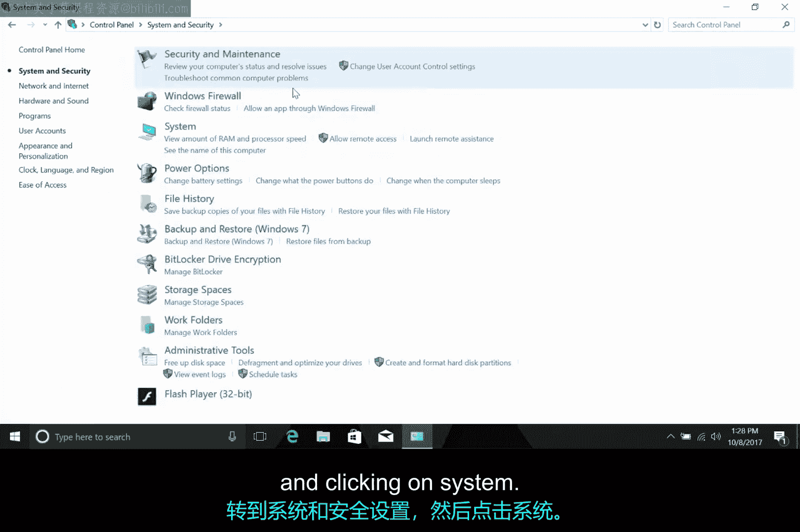
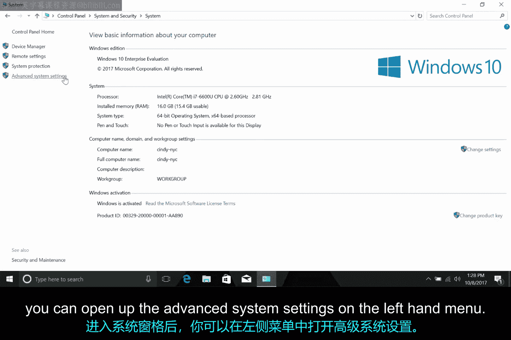
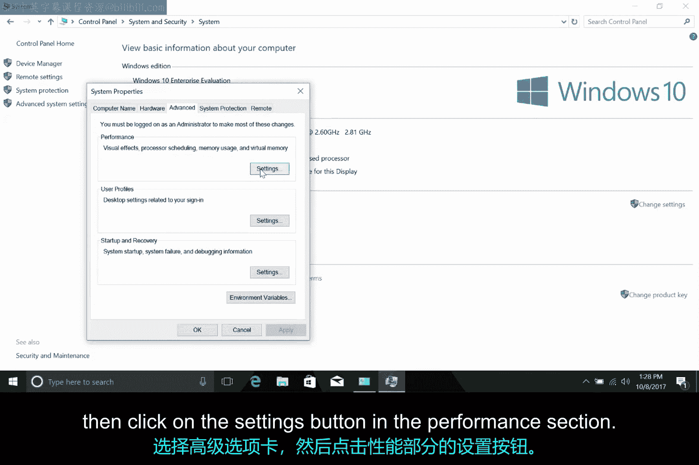
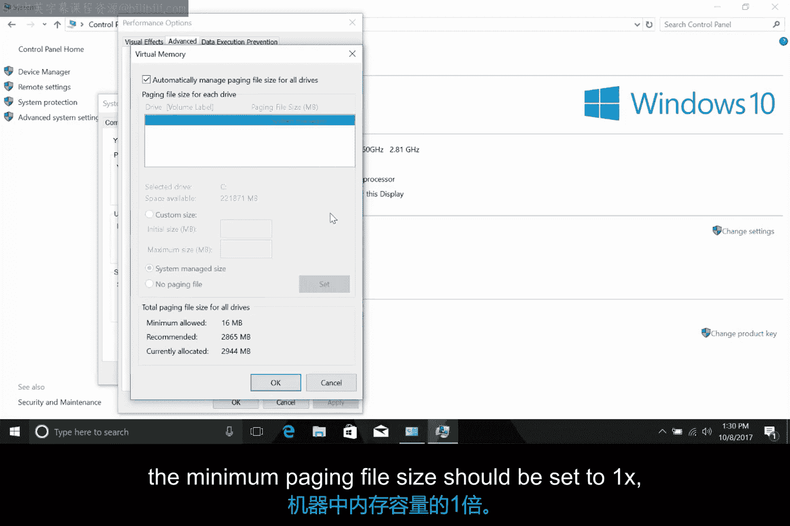

# 165：Windows交换分区 🖥️

在本节课中，我们将要学习一个与磁盘和分区相关的术语——交换空间。我们将从虚拟内存的概念入手，解释操作系统如何管理内存资源，并详细介绍Windows系统中交换空间（即页面文件）的工作原理与配置方法。

## 虚拟内存与交换空间概念

上一节我们提到了交换空间这个术语。在深入探讨之前，让我们先了解虚拟内存的概念。

虚拟内存是操作系统向计算机上运行的应用程序提供物理内存（如RAM）的一种方式。它通过创建虚拟地址到物理地址的映射来实现这一点。

**虚拟地址映射公式**：`虚拟地址 -> 物理地址`

这种方式简化了程序访问内存的过程。程序无需担心其他程序可能正在使用哪些内存部分，也无需跟踪其使用的数据在RAM中的具体位置。

更重要的是，虚拟内存使计算机能够使用比实际安装的物理内存更多的内存。为实现这一点，操作系统会在硬盘上划出一块专用区域，作为数据块（称为“页面”）的存储基地。

## 页面交换机制

上一节我们介绍了虚拟内存如何扩展可用内存。本节中我们来看看数据是如何在内存和硬盘间移动的。

当某个数据页面未被应用程序使用时，它会被“逐出”。这意味着它会被从内存复制到硬盘上。这是因为访问RAM中的数据速度很快，远比访问硬盘快，而RAM空间是宝贵的。

因此，操作系统希望将最常访问的数据页面保留在RAM中，而将一段时间未使用的数据放到磁盘上。这样，即使程序需要一个不常访问的页面，操作系统仍然可以获取它，但必须从相对较慢的硬盘中读取并放回内存。

几乎所有操作系统都使用某种虚拟内存管理方案和分页机制。

## Windows中的内存管理

了解了通用原理后，我们来看看它在Windows系统中是如何具体实现的。

Windows操作系统使用一个名为“内存管理器”的程序来处理虚拟内存。它的职责是为我们的程序管理虚拟到物理内存的映射，并管理分页。

在Windows中，保存到磁盘的页面存储在一个特殊的隐藏文件中，该文件位于卷的根分区，名为 **`pagefile.sys`**。

Windows会自动创建页面文件，并使用内存管理器根据需要复制内存页面以供读取。操作系统在自动管理页面文件方面做得相当出色。

## 配置Windows页面文件

尽管系统能自动管理，但Windows仍然提供了修改页面文件大小、数量和位置的方法。这通过一个名为“系统属性”的控制面板小程序完成。

以下是访问和修改虚拟内存设置的具体步骤：

1.  打开控制面板。
2.  进入“系统和安全”设置。
3.  点击“系统”。

进入系统面板后，您可以在左侧菜单中打开“高级系统设置”。

在“高级”选项卡中，点击“性能”部分的“设置”按钮。

再次点击“高级”选项卡，您应该会看到一个名为“虚拟内存”的部分，这里会显示页面文件的大小。点击“更改”按钮，您可以覆盖Windows提供的默认设置，从而设置页面文件的大小，并将页面文件添加到计算机的其他驱动器上。

## 页面文件大小设置指南

在修改设置前，了解一些通用准则是很重要的。微软提供了一些设置页面文件大小的指南可供遵循。

例如，在64位Windows 7上，最小页面文件大小应设置为机器RAM容量的1倍。

**示例公式**：`最小页面文件大小 = 1 × RAM容量`

除非有特定原因需要更改，否则通常最好让Windows自动管理页面文件大小本身。

---

本节课中我们一起学习了虚拟内存和交换空间的核心概念。我们了解到，虚拟内存通过硬盘上的页面文件扩展了可用内存，而Windows系统通过内存管理器自动处理这一过程。虽然可以手动配置页面文件，但对于大多数用户而言，依赖系统的自动管理是最佳选择。理解这一机制有助于我们更好地认识计算机如何高效地利用有限的内存资源。