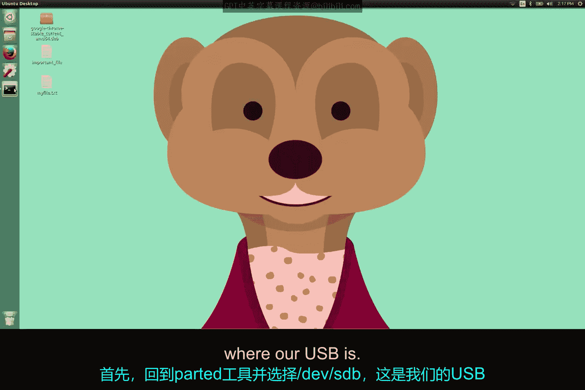
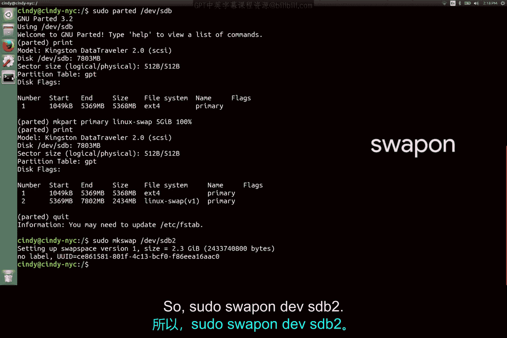

# 166：Linux交换分区管理 🐧

在本节课中，我们将要学习Linux系统中一个重要的概念——虚拟内存，具体来说，是用于虚拟内存的硬盘专用区域，即交换空间。我们将了解其作用，并掌握如何创建、格式化并启用一个交换分区。

## 交换空间概述

在Linux中，用于虚拟内存的硬盘专用区域被称为交换空间。

上一节我们介绍了磁盘分区工具，本节中我们来看看如何利用这些工具来创建交换空间。

## 创建交换分区

我们可以使用之前学习的新磁盘分区工具来创建交换空间。

一个用于确定需要多少交换空间的实用指南是遵循下一篇补充阅读材料中推荐的划分方案。

在我们的案例中，由于我们只有一个USB驱动器，它本身不需要交换空间，我们将仅把剩余空间划分为交换分区，以便向你演示这个过程是如何工作的。在实际操作中，你会为你的主要存储设备（如硬盘和SSD）创建交换分区。

好的，让我们首先创建交换空间。回到 `parted` 工具，并选择我们的USB驱动器所在的位置 `/dev/sdb`。

我们将再次对它进行分区，这次是为了创建一个交换分区，然后在其上格式化Linux交换文件系统。

以下是创建分区的命令步骤：
*   `mklabel gpt` （如果磁盘未初始化）
*   `mkpart primary linux-swap 5GiB 100%`

你会注意到驱动器的终点显示为100%，这表示我们应该使用驱动器上所有剩余的空闲空间。

## 格式化与启用交换空间

我们还没有完成。交换空间本身并不是一个文件系统，所以仅靠分区命令是不够的。我知道，很抱歉，我大约五秒钟前对你说了谎。如果你仔细想想，这很有道理，因为进入交换空间的是内存页，而不是文件数据。

无论如何，要完成这个过程，我们需要使用 `mkswap` 命令来指定将其制作为交换空间。

让我们退出 `parted`，并在我们新的交换分区上运行这个命令。

以下是格式化与启用交换空间的完整命令流程：
1.  `sudo mkswap /dev/sdb2`
2.  `sudo swapon /dev/sdb2`

## 配置开机自动挂载

如果我们希望每次计算机启动时自动挂载交换空间，只需像之前操作一样，在 `/etc/fstab` 文件中添加一个交换条目。

本节课中我们一起学习了Linux交换空间的概念及其管理。我们了解了交换空间是用于虚拟内存的硬盘区域，并实践了使用 `parted` 工具创建交换分区、用 `mkswap` 命令进行格式化、用 `swapon` 命令启用它，最后还知道了如何通过修改 `/etc/fstab` 文件实现开机自动挂载。掌握这些步骤对于有效管理系统内存和存储资源至关重要。