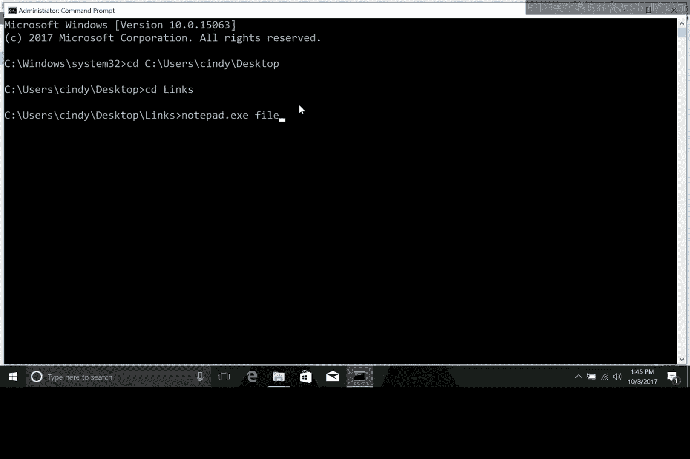
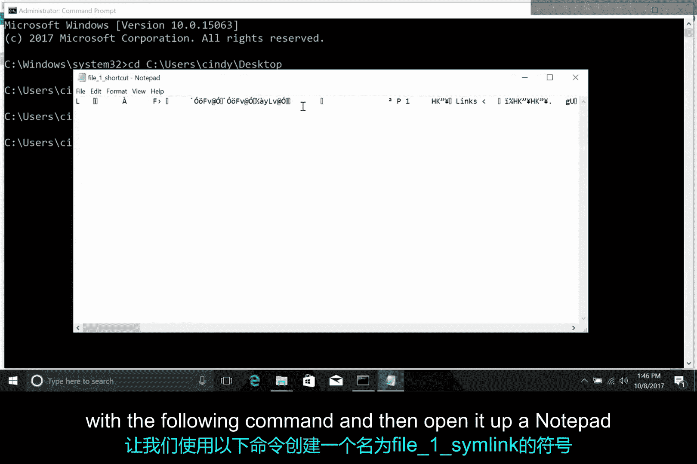
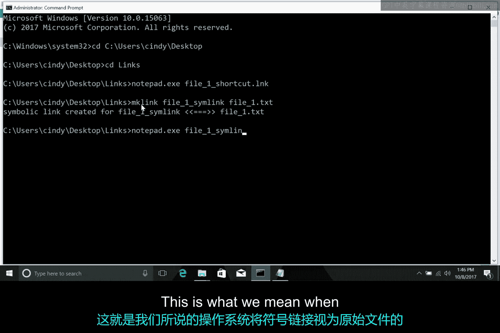
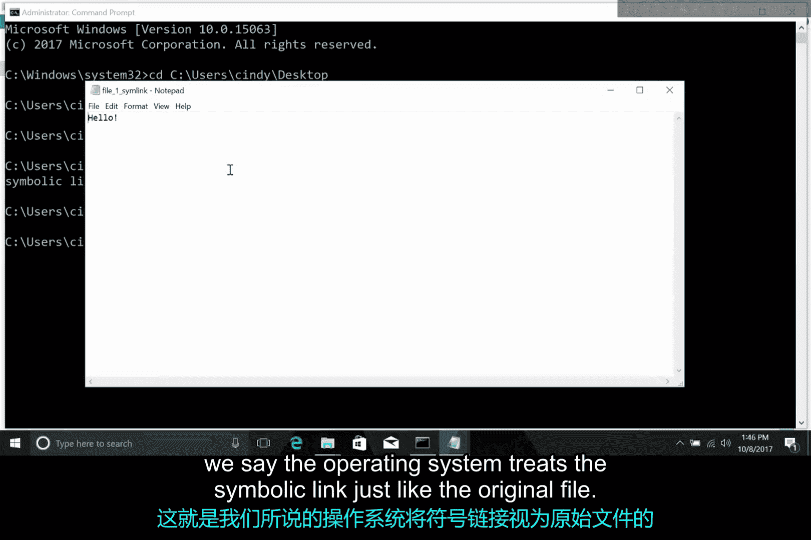
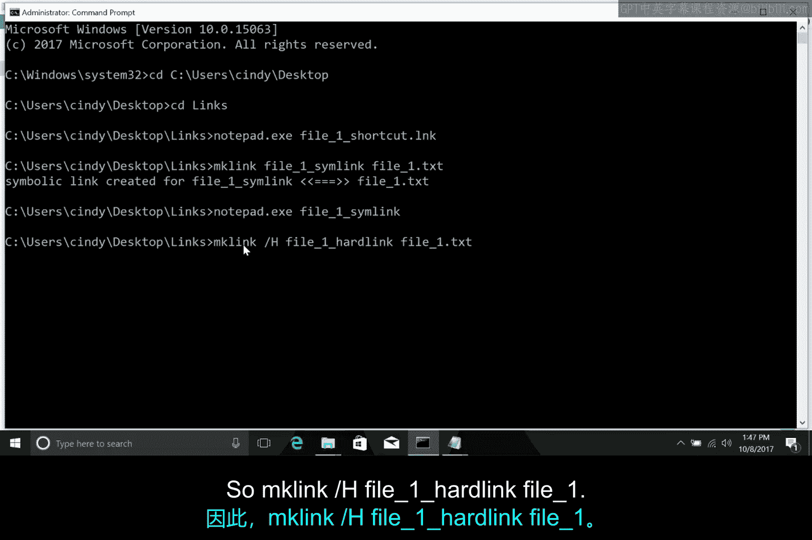

# 167：Windows文件系统详解

在本节课中，我们将要学习Windows操作系统如何处理文件。我们将深入探讨文件数据、文件元数据，以及NTFS文件系统如何通过主文件表来组织和管理这些信息。此外，我们还将比较快捷方式、符号链接和硬链接的区别与用途。

## 概述

上一节我们介绍了磁盘分区和文件系统创建等实际操作。本节中，我们将探讨一些核心概念。我们曾讨论过操作系统如何管理文件，它实际上管理着文件数据、文件元数据和文件系统。我们已经覆盖了文件系统部分。在本视频中，我们将重点讲解文件数据和文件元数据。

## 文件数据与元数据

当我们谈论数据时，指的是文件的实际内容，例如保存到硬盘的文本文档。文件元数据则包含其他所有信息，例如文件所有者、权限、文件大小、在硬盘上的位置等。请记住，NTFS文件系统是Windows的原生文件系统格式。

那么，NTFS究竟如何存储和表示我们在操作系统中处理的文件呢？

## 主文件表

NTFS使用一种称为主文件表的结构来理清一切。卷上的每个文件在MFT中至少有一个条目，包括MFT本身。通常，文件和MFT记录之间存在一一对应的关系。但是，如果一个文件拥有大量属性，则可能需要多个记录来表示它。

在此上下文中，属性指的是诸如文件名、创建时间戳、文件是否为只读、文件是否被压缩、文件包含数据的位置以及许多其他信息。

当你在NTFS文件系统上创建文件时，条目会被添加到MFT中。当文件被删除时，它们在MFT中的条目会被标记为空闲，以便重用。

文件在MFT中的条目有一个重要部分，称为文件记录号。这是文件条目在MFT中的索引。

## Windows中的快捷方式

在Windows中，有一种特殊的文件类型值得提及，称为快捷方式。快捷方式只是另一个文件，是MFT中的另一个条目，但它包含对某个目标的引用，因此当你打开它时，可以跳转到该目标。你可以通过右键单击目标文件并选择“创建快捷方式”选项来创建快捷方式。

除了创建快捷方式作为访问其他文件的方法外，NTFS还提供了另外两种方式：硬链接和符号链接。

## 符号链接与硬链接

这可能会有点奇怪，但请耐心听我解释。符号链接有点像快捷方式，但发生在文件系统层面。当你创建符号链接时，你会在MFT中创建一个条目，该条目指向另一个条目或另一个文件的名称。

这看起来可能只是创建快捷方式的另一种方式，但符号链接有一个关键区别：操作系统在几乎所有有意义的方面都将它们视为所链接文件的替代品。这部分听起来可能很奇怪，让我们来演示一下。

以下是创建和测试符号链接与快捷方式的步骤：

1.  在桌面上创建一个名为 `linksx` 的目录。
2.  在其中创建一个名为 `F1.txt` 的文本文件。
3.  在该文件中添加单词 `hello`。
4.  创建一个指向此文件的快捷方式，名为 `file_one_shortcut.lnk`。
5.  打开命令提示符并导航到此目录。
6.  尝试通过快捷方式用记事本打开文件：`notepad file_one_shortcut.lnk`。你会发现记事本打开的是快捷方式文件本身，其中包含一些我们无法阅读的文本，而不是显示“hello”。
7.  现在，使用 `mklink` 命令创建一个符号链接：`mklink File1_SymLink F1.txt`。
8.  用记事本打开这个符号链接：`notepad File1_SymLink`。此时，记事本将显示“hello”。这就是我们说操作系统将符号链接视为原始文件的含义。

还有另一种值得提及的链接类型，称为硬链接。当你在NTFS中创建硬链接时，会向MFT添加一个条目，该条目指向链接文件的**文件记录号**，而不是文件名。这意味着目标文件的文件名可以更改，而硬链接仍然指向它。

你可以用类似创建符号链接的方式创建硬链接，但使用 `/H` 选项：`mklink /H file_one_hardlink F1.txt`。由于硬链接指向文件记录号而非文件名，你可以更改原始文件的名称，链接仍然有效。

## 总结

本节课中，我们一起学习了Windows NTFS文件系统如何通过主文件表管理文件。我们区分了文件数据与元数据，并详细探讨了快捷方式、符号链接和硬链接的工作原理与区别。符号链接在文件系统层面充当目标文件的替身，而硬链接则直接指向文件的MFT记录号，因此不受文件名更改的影响。下一节，我们将看看Linux是如何组织文件以及它如何处理硬链接和符号链接的。