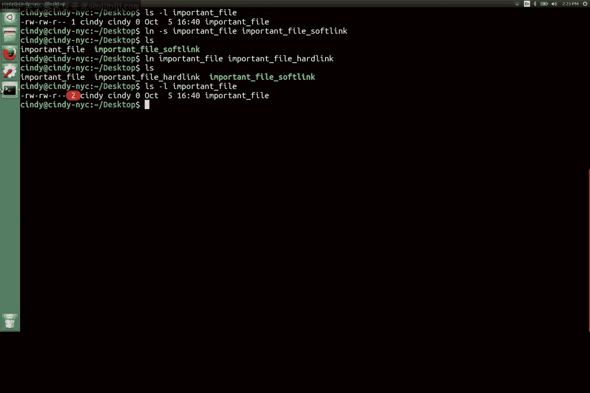

# 168：深入理解inode与链接

在本节课中，我们将要学习Linux文件系统中两个核心概念：**inode**和**链接**。我们将了解文件数据是如何被组织和管理的，以及如何创建软链接和硬链接来高效地管理文件。

## 理解inode：文件的元数据管家

在Linux中，文件的元数据和文件本身被组织成一个称为**inode**的结构。inode类似于Windows NTFS文件系统中的MFT记录。

我们将inode存储在一个**inode表**中，它们帮助我们管理文件系统上的文件。

inode本身并不存储文件的实际数据或文件名，但它存储了关于一个文件的**所有其他信息**，例如文件大小、所有者、权限、时间戳以及指向数据块的指针。

## 链接：文件的快捷方式与分身

在上一节中，我们介绍了inode如何存储文件信息。本节中，我们来看看如何通过“链接”来引用这些文件。在之前的课程中，我们学习了如何在Windows中创建文件快捷方式、符号链接和硬链接。在Linux中，我们有相同的概念。

Linux中的快捷方式被称为**软链接**或**符号链接**。它们的工作方式与Windows中的符号链接类似，因为它们只是指向另一个文件。

软链接允许我们使用一个文件名链接到另一个文件。它们非常适合为其他文件创建快捷方式。

Linux中另一种链接类型是**硬链接**。与Windows类似，硬链接在Linux中不指向一个文件，而是链接到一个存储在文件系统inode表中的**inode**。

本质上，当你创建一个硬链接时，你是指向磁盘上的一个物理位置，或者更具体地说，是指向文件系统上的同一个inode。

但是，如果你删除了一个文件的某个硬链接，所有其他指向同一inode的硬链接仍然有效。

## 查看与创建链接


让我们实际看看硬链接是如何被引用的。如果我们对一个文件（例如 `important_file`）执行 `ls -l` 命令：

```
ls -l important_file
```

你会注意到详细信息中的第三个字段。这个字段实际上指示了一个文件拥有的**硬链接数量**。

当一个文件的硬链接计数降为零时，该文件才会被从计算机中完全删除。

以下是创建链接的具体步骤：

**创建软链接**：我们可以运行 `ln` 命令并加上 `-s` 标志（代表软链接）。
```
ln -s original_file softlink_name
```

**创建硬链接**：我们可以运行不带 `-s` 标志的 `ln` 命令来指定创建硬链接。
```
ln original_file hardlink_name
```



现在，如果我们再次检查 `ls -l important_file`，会看到硬链接计数增加了1。

## 软链接与硬链接的应用场景

硬链接非常有用，如果你需要在不同位置存储“同一个”文件，但又不想在卷上占用额外的存储空间。这是因为所有的硬链接都指向卷上的同一块存储空间。

你也可以使用软链接来做同样的事情，但如果你移动了原始文件，软链接就会断裂，并且你可能会忘记在其他地方使用过它。那些链接也会失效，可能需要一些时间来清理。

你现在可能还看不到为自己创建软链接或硬链接的用途，但它们被广泛用于整个系统中，因此你应该了解它们的工作原理。

## 总结

本节课中，我们一起学习了Linux文件系统的两个基石：**inode**和**链接**。我们了解到inode是存储文件元数据的关键结构，而链接（包括软链接和硬链接）则提供了灵活的文件引用方式。硬链接通过共享inode来节省空间，而软链接则作为指向目标路径的指针。理解这些概念对于高效管理Linux系统至关重要。