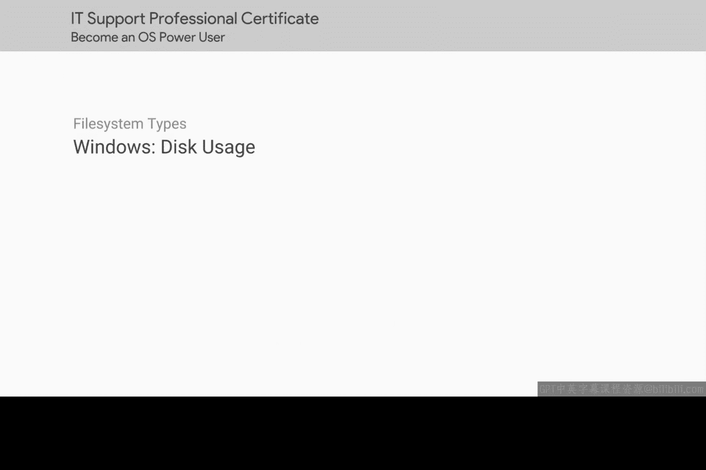
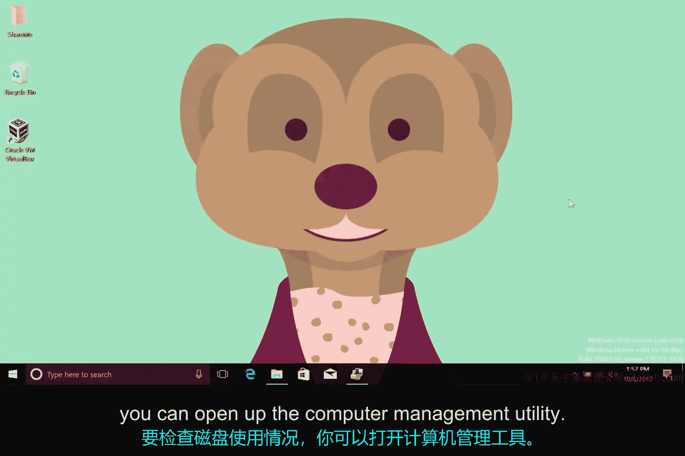
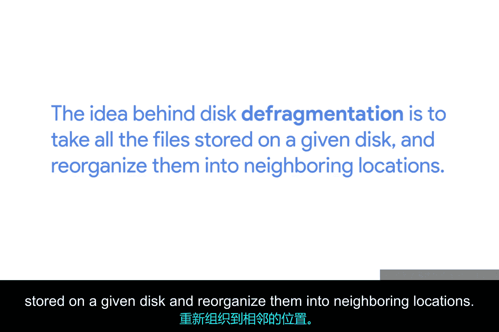
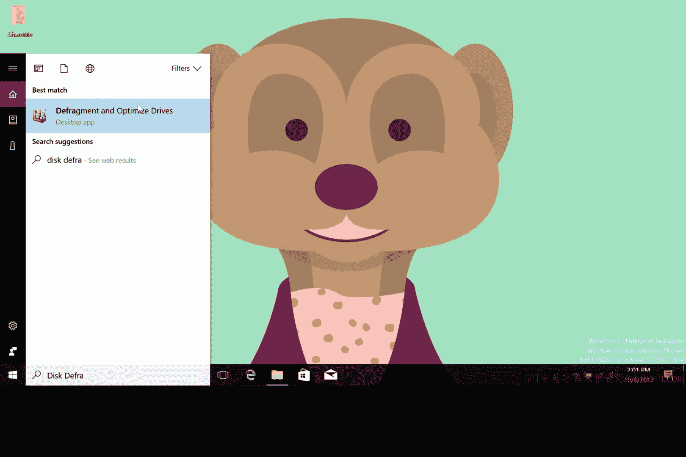
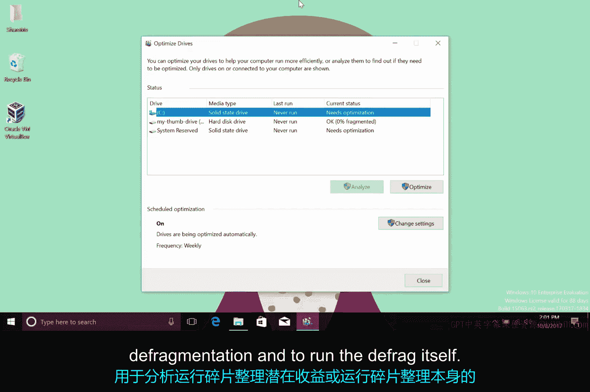

# 169：Windows磁盘使用监控与管理 🖥️💾

在本节课中，我们将学习如何在Windows操作系统中监控和管理磁盘使用情况。我们将探讨如何查看磁盘容量、使用空间，以及如何通过系统工具进行磁盘清理和碎片整理，以优化存储性能。

---

在上一节中，我们深入了解了文件和不同的文件系统。本节中，我们来看看如何监控Windows中这些文件的数量和大小。

市面上有许多第三方程序可用于在Windows上分区和格式化磁盘。同样，你也可以下载许多应用程序来检查和可视化Windows机器上的磁盘使用情况。但是，你可以使用我们在早期课程中检查过的磁盘管理控制台来了解磁盘容量和使用情况。

要检查磁盘使用情况，你可以打开计算机管理实用程序。

然后进入磁盘管理控制台。在那里，右键单击你感兴趣的分区并选择“属性”。

这将打开“常规”选项卡，你可以在其中查看驱动器上的已用空间和可用空间。

除了使用此图形用户界面检查磁盘使用情况外，Windows还提供了一个名为`disk usage`的命令行实用程序，作为其Sysinternals工具集的一部分。该`DU`实用程序可以打印出给定磁盘的使用情况，并告诉你它有多少个文件。这对于创建可能需要基于文本的输出（而不是像磁盘管理中的饼图那样的可视化报告）的脚本很有用。你可以在下一个补充阅读中找到`DU`工具的链接。

在磁盘管理控制台的同一选项卡上，你可能会注意到一个名为“磁盘清理”的按钮。如果你按下此按钮，Windows将启动一个名为`cleanmgr`的程序，它将在你的硬盘驱动器上进行一些整理工作，以尝试释放一些空间。

以下是磁盘清理包含的任务：
*   删除临时文件。
*   压缩旧的和很少使用的文件。
*   清理日志。
*   清空回收站。

---

另一个与磁盘健康相关的任务称为“碎片整理”。磁盘碎片整理背后的想法是获取存储在给定磁盘上的所有文件，并将它们重新组织到相邻的位置。

像这样有序地存放文件，对于使用致动臂在旋转盘片上写入和读取数据的旋转硬盘驱动器来说，将使工作变得更轻松。致动臂的磁头实际移动读取所需数据的距离会更短。

需要指出的是，这对于固态硬盘的好处较小，因为没有需要在旋转盘片上移动的物理读写头。对于这类驱动器，操作系统可以使用一个名为`TRIM`的过程来回收固态硬盘上未使用的部分。我们不会深入探讨`TRIM`的工作原理，但知道它的存在是很好的。我在此视频后的阅读材料中提供了一个关于`TRIM`更多信息的链接。

在Windows中，碎片整理是作为一项计划任务处理的。操作系统会定期自动对驱动器进行碎片整理，你无需担心。但如果你愿意，也可以在Windows中手动对驱动器进行碎片整理。

要启动手动碎片整理，请打开操作系统自带的磁盘碎片整理工具。输入`disk defragmenter`。

启动后，你将获得一个可以进行碎片整理的磁盘列表，以及用于分析运行碎片整理的潜在收益和运行碎片整理本身的按钮。

---

本节课中，我们一起学习了如何在Windows中监控磁盘使用情况，包括使用图形界面和命令行工具查看磁盘空间。我们还探讨了如何使用磁盘清理工具释放空间，以及针对传统机械硬盘进行碎片整理以优化性能。了解这些工具和概念，将帮助你更有效地管理Windows系统的存储资源。