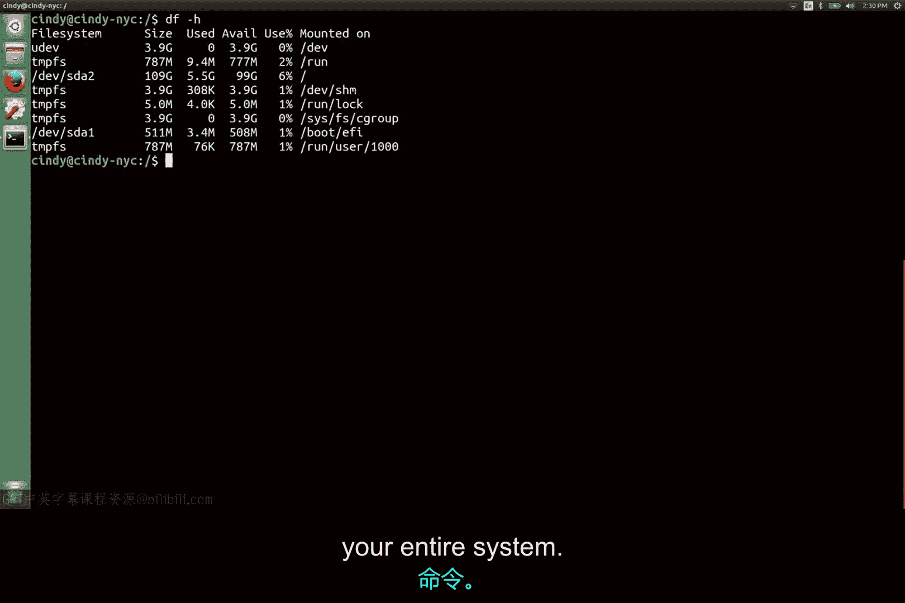

# 170：Linux磁盘使用 💾

在本节课中，我们将学习如何在Linux系统中查看磁盘使用情况。我们将介绍两个核心命令：`du` 和 `df`，它们分别用于查看目录的磁盘使用量和整个系统的可用空间。掌握这些命令对于管理和维护系统存储空间至关重要。

## 查看目录磁盘使用量

上一节我们介绍了在Windows中查看磁盘使用情况的方法。本节中我们来看看在Linux系统中如何实现类似的功能。

我们可以使用 `du -h` 命令来查看磁盘使用情况。

`du`（即磁盘使用）命令向我们显示特定目录的磁盘使用量。

如果不指定目录，该命令将默认使用当前目录。

`-h` 标志以人类可读的形式提供数据测量结果。

如果您想知道某个目录中的文件占用了多少磁盘空间，就应该使用 `du` 命令。

## 查看系统可用空间

了解了如何查看具体目录的占用后，接下来我们看看如何检查整个系统的存储空间状况。

另一个可以使用的命令是 `df` 命令，即“磁盘空闲”。

该命令显示您整个机器上的可用空间。

`-h` 标志以人类可读的形式提供数据测量结果。

如果您想知道整个系统有多少可用空间，就应该使用 `df` 命令。

## 关于碎片整理的说明

您可能已经注意到，我们没有真正涉及Linux的文件系统碎片整理。

与Windows相比，Linux通常在避免碎片化方面做得更好。

我们不会深入探讨这一点，但您可以在接下来的补充阅读中了解更多信息。

## 磁盘空间管理实践

在常见场景中，您可能会发现自己磁盘空间不足。

需要由您来调查是哪些文件和文件夹占用了空间，以及是否需要删除这些文件。

请务必记住，删除文件时要格外小心。

---

本节课中我们一起学习了Linux系统中两个关键的磁盘管理命令：`du` 用于分析目录级别的磁盘使用量，而 `df` 用于查看整个文件系统的可用空间。理解并熟练运用这些命令是有效进行系统存储管理和故障排查的基础技能。