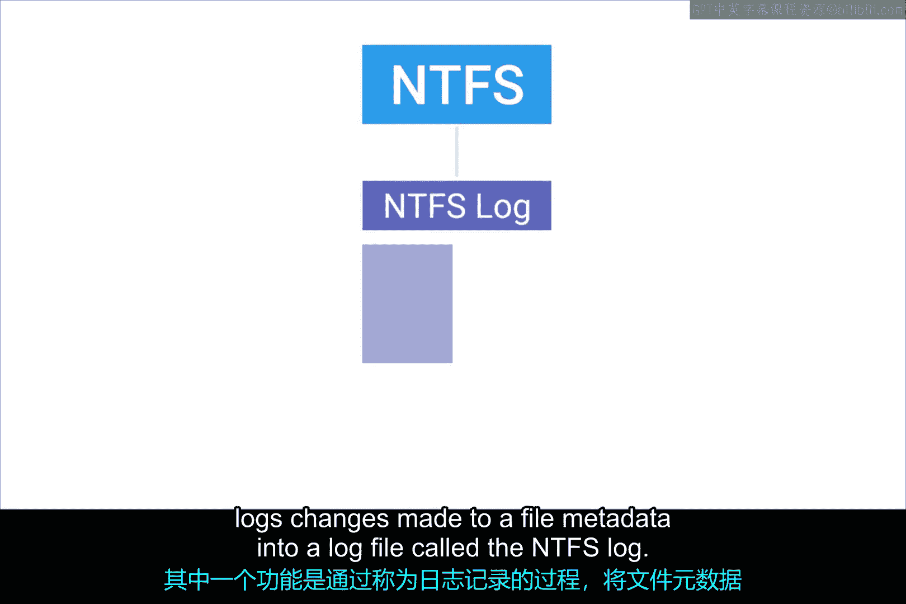
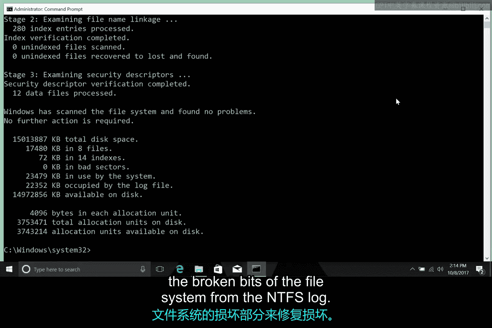

# 171：Windows文件系统修复 🛠️

在本节课中，我们将要学习为什么需要安全移除USB设备，以及Windows NTFS文件系统如何通过日志记录、自我修复和磁盘检查等机制来防止和修复数据损坏。我们还将了解如何在Windows中手动运行这些修复工具。

## 数据损坏的风险与原因

在之前的课程中，我们讨论了未从计算机中“弹出”或“卸载”USB设备就直接拔出的危险性。

你可能自己也曾见过类似的错误信息，当系统提示你必须安全弹出这个U盘时。

为什么当我们向U盘复制文件，并且看到文件已成功复制后，还需要执行这个操作？为什么我们不能在不卸载或点击操作系统中的“弹出”按钮的情况下直接拔掉驱动器？

事实证明，数据可能尚未完成复制。系统并非无缘无故地警告我们。

当我们向驱动器读取或写入数据时，实际上会先将数据放入缓冲区或缓存中。

**数据缓冲区**是RAM中的一个区域，用于在数据移动过程中临时存储数据。

因此，当你从操作系统向USB驱动器复制内容时，数据会首先被复制到数据缓冲区，因为RAM的运行速度比硬盘驱动器快。

所以，如果你没有正确卸载文件系统，并且没有给缓冲区足够的时间来完成数据传输，你就有数据损坏的风险。

数据损坏可能由多种原因引起，而不仅仅是不安全地移除磁盘驱动器。

假设你正在使用电脑，大楼突然断电，导致你的电脑突然关机。这种崩溃也会导致数据损坏。

系统故障或软件错误同样可能导致数据损坏。

## NTFS文件系统的防护机制

NTFS文件系统内置了一些高级功能，可以帮助最小化损坏的风险，并在文件系统确实受损时尝试恢复。

其中一项功能是通过一个称为**日志记录**的过程，将对文件元数据的更改记录到一个名为**NTFS日志**的日志文件中。




通过记录这些更改，NTFS创建了其执行操作的历史记录。

这意味着它可以查看日志，以了解文件系统当前应该处于什么状态。

如果崩溃或错误确实导致了损坏，文件系统可以启动一个恢复过程，该过程将使用该日志来确保系统处于一致的状态。

除了日志记录，NTFS和Windows还实现了一种称为**自我修复**的功能。

正如你从名称中可以猜到的那样，自我修复机制会在后台自动修复磁盘上的小问题和损坏。

它在Windows运行时执行此操作，因此你无需重新启动系统。

如果你想检查计算机上自我修复过程的状态，可以打开一个管理员命令提示符，并使用`FSUTIL`工具，如下所示：

以下是使用FSUTIL工具查询自我修复状态的命令示例：
```cmd
FSUTIL repair query C:
```

## 手动磁盘检查工具

最后，当情况变得非常糟糕，出现一些严重或灾难性的磁盘损坏时，例如坏扇区、磁盘故障等，你可以求助于**NTFS磁盘检查实用程序**。

NTFS内置的恢复功能意味着你通常不需要运行磁盘检查，但在紧急情况下它仍然可用。

要手动运行磁盘检查，你可以打开管理员命令提示符，并在命令行中键入`chkdsk`。

默认情况下，磁盘检查将以只读模式运行，因此它会为你提供磁盘健康状况的报告，但不会对其进行任何修改或修复。

你可以使用`/F`标志告诉磁盘检查程序修复它发现的任何问题。

你还可以指定要检查的驱动器，如下所示。如果输入`chkdsk /F D:`，我将检查我的U盘，它位于D盘。

不过，很多时候你不需要手动运行磁盘检查。

如果操作系统检测到某些数据已损坏或磁盘有坏扇区，它会在卷上的一个元数据文件中设置一个位，以指示存在损坏。

当系统启动时，磁盘检查实用程序将检查此位。如果它被设置，程序将执行并尝试通过从NTFS日志中重建文件系统的损坏部分来修复损坏。



正如你所见，Windows NTFS文件系统拥有一些相当强大的措施和功能，用于恢复和防止损坏破坏你的分区。

## 总结


本节课中我们一起学习了数据损坏的常见原因，特别是因不安全移除USB设备导致的风险。我们深入探讨了Windows NTFS文件系统为应对这些风险而设计的核心防护机制：**日志记录**用于追踪和恢复更改，**自我修复**用于在后台自动处理小问题，以及**磁盘检查实用程序**用于手动诊断和修复严重损坏。这些功能共同作用，极大地增强了文件系统的健壮性和数据的安全性。

下一节，让我们来看看如何在Linux系统中执行文件系统修复。