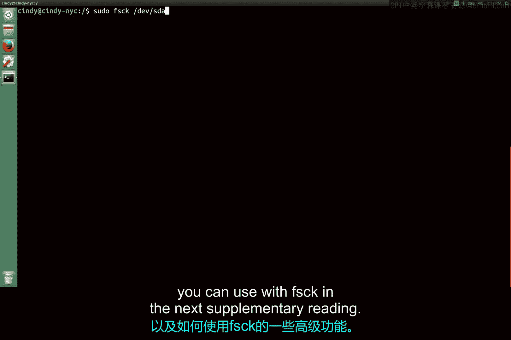

# 172：Linux文件系统修复 🛠️

在本节课中，我们将学习如何在Linux系统中手动尝试修复文件系统。核心内容包括使用`fsck`命令的注意事项、修复的局限性以及系统启动时的自动检查机制。

## 文件系统检查命令：`fsck`

上一节我们介绍了磁盘分区与挂载的基本操作。本节中我们来看看如何检查和修复可能损坏的文件系统。


在Linux中，你可以使用`fsck`（File System Check）命令来尝试手动修复文件系统。

**重要前提**：执行此命令前，必须确保目标文件系统**未被挂载**。以下是一个命令示例（仅为示意，未实际运行）：

```
fsck /dev/sda1
```


**警告**：如果在已挂载的分区上运行`fsck`命令，极有可能损坏该文件系统。

## 文件系统修复的局限性

需要明确的是，文件系统修复并非总能保证成功，但在大多数情况下它能提供帮助。

对待硬件设备保持谨慎和规范的操作，在多数情况下它能稳定地为你服务。



## 系统启动时的自动检查

另一个需要指出的要点是，在某些Linux版本中，`fsck`实际上会在计算机启动时自动运行，以检查并尝试自动修复文件系统中存在的问题。


你可以在接下来的补充阅读材料中，了解更多关于如何启用此功能以及`fsck`的一些高级特性。

## 课程总结与展望

本节课中我们一起学习了许多磁盘管理和文件系统的核心概念。

我们涵盖了如何对磁盘进行分区、如何格式化文件系统以及如何挂载文件系统。甚至还讨论了如何修复损坏的文件系统。

在IT支持工作中，掌握如何操作磁盘至关重要。你的客户将他们宝贵的数据存储在这些磁盘上——无论是孩子的照片、重要的演示文稿、音乐收藏还是其他任何资料——他们都不希望丢失这些数据。

因此，懂得如何管理磁盘及其上的数据，是IT角色中至关重要的一部分。

接下来，如你所料，又到了Windows和Bash评估练习的时间。请从容完成，如有需要，随时可以回顾本模块的任何学习材料。

---

本节课中我们一起学习了Linux文件系统修复的基本方法，包括`fsck`命令的使用条件与风险、修复的有限性，以及系统启动时的自动检查机制。理解这些知识对于执行有效的系统维护和数据保护至关重要。