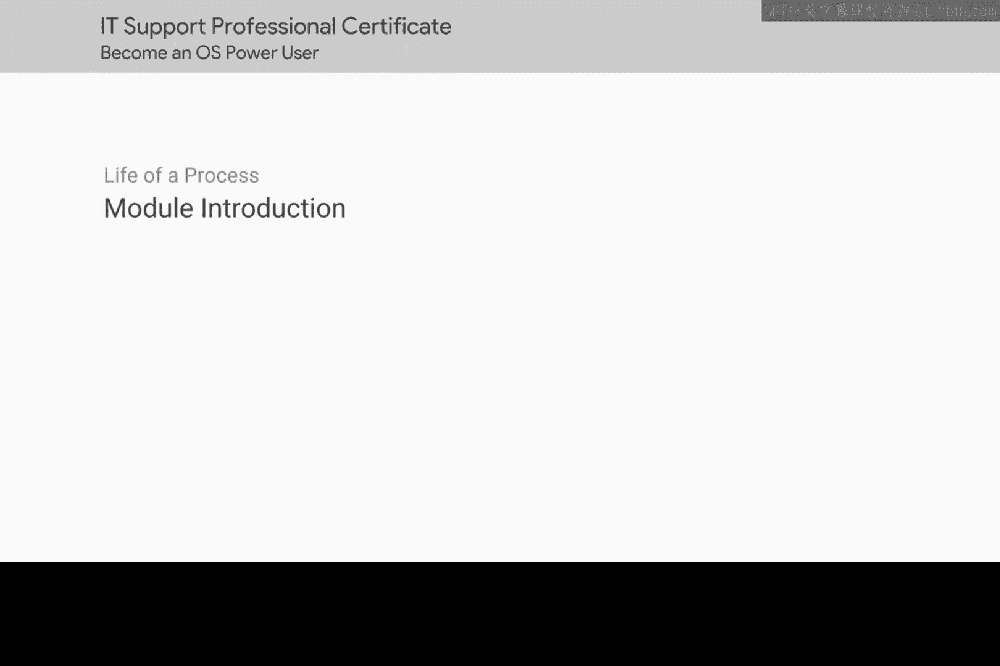

# 174：进程管理 🖥️

在本节课中，我们将要学习计算机中进程的概念及其管理。进程是计算机运行程序的基础，理解它们对于有效利用硬件资源至关重要。

## 课程概述

到目前为止，我们已经完成了四个模块的学习，本课程还剩两个模块。在上一课中，我们学习了如何对磁盘进行分区、设置文件系统以开始存储文件。我们还深入探讨了文件系统的细节，甚至学习了修复损坏的文件系统和磁盘的工具。

本节中，我们将讨论进程。进程在我们的计算机用户体验中扮演着重要角色。毕竟，如果无法运行任何程序，我们为何要使用计算机呢？随着计算机上运行的进程越来越多，我们必须思考如何更好地利用硬件资源。

准备好，因为我们将深入探讨进程的细节。我们将讨论如何读取进程输出，并学习如何跟踪我们的资源。预备，开始。

## 进程的重要性

进程是计算机中正在执行的程序的实例。它们是操作系统进行资源分配和调度的基本单位。随着计算机上运行的进程数量增加，有效管理这些进程对于保持系统性能和稳定性至关重要。

以下是进程管理中的几个核心概念：

*   **进程标识符（PID）**：每个进程都有一个唯一的数字标识符，称为PID。操作系统通过PID来识别和管理进程。
*   **进程状态**：进程在其生命周期中会处于不同的状态，例如运行、就绪、阻塞等。
*   **资源分配**：进程在执行时需要占用CPU时间、内存空间和I/O设备等系统资源。

## 进程监控与管理工具

为了有效地管理系统资源，我们需要使用工具来监控和管理进程。这些工具可以帮助我们查看哪些进程正在运行，它们占用了多少资源，并在必要时进行干预。

以下是几种常用的进程管理命令及其功能：

*   **`ps`命令**：用于报告当前系统的进程状态。例如，`ps aux`可以列出所有用户的详细进程信息。
*   **`top`命令**：提供了一个动态的、实时更新的进程视图，显示系统摘要信息和进程列表，按CPU或内存使用率排序。
*   **`kill`命令**：用于向进程发送信号，以终止或控制进程。例如，`kill -9 <PID>`会强制终止指定PID的进程。

## 总结

本节课中，我们一起学习了计算机进程的基础知识及其管理。我们了解到进程是程序执行的载体，有效的进程管理对于优化计算机性能和资源利用率至关重要。通过学习使用如`ps`、`top`和`kill`等工具，我们可以监控系统状态、识别资源瓶颈，并对进程进行必要的控制。掌握这些技能是成为一名合格IT支持专业人员的重要一步。