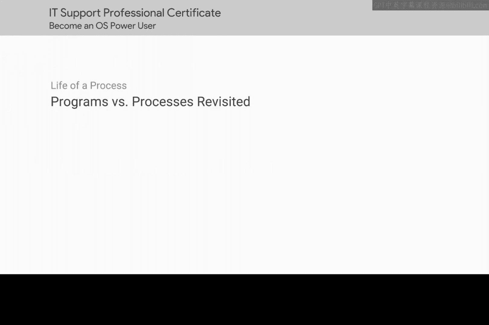
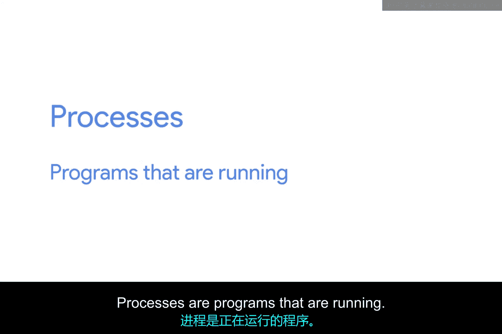
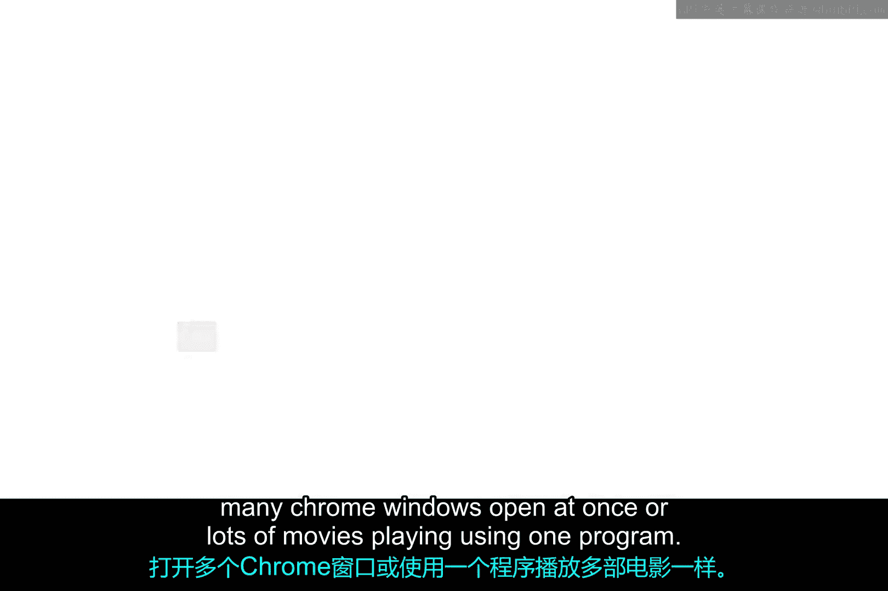
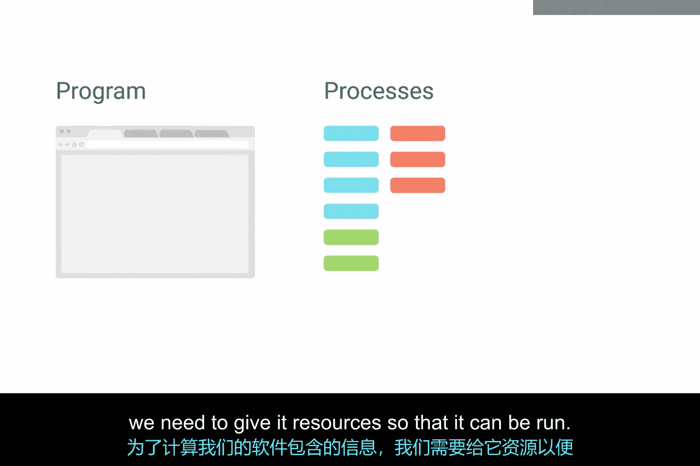
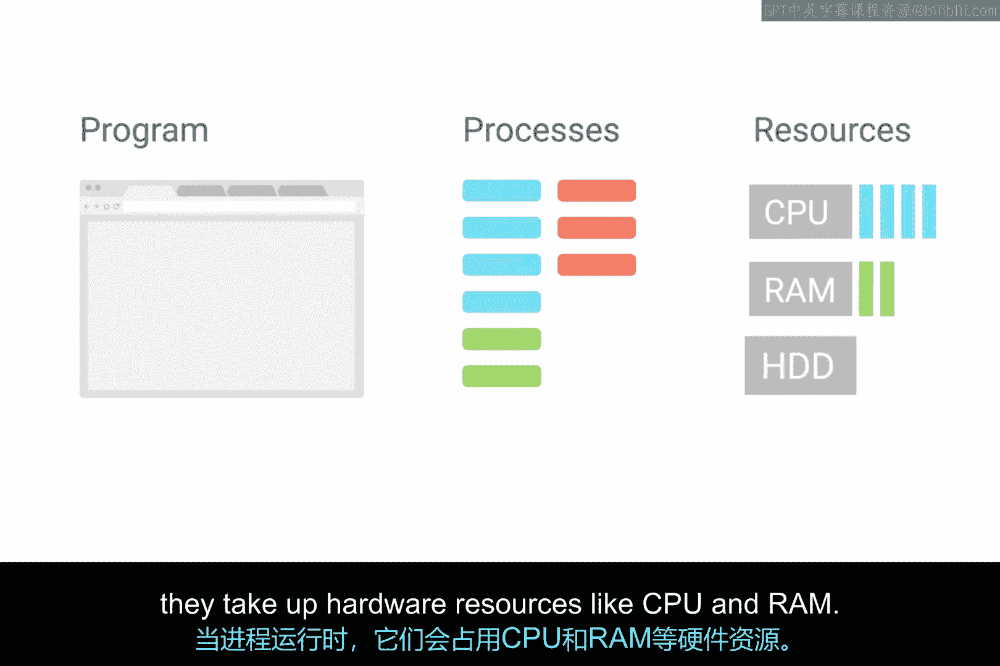

# 175：程序与进程再探 🔄

在本节课中，我们将深入探讨程序与进程的概念，理解它们如何占用计算机资源，并初步了解进程管理的重要性。我们将从基本定义开始，逐步深入到进程的创建、运行以及后台进程的作用。

## 概述

在之前的课程中，我们学习了程序是我们能够运行的应用程序，例如Chrome网络浏览器。进程则是正在运行的程序。同一个程序可以同时运行多个进程，就像我们可以同时打开多个Chrome窗口，或者使用一个程序播放多部电影。

## 程序与进程的关系

当我们启动一个进程时，实际上是在执行一个程序。请记住，程序本质上就是软件。为了计算软件所包含的信息并使其运行，我们需要为它分配资源。

## 进程与硬件资源

进程在运行时，会占用CPU和内存等硬件资源。幸运的是，如今的计算机性能足够强大，能够处理我们日常活动（如浏览网页、观看电影等）中使用的进程。但有时这还不够。

## 进程管理的重要性

有时，一个进程会占用超出预期的资源。有时，进程会失去响应，导致系统资源被占用，从而使整个计算机变得无响应。在接下来的课程中，我们将讨论这种情况发生的原因以及如何解决它。

但在讨论如何管理进程之前，我们必须先理解它们是如何工作的。

## 进程的启动与标识

当你打开一个应用程序（如文字处理器）时，你就在启动一个进程。该进程会被分配一个**进程ID**，用于唯一地将其与其他进程区分开来。我们的计算机识别到该进程需要硬件资源才能运行，因此内核会做出决策，决定分配哪些资源给它。然后，眨眼之间，计算机就启动了文字处理器，我们便可以开始工作了。

## 可见进程与后台进程

这个过程适用于你手动启动的每一个进程，也适用于那些你甚至不知道正在运行的进程。除了我们启动的可见进程（如音乐播放器或文字处理器）之外，还有一些不那么可见的进程在运行。这些被称为**后台进程**，有时也称为**守护进程**。

后台进程在后台运行，我们通常看不到它们，也不与它们交互，但我们的系统需要它们才能正常运作。它们包括调度资源、记录日志、管理网络等进程。

## 查看系统进程

当我们查看系统上运行的所有进程时，你就会明白我在说什么。在接下来的几节课中，我们将讨论进程是如何创建和终止的。然后，我们就可以开始深入研究进程管理的细节了。

## 总结

本节课中，我们一起学习了程序与进程的核心区别，了解了进程如何占用系统资源，并认识了后台进程的作用。进程管理是IT支持中的一项关键技能，你经常会遇到需要排查应用程序冻结、运行缓慢等问题的情况。理解这些基础知识是进行有效故障排除的第一步。