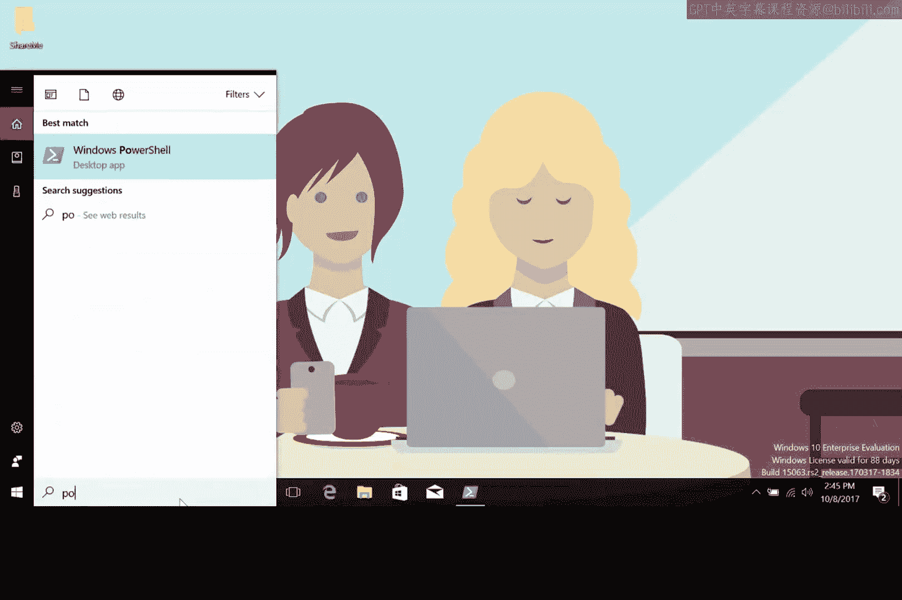
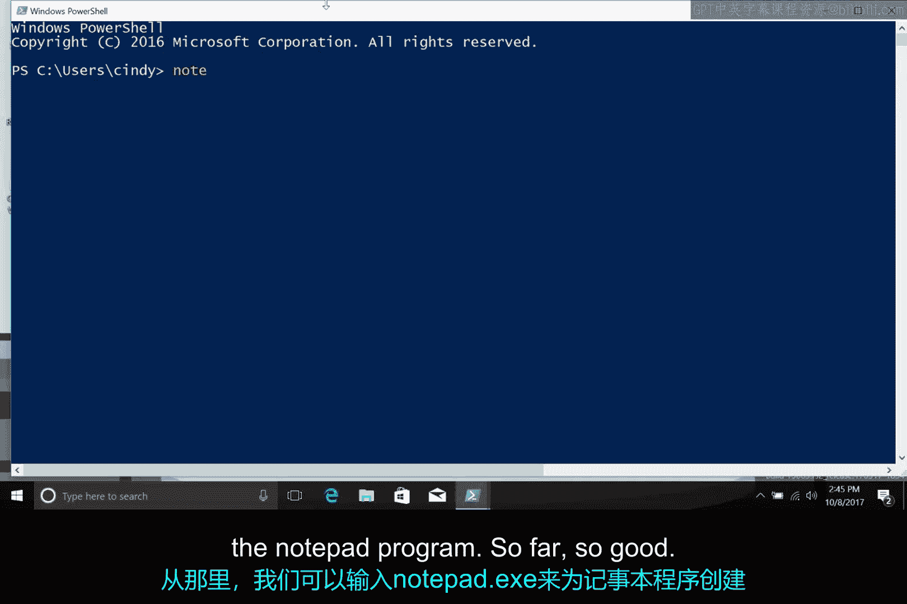
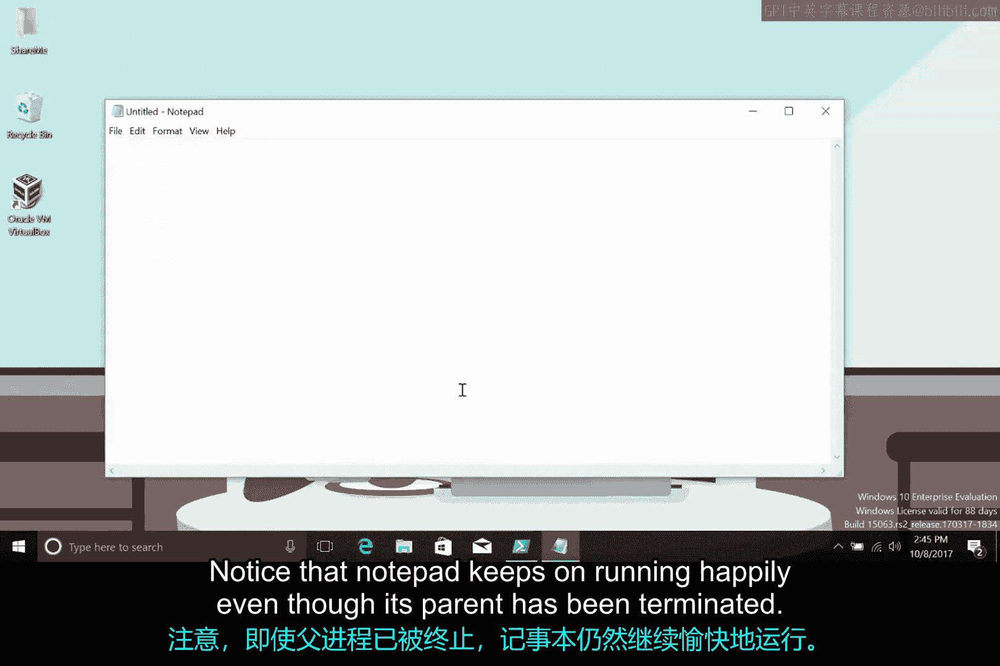
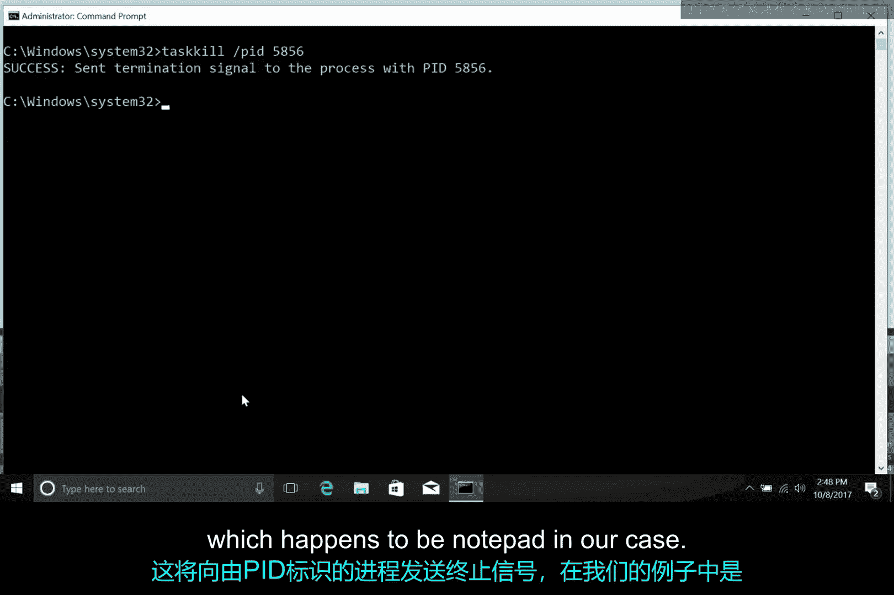

# 176：Windows进程创建与终止 🖥️

在本节课中，我们将学习Windows操作系统是如何创建和终止进程的。我们将从系统启动时的第一个进程开始，逐步了解进程的父子关系、继承机制，以及如何手动创建和停止一个进程。

## 系统启动与初始进程

进程的创建和停止方式因您使用的操作系统而异。首先，让我们看看Windows是如何运作的。

当Windows启动时，第一个启动的非内核用户模式进程是会话管理器子系统，即 **smss.exe**。`smss.exe` 进程负责为操作系统运行设置一些必要的环境。

随后，它会启动登录进程 **Winlogon.exe**，以及客户端/服务器运行时子系统 **csrss.exe**。`csrss.exe` 负责运行Windows图形用户界面和命令行控制台。

> 提示：我们将在下一课讨论Linux使用的第一个进程 `init`。您可能会认为 `smss.exe` 是Windows中与 `init` 等效的进程，但请不要陷入这个误区。在进程创建机制方面，它们有很大的不同。

## 进程创建与父子关系

在Windows中，每个新创建的进程都需要一个父进程来通知操作系统需要创建一个新进程。

子进程会从其父进程继承一些东西，例如变量和设置，我们可以统称为 **环境**。这为子进程提供了一个良好的起点，但在初始创建步骤之后，子进程基本上是独立运行的。

与Linux不同，Windows进程可以独立于其父进程运行。让我们通过创建一个自己的进程来看看这是如何工作的。

## 动手实践：创建进程

以下是创建进程的步骤：

首先，我们启动PowerShell进程以获得一个Windows命令提示符。



然后，我们可以在其中输入 `notepad.` 来为记事本程序创建一个新进程。



到目前为止一切顺利。父进程是PowerShell，子进程是记事本应用程序。


## 进程的独立性

如果我们通过点击“X”按钮来终止父进程，会发生什么？


请注意，即使其父进程已被终止，记事本仍然在愉快地运行。



这些子进程完全活在自己的世界里。


## 终止进程的方法

点击“X”只是停止Windows中进程运行的一种方式。但正如您所料，还有其他方法可以停止进程。

您可以使用命令提示符命令，调用任务终止实用程序 **`taskkill`**。`taskkill` 可以通过几种方式查找并停止一个进程。

更常见的方法之一是使用一个称为 **进程ID** 或 **PID** 的标识号，来告诉 `taskkill` 您希望停止哪个进程。

## 使用 `taskkill` 终止进程

一种方法是再次终止记事本，通过使用 `taskkill /PID` 后跟PID号来指定PID。

例如，命令格式为：
```cmd
taskkill /PID <进程ID号>
```
这里的 `<进程ID号>` 是记事本的进程ID。成功后，这将向由该PID标识的进程（在我们的例子中恰好是记事本）发送终止信号。



## 如何获取进程ID

这很有用，但我们首先如何获取那个PID呢？很高兴您会问。我们将在接下来的课程中讨论如何定位和查看进程以及其他更详细的进程信息。


---

## 总结

本节课中，我们一起学习了Windows进程的生命周期。我们从系统启动时的初始进程 `smss.exe` 开始，理解了进程的父子创建关系以及子进程对环境的继承。通过实践，我们看到了Windows进程可以独立于父进程运行的特点。最后，我们介绍了使用 `taskkill` 命令和进程ID来终止进程的方法，为后续深入学习进程管理打下了基础。