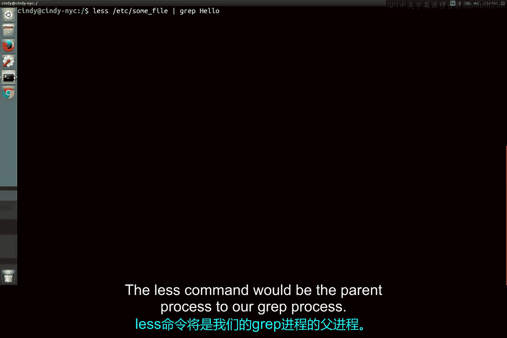
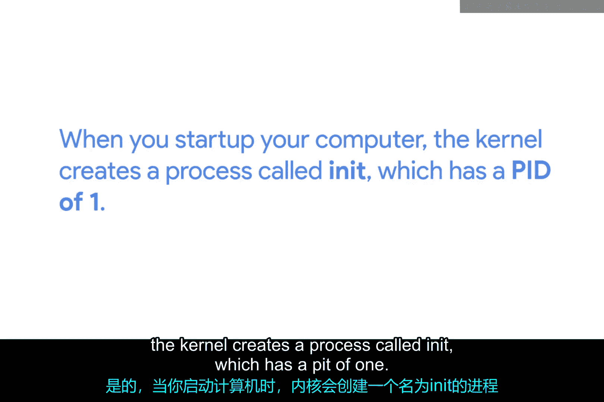

# 177：进程创建与终止 🖥️

在本节课中，我们将要学习Linux系统中进程的创建与终止机制。我们将了解进程之间的父子关系、系统的初始进程，以及进程结束时的资源回收过程。

## 进程的父子关系 👨‍👦

在Linux中，进程之间存在父子关系。这意味着你启动的每一个进程都源自另一个进程。

让我们查看以下命令：

在这个例子中，`less`命令将是`GrP`进程的父进程。

## 初始进程：init 🚀

既然所有进程都源自另一个进程，那么必须存在一个启动这一切的初始进程，对吗？是的，确实存在。

当你启动计算机时，内核会创建一个名为`init`的进程，其进程ID（PID）为1。

然后，`init`进程会启动我们启动和运行计算机所需的其他进程。

进程创建的过程比这更复杂，但我想介绍父进程的概念，因为在我们开始管理进程时你会看到它们。

## 进程的终止与资源回收 ♻️

上一节我们介绍了进程的创建，本节中我们来看看进程的终止。

当你的进程完成任务后，它们通常会**自动终止**。一旦一个进程终止，它会将其正在使用的所有资源释放回内核，以便这些资源可以被另一个进程使用。

你也可以**手动终止**一个进程，我们将在后续课程中讨论如何操作。

---

本节课中我们一起学习了Linux进程的父子关系、系统初始进程`init`的作用，以及进程终止时如何回收资源。理解这些概念是有效管理系统进程的基础。