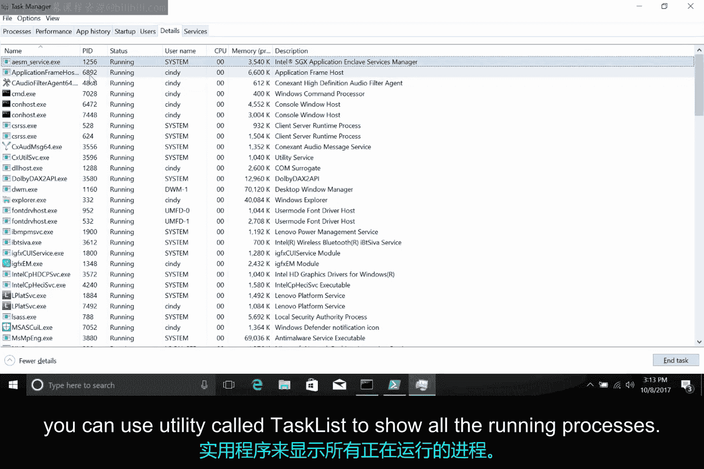
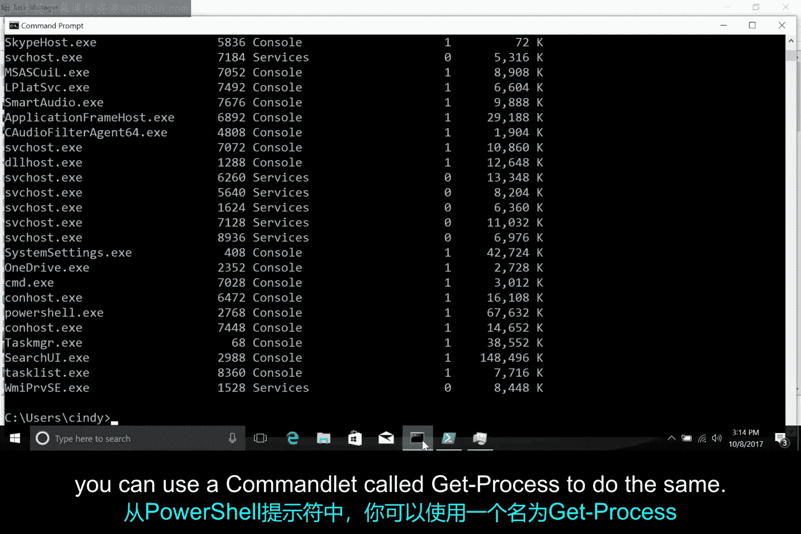
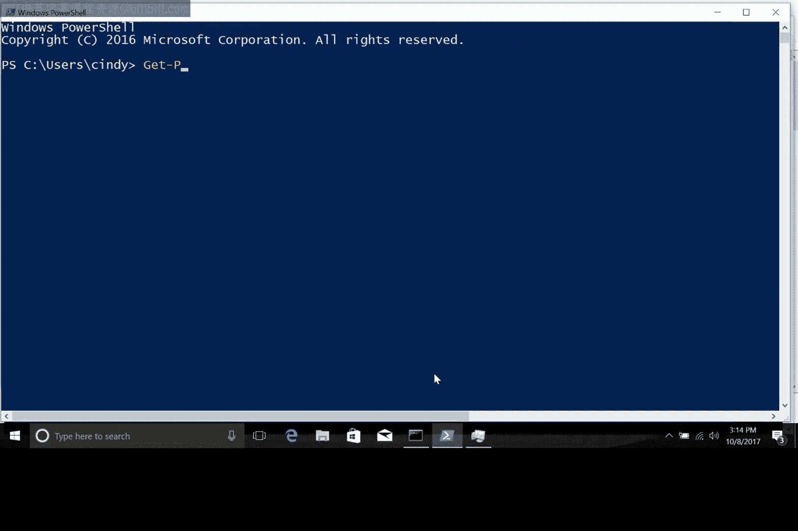

**IT支持：第2课：Windows进程信息查看与管理** 🖥️

在本节课中，我们将学习进程在操作系统中的核心概念，并重点掌握在Windows操作系统中查看和管理运行中进程的多种实用方法。

---

### **进程的本质**

上一节我们介绍了进程的基本概念，本节中我们来深入理解其本质。

你可以将进程理解为“运行中的程序”。以你的网络浏览器代码为例，它原本静静地存储在硬盘上。一旦你启动它，操作系统便会将这些静态代码转化为一个动态运行、可交互的应用程序。换句话说，它变成了一个你可以与之互动的进程。

我们在电脑上随时都在启动和终止进程，尽管操作系统通常在幕后处理这一切。通过学习进程，你得以窥见操作系统实际工作的原理。这些知识既有趣又强大，尤其当被精明的IT支持专家用来解决问题时。

---

### **在Windows中查看进程**

了解了进程是什么之后，我们来看看如何在Windows电脑上探查哪些进程正在运行，以及更多与它们交互的方法。

在Windows操作系统中，任务管理器是获取进程信息的一种方法。你可以通过按下 `Ctrl + Shift + Esc` 组合键，或通过开始菜单找到并打开它。

如果你点击“进程”选项卡，会看到一个列表，其中包含当前用户正在运行的进程，以及用户可见的一些系统级进程。

任务管理器将每个进程的信息分列显示。它会告诉你进程正在运行什么应用程序或映像文件、启动它的用户以及它正在使用的CPU或内存资源。

---

### **终止进程**

以下是终止进程的步骤：

1.  在任务管理器的进程列表中，选择任意一个进程行。
2.  点击右下角的“结束任务”按钮。

我们可以通过一个例子来演示：先从命令行启动另一个记事本进程，然后切换到任务管理器，选择该记事本进程并结束它。

---

### **获取进程标识符**

在之前的课程中，我们讨论过启动和结束Windows进程。记得我们使用 `taskkill` 命令通过其标识号来停止进程。

那么，如何获取这个PID呢？在任务管理器中，你可以点击“详细信息”菜单选项。在这里，你可以看到任务管理器能显示的大量其他信息，包括PID。



你也可以从命令提示符和PowerShell中查看此信息。

*   从命令提示符，你可以使用名为 `tasklist` 的实用程序来显示所有正在运行的进程。
    ```cmd
    tasklist
    ```
*   从PowerShell提示符，你可以使用名为 `Get-Process` 的命令来执行相同的操作。
    ```powershell
    Get-Process
    ```





---

### **总结**

本节课中，我们一起学习了进程作为“运行中程序”的核心概念。我们重点探讨了在Windows操作系统中，如何使用任务管理器、命令提示符的 `tasklist` 命令以及PowerShell的 `Get-Process` 命令来查看运行中的进程信息，并掌握了通过任务管理器图形界面终止进程的基本方法。从Windows操作系统中获取进程信息的方式多种多样，如果你想更深入地研究这些工具，我们已在补充阅读材料中附上了 `tasklist` 和 `Get-Process` 的文档链接。