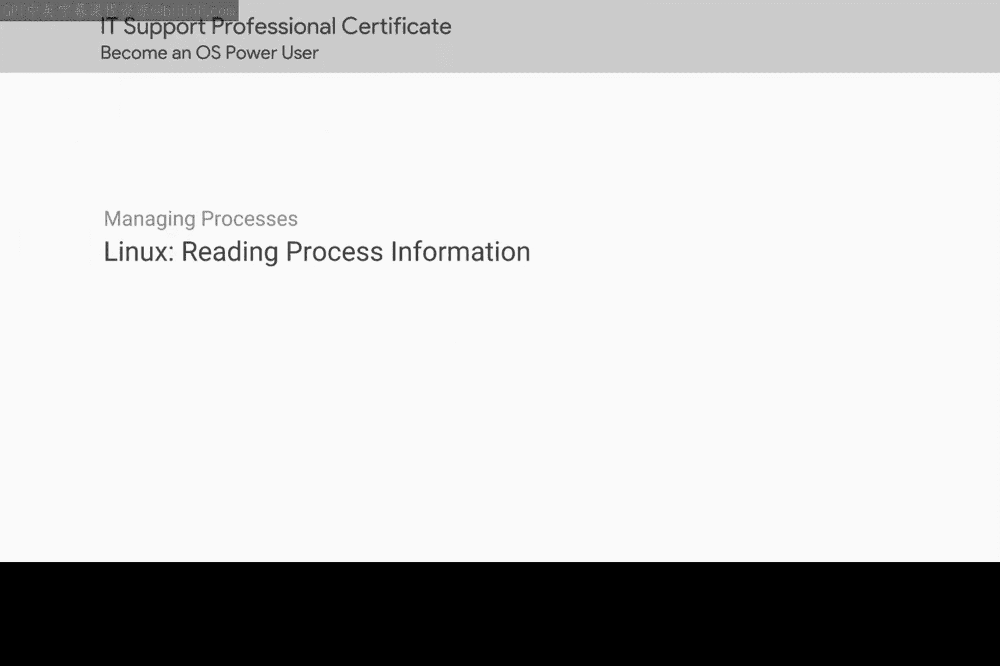
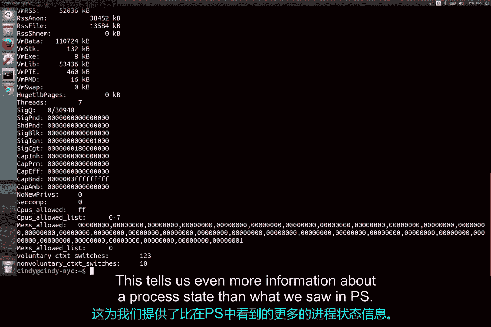

# 180：查看系统进程信息 🖥️



在本节课中，我们将学习如何在Linux系统中查看正在运行的进程信息。我们将重点介绍`ps`命令及其常用选项，并了解如何解读其输出结果。掌握这些知识是进行系统监控和故障排查的基础。

## 概述：使用`ps`命令查看进程

首先，我们来运行一个基本的`ps`命令。在Linux中，我们可以使用`ps`命令来查看系统进程。让我们运行带有`-x`标志的`ps`命令，看看会发生什么。

```bash
ps -x
```

这个命令会显示你系统上当前运行进程的一个快照。初次查看`ps`的输出可能会让人感到不知所措，但别担心，我们将一步步学习如何解读它。

## 解读`ps -x`的输出

以下是`ps -x`命令输出的一个示例，我们将从左到右解读每个字段的含义。

*   **PID**：这是进程ID。请记住，进程在启动时会获得一个唯一的ID。
*   **TTY**：这是与进程关联的终端。我们不会深入讨论这个字段，但你可以在本视频链接的手册页中阅读更多相关信息。
*   **STAT**：这是进程状态。如果你在这里看到`R`，意味着进程正在运行或等待运行。另一个常见的状态是`T`，表示进程已停止，即一个被挂起的进程。你可能还会看到`S`，表示可中断睡眠，意味着任务正在等待某个事件完成才能恢复。你可以在手册页中阅读关于其他进程状态的更多信息。
*   **TIME**：这是进程已占用的总CPU时间。
*   **COMMAND**：这是我们正在运行的命令的名称。

## 进阶：使用`ps -ef`查看详细信息

现在，我们将进入更深入的查看模式。运行以下命令：

```bash
ps -ef
```

其中，`-e`标志用于获取所有进程，包括其他用户运行的进程。`-f`标志表示完整格式，它会显示关于进程的完整详细信息。

看，我们现在有了更多的进程和更详细的进程信息。让我们来分解一下这个输出：

*   **UID**：启动进程的用户的用户ID。
*   **PID**：进程ID。
*   **PPID**：父进程ID，我们在之前的课程中讨论过，它表示启动该进程的父进程。
*   **C**：此进程拥有的子进程数量。
*   **STIME**：进程的启动时间。
*   **TTY**：与进程关联的终端。
*   **TIME**：进程已占用的总CPU时间。
*   **CMD**：我们正在运行的命令的名称。

## 在输出中搜索特定进程

如果我们想在这个输出中进行搜索，现在看起来非常混乱，你能想到一种方法来查看特定进程（例如Chrome）是否在运行吗？没错，使用`grep`命令。我告诉过你我们会经常用到它。

```bash
ps -ef | grep chrome
```

这将为我们提供一个包含名称中有“chrome”的进程列表。

## 通过`/proc`目录查看进程信息

还有另一种查看进程信息的方式。请记住，Linux中的一切都是文件，进程也不例外。要查看与进程对应的文件，我们可以查看`/proc`目录。

```bash
ls /proc
```

这里有很多目录，对应着每一个正在运行的进程。如果你查看其中一个子目录，它会提供关于该进程的更多信息。

让我们查看一个示例进程的状态文件，例如PID为1805的进程：

```bash
cat /proc/1805/status
```



这告诉我们关于一个进程的更多详细信息，比我们在`ps`命令中看到的还要多。虽然`/proc`目录看起来很有趣，但当我们需要对进程问题进行故障排查时，它并不非常实用。目前，请坚持使用`ps -ef`命令来查看进程信息。

## 总结

本节课中，我们一起学习了如何查看Linux系统中的进程信息。我们介绍了`ps -x`和`ps -ef`命令的基本用法，并详细解读了输出结果中各字段的含义。我们还学习了如何使用`grep`命令过滤`ps`的输出，以及如何通过`/proc`文件系统访问进程的底层信息。

正如你所见，只需几个按键，我们就能了解到很多关于机器上运行进程的信息。在接下来的课程中，我们将讨论如何利用进程信息来找出哪些进程占用了过多资源。现在，请随意多了解一下你正在运行的进程。我将在下一个视频中等待你。