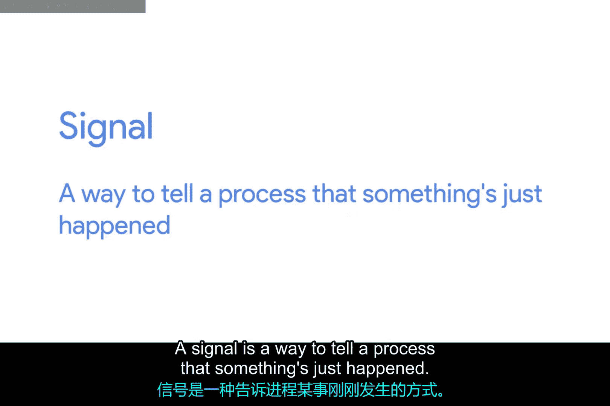
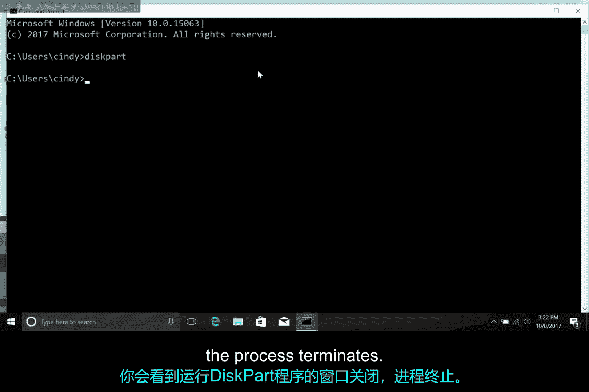

**操作系统与网络基础：第2课：Windows信号处理**

在本节课中，我们将学习操作系统如何通过“信号”来管理进程，特别是在Windows环境下如何中断或终止正在运行的程序。

想象一下，你启动了一个视频游戏，它正在花时间渲染图形。你决定不再想玩了，这时你有几个选择。你可以等待它完成加载，然后从菜单中退出游戏。或者，你可以完全中断这个过程，在系统层面告诉它退出。

这只是一个例子，说明你可能需要在进程完全完成之前关闭它。为了在系统层面告诉一个进程退出，我们使用一种叫做“信号”的东西。信号是一种告诉进程刚刚发生了某事的方式。

你可以通过键盘上的特殊字符以及其他进程和软件来生成信号。

**SIGINT信号**

你将遇到的最常见的信号之一叫做 **SIGINT**，它代表“信号中断”。你可以通过 **Ctrl + C** 组合键将这个信号发送给一个正在运行的进程。

假设你启动了我们在讨论分区格式化时看过的 `diskpart` 工具。打开命令提示符，然后启动 `diskpart`。如果你决定不想实际格式化任何磁盘，你可以按住 **Ctrl** 键并同时按下 **C** 键，将 **SIGINT** 信号发送给 `diskpart` 进程。你会看到运行 `diskpart` 程序的窗口关闭，进程终止。

**其他Windows信号**

进程可以发送和接收一些其他的Windows信号。但与Linux不同，对于最终用户来说，没有简单的方法来发出任意的信号命令。

如果你想了解更多关于Windows信号的信息，请查看补充阅读材料中的信号参考链接。

**总结**

本节课中，我们一起学习了操作系统中的“信号”概念。我们了解到信号是系统与进程通信的一种方式，用于通知进程发生了特定事件。重点掌握了在Windows中如何使用 **Ctrl + C**（对应 **SIGINT** 信号）来中断一个命令行进程。虽然Windows不像Linux那样为用户提供丰富的信号操作命令，但理解这个基本机制对于管理程序执行流程非常重要。