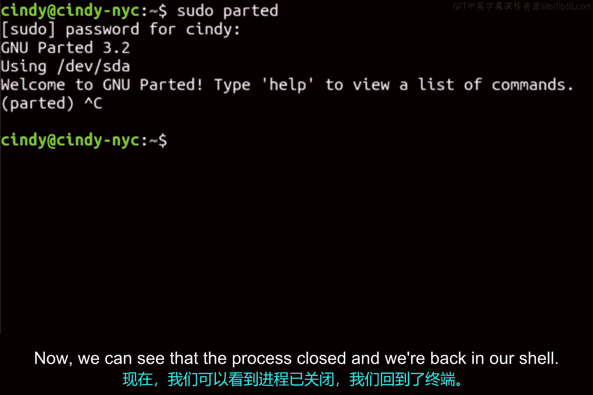

# 182：Linux信号基础

在本节课中，我们将要学习Linux操作系统中的信号机制。信号是进程间通信的一种基本方式，用于通知进程系统中发生了某个事件。我们将了解信号的命名规则、如何发送信号以及一个常见信号的实际应用。

## 信号概述

在Linux中，我们可以向进程发送多种信号。这些信号是操作系统用来通知进程有特定事件发生的一种简单通信机制。

## 信号命名规则

这些信号的名称都以`SIG`开头。例如，我们之前讨论过的`SIGINT`信号，你可以使用它来中断一个进程。

## SIGINT信号详解

`SIGINT`信号的默认操作是终止它正在中断的进程。在Linux中，你可以通过键盘组合键`Ctrl+C`来发送`SIGINT`信号。

## 实践演示

让我们通过一个实际操作来看看这个机制。我将像在Windows中那样，启动一个名为`parted`的程序。

我们可以看到现在已经进入了`parted`工具。接下来，我们尝试中断这个工具，使用`Ctrl+C`键盘组合键来中止这个进程。

现在，我们可以看到进程已经关闭，并且我们回到了命令行界面。我们成功地在进程执行中途中断并终止了它。

## 其他常见信号

Linux中使用了许多不同的信号，我们将在接下来的课程中讨论最常见的一些。

## 总结

本节课中我们一起学习了Linux信号的基础知识。我们了解了信号以`SIG`命名的规则，重点探讨了`SIGINT`信号的作用及其通过`Ctrl+C`发送的方式，并通过`parted`工具进行了实际操作演示。理解信号是掌握进程管理的重要一步。