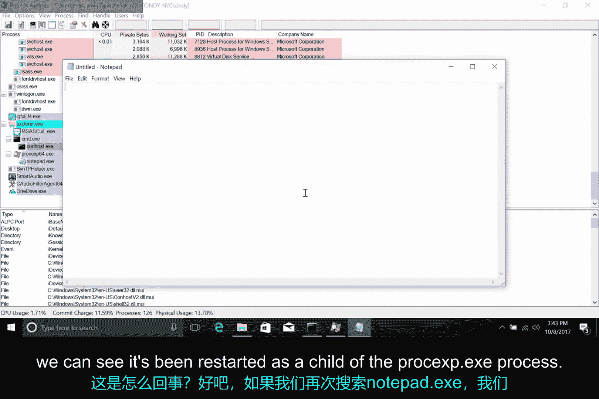
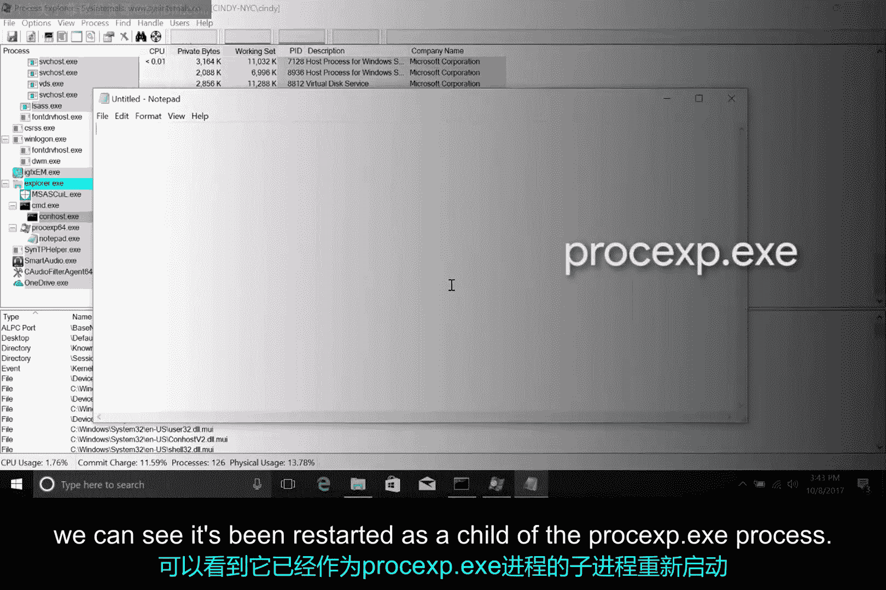
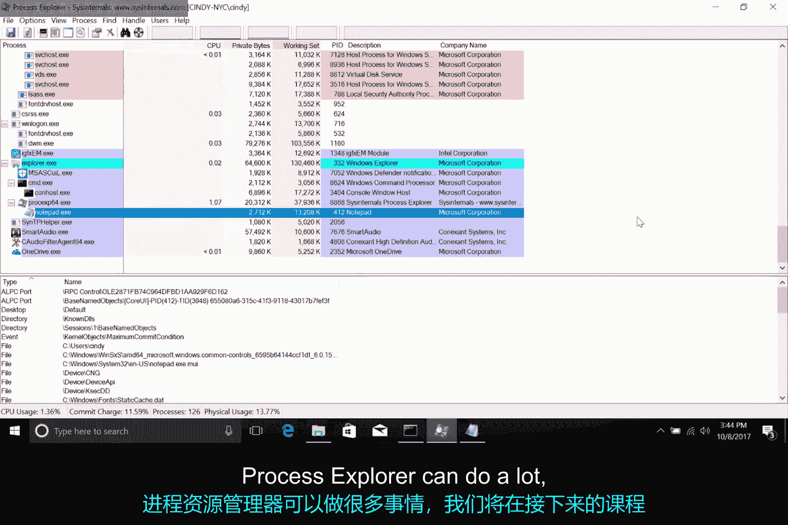

# 183：Windows进程管理进阶 🖥️

在本节课中，我们将深入学习Windows操作系统中的进程管理。之前我们已经了解了进程的基本概念以及如何使用信号来操作它们。本节我们将重点介绍一个功能强大的工具——Process Explorer，它允许您执行重启、暂停等更高级的进程管理操作。

## 进程管理工具回顾

在之前的课程中，我们讨论了进程，并看到了使用信号操作进程的一些示例。本节我们将扩展进程管理的概念，探讨其他可用于操作进程的方法。

在Windows中，我们已经了解了诸如**任务管理器**、PowerShell命令**`Get-Process`**以及**`tasklist`**实用程序等工具。我们还学习了如何通过**`Ctrl+C`**向正在运行的进程发送信号。

然而，还有一个我们尚未讨论的进程管理工具，它允许您执行重启甚至暂停进程等操作。这个工具就是**Process Explorer**。

## 认识Process Explorer 🔧

Process Explorer是微软创建的一款实用程序，旨在让IT支持专家、系统管理员和其他用户查看正在运行的进程。

虽然它没有内置在Windows操作系统中，但您可以从微软网站下载它。下载链接已在本视频后的补充阅读材料中提供。

下载并启动Process Explorer后，您将在顶部窗格中看到当前活动进程的视图。在底部窗格中，您将看到所选进程正在使用的文件列表。

如果您需要找出哪些进程使用了某个特定文件，或者想深入了解某个进程的具体行为和运作方式，这个功能会非常方便。

## 使用Process Explorer搜索进程 🔍

在Process Explorer中，您可以轻松搜索进程，方法是按**`Ctrl+F`**或点击小望远镜按钮。

让我们搜索之前打开的记事本进程。您应该会看到**`C:\Windows\System32\notepad.exe`**被列为搜索结果之一。如果您看到名为`notepad.mui`的内容，无需担心。MUI代表多语言用户界面，它包含支持不同语言的功能包。

找到`notepad.exe`进程后，请注意它在用户界面中是如何嵌套在`cmd.exe`进程之下的。这表明它是`cmd.exe`的一个子进程。

## 管理进程选项 ⚙️

如果您右键单击`notepad.exe`进程，将会看到一个可用于管理该进程的不同选项列表。请注意以下几个选项：**结束进程**、**结束进程树**、**重启**和**挂起**。

*   **结束进程**：执行您预期的操作，即终止该进程。
*   **结束进程树**：功能更强大一些。它会终止该进程及其所有后代进程。因此，由其启动的任何子进程都将被停止。
*   **重启**：这是另一个有趣的选项。您可能从其名称就能猜到它的作用。它会先停止，然后再次启动该进程。

让我们对从`cmd.exe`启动的`notepad.exe`进程执行重启操作。有趣的是，重启后，记事本不再显示为`cmd.exe`的子进程。这是为什么呢？如果我们再次搜索`notepad`，可以看到它已作为`procexp.exe`进程的子进程重新启动。`procexp.exe`是Process Explorer的进程名称。这很合理，因为Process Explorer是在我们终止记事本后负责重新启动它的进程。

## 挂起与恢复进程 ⏸️▶️

那么**挂起**选项呢？与终止进程不同，您可以使用此选项挂起进程，并可能在以后某个时间继续运行它。

如果我们右键单击并选择挂起该进程，我们将在Process Explorer输出的CPU列中看到“已挂起”一词。当进程被挂起时，它不会消耗其处于活动状态时所消耗的资源。我们可以通过右键单击并选择**恢复**选项来重新启动它。

## 总结与展望 📚

本节课中，我们一起学习了如何使用Process Explorer这一高级工具来管理Windows进程，包括搜索、结束、重启、挂起和恢复进程等操作。

Process Explorer功能非常强大，在接下来的课程中，我们将了解它可以提供的一些监控信息。我们不会详细介绍其所有功能，因此如果您感到好奇，可以查看微软网站上的文档。我们已在补充阅读材料中为您提供了链接。