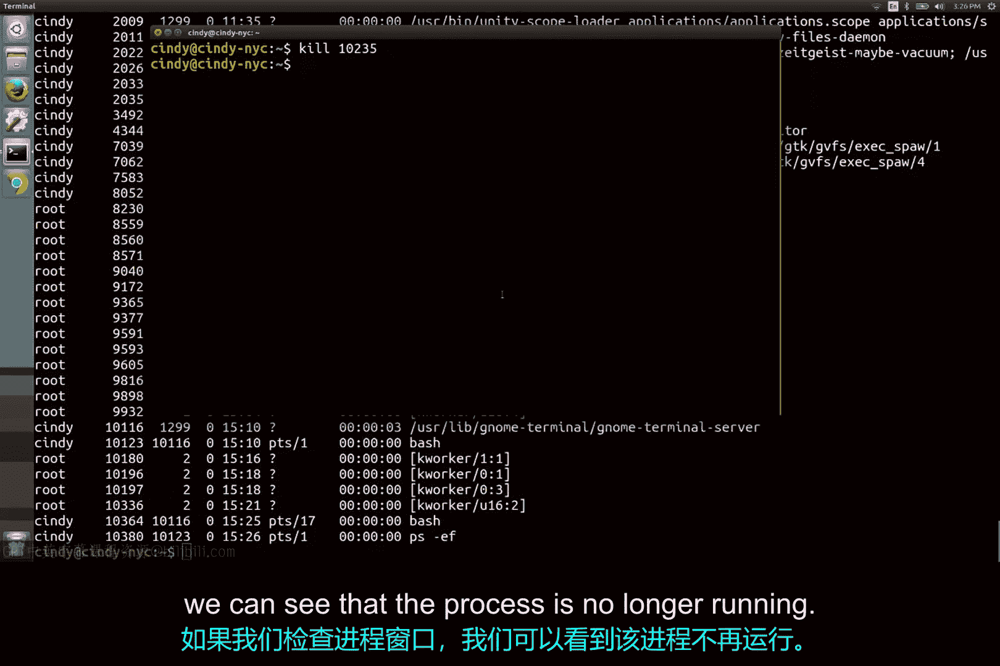
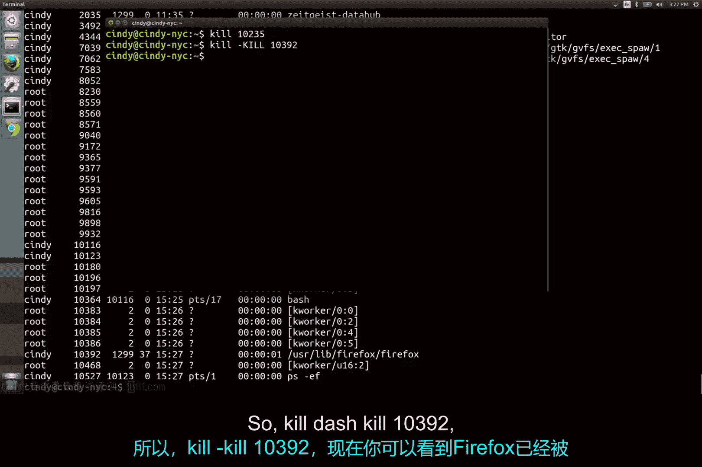
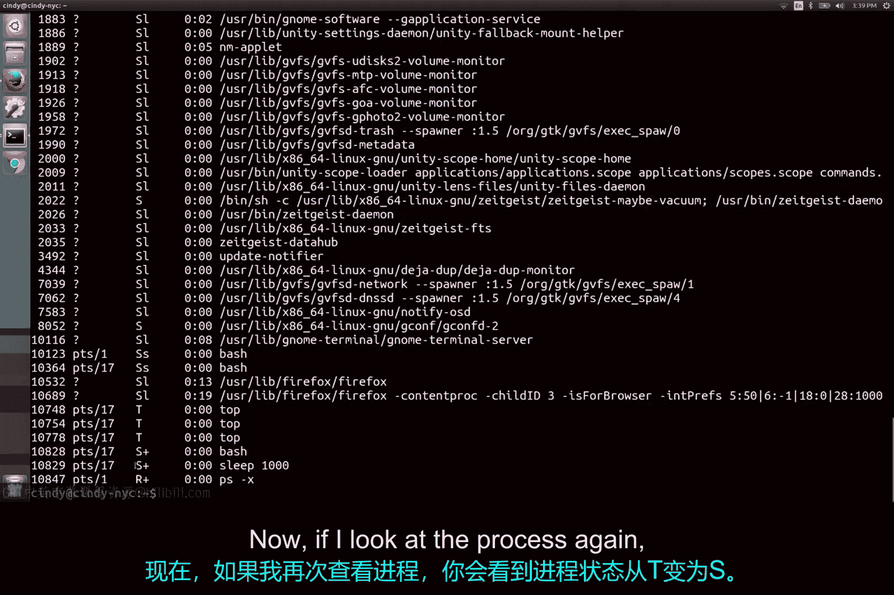

# 184：使用信号管理进程 🔧

在本节课中，我们将学习如何在Linux系统中使用信号来管理进程。我们将重点介绍如何终止、暂停和恢复进程，并理解不同信号对进程行为的影响。

## 概述

在Linux系统中，进程是运行中的程序实例。有时我们需要干预这些进程，例如终止一个无响应的程序或暂停一个任务以释放系统资源。这可以通过向进程发送特定的“信号”来实现。`kill`命令是发送这些信号的主要工具，尽管名字听起来有些严厉，但它是进程管理中的标准操作。

## 终止进程

首先，我们来学习如何终止一个进程。我们可以使用`kill`命令来完成这个操作。

`kill`命令在不带任何标志的情况下，会发送一个终止信号（SIGTERM）。这个信号会要求进程结束运行，但会给它一些时间来清理正在使用的资源。如果不给进程清理文件的机会，可能会导致文件损坏。

为了演示命令的效果，我们将保持一个进程监控窗口打开。

以下是终止进程的步骤：
1.  使用`kill`命令。
2.  后面跟上你想要终止的进程的PID（进程ID）。

例如，让我们终止一个Firefox进程。执行命令后，在进程监控窗口中可以看到该进程已经不再运行。

## 强制终止进程

你可能会遇到的另一个信号是SIGKILL信号。这个信号会强制终止你的进程。

使用SIGTERM就像告诉你的进程：“你好，我现在不需要你继续运行了，请停止你手头的工作。”而使用SIGKILL则基本上是命令你的进程：“好了，是时候结束了。”SIGKILL信号会尽最大努力确保你的进程被绝对终止，并且不会给它清理的时间。

要发送SIGKILL信号，你可以在`kill`命令后添加 `-9` 或 `-KILL` 标志。

让我们再次打开Firefox，然后使用强制终止命令：`kill -9 [PID]`。现在你可以看到Firefox已经被强制终止了。

这两种是最常见的终止进程的方法，但需要强调的是，使用`kill -9`是终止进程的最后手段。由于它不进行任何清理，你可能会对文件造成损害。

## 暂停与恢复进程

假设你有一个不想终止的进程，但也许你只是想暂停它。你可以通过发送SIGTSTOP（终端停止）信号来实现，这会使你的进程进入挂起状态。

要发送这个信号，你可以使用`kill`命令并加上 `-TSTOP` 标志。

我们可以运行`ps x`命令来查看进程的状态。然后，我们暂停一个进程：`kill -TSTOP [PID]`。现在你可以看到，该进程的状态变成了“T”（已停止）。你也可以使用键盘组合键 `Ctrl+Z` 来发送SIGTSTOP信号。

要恢复进程的执行，你可以使用SIGCONT（继续）信号。让我们再次查看进程表，并对刚才暂停的进程使用恢复命令：`kill -CONT [PID]`。现在再看进程状态，它会从“T”变回“S”。

## 核心信号总结

SIGTERM、SIGKILL和SIGTSTOP是你在Linux中处理进程时会遇到的一些最常见信号。

现在你已经掌握了这些信号，接下来让我们学习如何利用它们来更好地管理系统硬件资源。

## 总结

本节课中，我们一起学习了Linux进程管理中的核心操作——使用信号控制进程。我们介绍了如何使用`kill`命令发送SIGTERM信号来正常终止进程，使用SIGKILL信号来强制终止进程，以及如何使用SIGTSTOP和SIGCONT信号来暂停和恢复进程。理解这些信号的区别和适用场景，对于安全有效地管理系统至关重要。记住，`kill -9`应作为最后的手段使用，优先考虑给进程预留清理资源的正常终止方式。