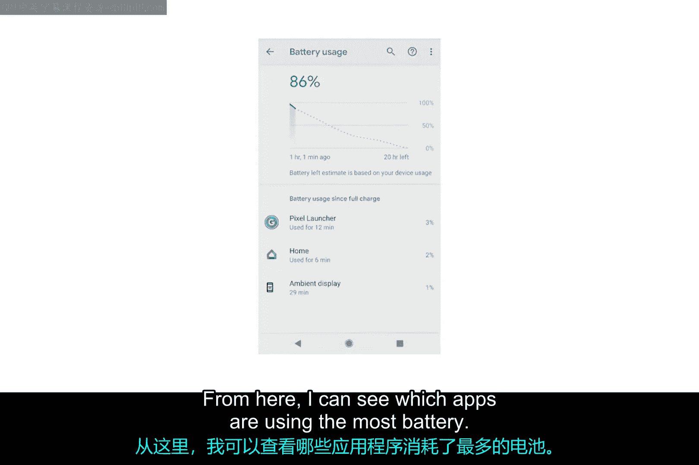

# 185：移动应用程序管理 🧑‍💻

在本节课中，我们将学习如何在iOS和Android等移动操作系统中管理正在运行的应用程序。与桌面系统不同，移动系统不直接显示进程列表，而是通过管理应用来间接控制系统资源。我们将了解前台与后台应用的区别，学习如何查看和关闭应用，并掌握诊断耗电或行为异常应用的基本方法。

## 移动应用与进程管理

在iOS和Android这类移动操作系统中，你无法直接看到一个正在运行的进程列表。取而代之的是，你需要管理在操作系统上运行的移动应用程序。当一个移动应用运行时，会有一个或多个进程与之关联，但这些细节由操作系统统一管理。

上一节我们介绍了移动应用管理的基本概念，本节中我们来看看如何管理正在运行的移动应用，并理解它们是如何使用移动设备资源的。

## 查看正在运行的应用

作为IT支持专家，你可能需要帮助终端用户排查移动设备运行缓慢的问题并管理他们的移动应用。我们将展示一些你可能看到的示例，但如果你的设备界面与示例不同，可能需要参考设备的官方文档。

首先，让我们通过打开应用切换器来检查设备上当前正在运行哪些应用。在iOS系统中，从应用切换器中，我可以看到此iPhone上正在运行的应用列表。

现在让我们在Android系统中进行同样的操作。很好，我启动的每一个应用都列在这里。我可以滚动浏览此列表，并通过点击切换到某个应用。现在我可以使用这个计算器了。

## 前台应用与后台应用

我们正在使用的应用被称为**前台应用**。所有其他应用都处于**后台**。

当我在计算这个兆字节包含多少比特时，你认为后台应用正在发生什么？细节可能有点复杂，但基本思想是这样的：操作系统会尽可能快地**挂起**后台移动应用。一个被挂起的应用是暂停的，但并未关闭。操作系统偶尔会唤醒一个后台应用，允许它做一些工作，但会尽可能多地让应用保持挂起状态。

让我们回到主屏幕。现在我位于主屏幕上，所有应用都处于后台，没有前台应用。计算器并没有被关闭。你打开的每个新应用都会被置于后台，并且通常会被挂起。这有助于设备节省电池电量。

## 诊断与关闭行为异常的应用

作为IT支持专家，一个非常实用的技巧是了解移动设备上哪些应用最耗电。如果一个应用因为持续在后台工作或卡住而无法被操作系统挂起，它可能会拖慢你的设备并消耗电池。IT支持专家经常需要找出这些行为异常的应用并关闭或卸载它们。

以下是关闭应用的方法：

*   在iOS应用切换器中，我们可以在任何后台应用上向上滑动。这将关闭该应用。
*   在此版本的Android系统中，我们也可以在这里滑动，并点击“全部清除”来一次性关闭所有应用。

你可以通过逐个关闭应用来排查行为异常的应用，观察是否有某个特定的应用导致设备变慢。有时，关闭一个行为异常的应用就足以让你的设备重新流畅运行。从当前正在使用的应用开始尝试，看看是否有帮助。应用切换器按照从最近使用到最久未使用的顺序显示应用。按时间顺序反向尝试，一次处理一个应用。

请记住，为了让设备正常工作，你不应该经常进行此操作。在当前版本的iOS和Android中，除非应用行为异常，否则你永远不必为了性能原因而关闭应用。实际上，关闭并重新打开一个应用可能比你让它继续运行更耗电。

## 检查应用电池使用情况

如果你发现某个应用经常行为异常，可以尝试像我们在之前的视频中看到的那样，通过清除其缓存来完全重置它。如果在关闭所有应用后设备仍然运行缓慢，接下来可以尝试简单地重启设备。如果重启设备不能解决性能问题，或者只是暂时修复，那么我们需要进行更深入的排查。

让我们检查已安装应用的电池使用情况。在iPhone上，我进入“设置”应用，然后是“电池”，接着是“电池健康”。在这里，我可以看到自上次充电以来电池的消耗速度。我还可以看到哪些应用最耗电。

让我们查看Android中的相同设置。同样，我进入“设置”应用，从这里选择“电池”，然后是“更多电池设置”或“电池使用情况”。从这里，我可以看到哪些应用最耗电。

如果我发现某个应用耗电量很大，那么它可能没有按预期工作，或者它本身就是一个需要大量电池才能工作的应用。你需要了解终端用户需要哪些应用，才能判断电池使用情况是否异常。

## 总结

本节课中我们一起学习了移动应用程序管理的基础知识。我们了解到移动操作系统通过管理应用而非直接管理进程来控制系统资源，区分了前台应用与后台应用的不同状态。我们掌握了查看、切换和关闭应用的方法，并学习了如何通过检查电池使用情况来诊断行为异常的应用。记住，在正常情况下无需频繁关闭应用，只有当应用出现卡顿、异常耗电等问题时，才需要进行针对性的管理和排查。