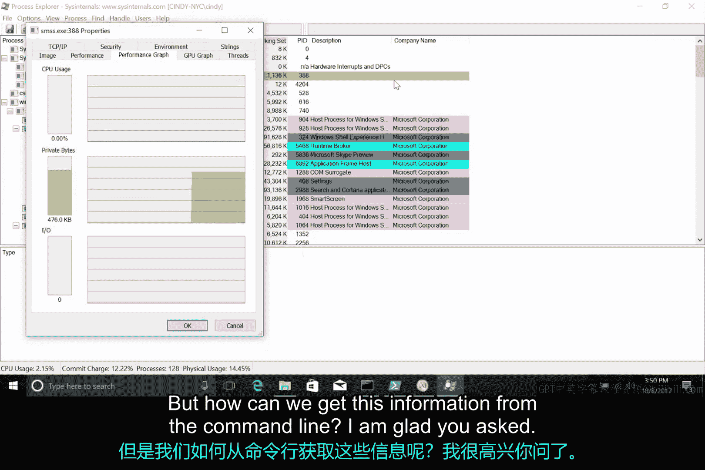
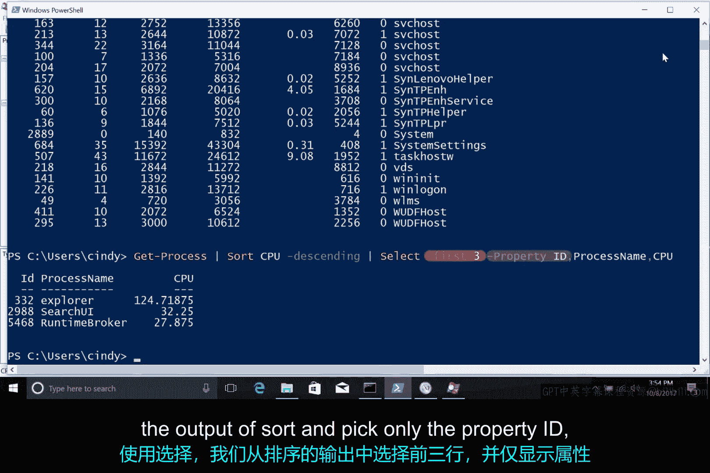

# 186：Windows资源监控 🖥️

在本节课中，我们将学习如何在Windows操作系统中监控系统资源，特别是进程的资源使用情况。我们将介绍图形界面工具和命令行工具，帮助你识别和管理可能影响系统性能的进程。

## 概述

上一节我们介绍了进程的基本概念及其管理方法。本节中，我们来看看如何在Windows系统中监控进程的资源使用情况。当进程行为异常或消耗过多资源时，这些监控技能在IT支持工作中将非常有用。

## 使用资源监控工具

Windows系统提供了有效的方法来监控进程并识别可能出现问题的进程。其中，资源监控工具是一种快速查看系统资源状态的常用方式。

你可以在多个位置找到此工具，我们将直接从开始菜单启动它。打开后，你会看到五个信息选项卡。第一个选项卡提供了系统所有资源的概览，其余每个选项卡则专门显示系统特定资源的信息。

资源监控器也会显示进程信息，以及进程所消耗资源的数据。

## 进程资源性能视图

你可以从进程资源管理器中获取性能信息，其展示的细节稍少一些。

只需选择你感兴趣的进程，右键点击并选择“属性”。然后，选择“性能图”选项卡。你可以看到当前CPU、内存（由“专用字节”指示）和磁盘活动（由I/O指示）的快速可视化图表。



## 命令行资源监控

那么，我们如何从命令行获取这些信息呢？

有多种方法可以从命令行获取此信息，但我们将重点介绍一种以PowerShell为中心的方法，即使用我们的朋友 `Get-Process` 命令。

我们知道，如果运行不带任何选项或标志的 `Get-Process` 命令，会获取系统上每个运行进程的信息。

如果你查看输出开头的列标题，会看到诸如 `NPM(K)` 的值。此列中的值表示进程正在使用的非分页内存量，`K` 代表单位千字节。你可以在接下来的补充阅读中查看微软文档，了解每列的完整说明。

这很有用，但信息量很大。将信息过滤到你只感兴趣的数据会非常有帮助。

假设你只想显示使用最多CPU的前三个进程，你可以编写以下命令：

```powershell
Get-Process | Sort-Object CPU -Descending | Select-Object -First 3 -Property ID, ProcessName, CPU
```

就这样，我们得到了系统上消耗CPU最多的前三个进程。这个命令可能有点难以理解，所以让我们逐步分析。

首先，我们调用 `Get-Process` cmdlet 从操作系统获取所有进程信息。
然后，我们使用管道将那个命令的输出连接到 `Sort-Object` 命令。
你可能还记得之前在Linux示例中提到的管道。
我们按CPU列降序排序 `Get-Process` 的输出，将最大的数字放在前面。
然后，我们将该信息通过管道传递给 `Select-Object` 命令。
使用 `Select-Object`，我们从排序后的输出中选取前三行，并仅选择属性ID、进程名和CPU使用量来显示。

## 过渡到Linux监控

现在你已经了解了Windows提供的用于调查资源使用的命令行和图形工具的一些知识，接下来让我们看看Linux的资源监控。



## 总结

本节课中，我们一起学习了在Windows系统中监控进程资源使用情况的方法。我们介绍了如何使用图形化的资源监控工具和进程资源管理器查看性能图表，并重点讲解了如何在PowerShell中使用 `Get-Process` 命令结合管道、排序和筛选来获取特定的进程资源信息。这些技能对于诊断系统性能问题和进行有效的IT支持至关重要。