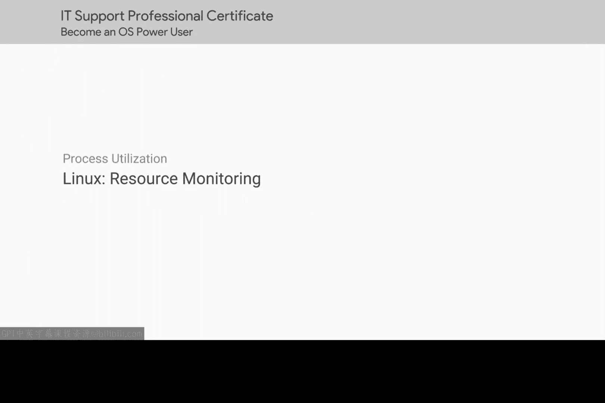
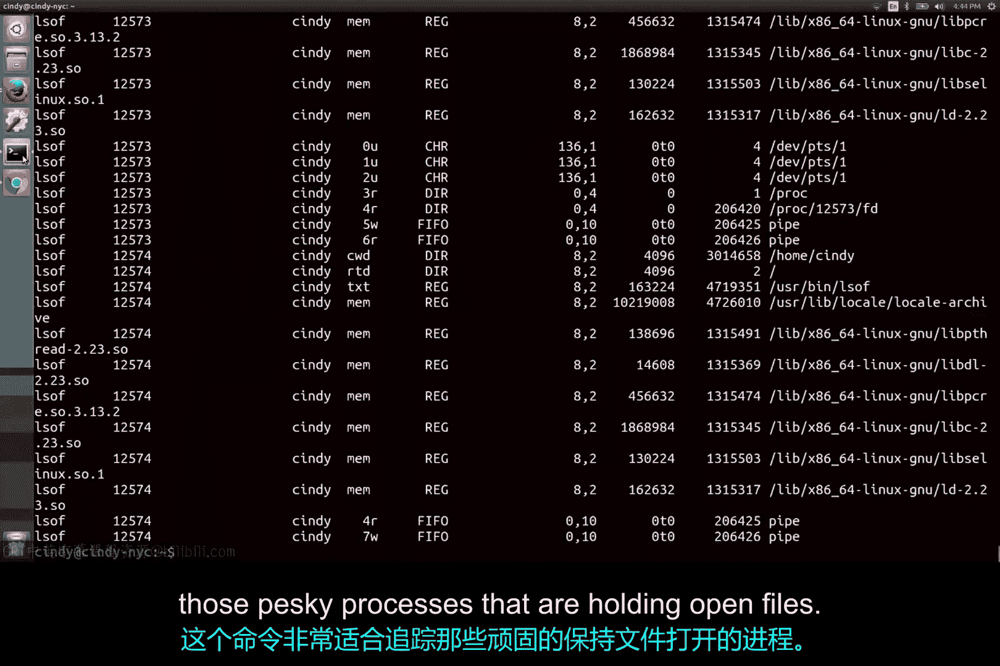

# 187：资源监控 🖥️

在本节课中，我们将学习如何在Linux系统中监控硬件资源的使用情况。掌握这些工具对于诊断系统性能问题至关重要。

---

## 实时进程监控：`top`命令

上一节我们介绍了进程的基本概念，本节中我们来看看如何实时监控它们。一个用于实时查看系统资源利用情况的实用命令是 `top` 命令。

`top` 命令向我们展示了占用机器最多资源的顶级进程。它还能快速显示运行或空闲的总任务数、CPU使用率、内存使用率等信息。

使用 `top` 命令时，最常查看的位置之一是这些字段：`%CPU` 和 `%MEM`。它们显示了单个任务所占用的CPU和内存使用率。

要退出 `top` 命令，只需按 `Q` 键（代表退出）。

---

## 诊断性能问题

您可能遇到的一个常见情况是用户的计算机运行有点慢。这可能有多种原因，但最常见的原因之一是硬件资源的过度使用。

如果您发现 `top` 命令显示某个任务占用了大量内存或CPU，您应该调查该进程正在做什么。您甚至可能终止该进程，以便它释放正在使用的资源。

---

## 系统运行时间与负载：`uptime`命令

另一个用于查看资源利用情况的实用工具是 `uptime` 命令。此命令显示有关当前时间、系统已运行时长、有多少用户登录以及机器的平均负载的信息。

从这里我们可以看到当前时间是16:43（或4:43 PM）。我们的系统已运行了5小时8分钟，并且有1个用户登录。我们想重点讨论的部分是系统平均负载。它显示了1分钟、5分钟和15分钟间隔内的平均CPU负载。

平均负载是一个有趣的度量指标。当您需要查看机器在特定时间段内的表现时，它们会变得非常有用。我们不会在此深入探讨平均负载，但您应该在下一篇补充阅读材料中了解它们。

---

## 追踪文件使用情况：`lsof`命令

另一个可用于帮助管理进程的命令是 `lsof` 命令。假设您有一个USB驱动器连接到您的机器。您正在处理机器上的一些文件。然后当您尝试弹出USB驱动器时，您收到一个错误，提示“设备或资源忙”。您已经检查过USB驱动器上的所有文件都没有在使用或在任何地方打开。

或者您认为是这样。使用 `lsof` 命令，您就不必猜测了；它会列出打开的文件以及哪些进程正在使用它们。这个命令非常适合追踪那些占用着文件的棘手进程。

---

## 硬件监控的扩展应用

关于硬件利用率，最后要指出的一点是，您可以独立于进程来监控它。如果您只想查看CPU或内存的运行情况，可以使用各种命令来检查它们的输出。

在单台机器上查看这一点可能不是立即可见其用处，但也许在未来，如果您管理一批机器，您可能会考虑一次性监控所有机器的硬件利用率。我们不会讨论如何做到这一点，但您可以在补充阅读材料中了解更多信息。

---

## 总结

您在本模块中完成了一些非常出色的工作。您学到了很多关于如何读取进程信息和管理进程的知识。这对于您作为IT支持专家在排除故障时至关重要。

接下来的评估将测试您新掌握的进程管理知识。然后，请做好准备，我们将进入本课程的最后一课。我们将介绍IT支持专家角色中使用的一些基本工具。😊