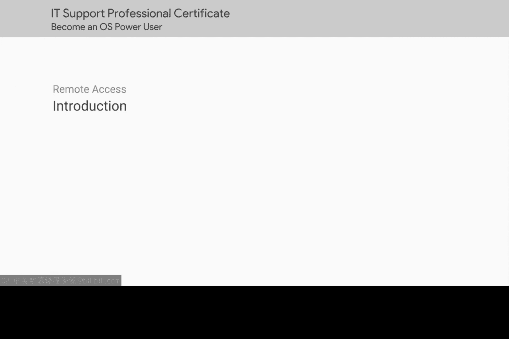

# 188：介绍

## 概述
在本模块中，我们将完成操作系统课程的学习。我们将回顾已掌握的关键技能，并介绍一些在IT支持工作中会频繁使用的、更实用的操作系统知识。

你已经成功抵达本课程的最后一个模块。到目前为止，你表现非常出色。你已经学会了如何操作Windows和Linux操作系统，如何设置和管理用户，以及如何管理软件。你还学习了如何处理磁盘和文件系统，以及如何管理进程和硬件资源。这些都是非常重要的工作成果。

你在本课程中学到的技能，对于构建作为IT支持专家的坚实技术基础至关重要。

现在，让我们以强劲的势头完成最后的学习。在接下来的几节课中，我们将通过介绍一些在IT支持中会经常用到的、更实用的操作系统知识来结束本课程。

让我们开始吧。

## 总结
本节课我们一起回顾了本课程已涵盖的核心技能，包括操作系统导航、用户与软件管理、磁盘文件系统以及进程与硬件资源管理。这些是IT支持工作的基础。接下来，我们将进入更实用的操作环节，为实际工作做好准备。