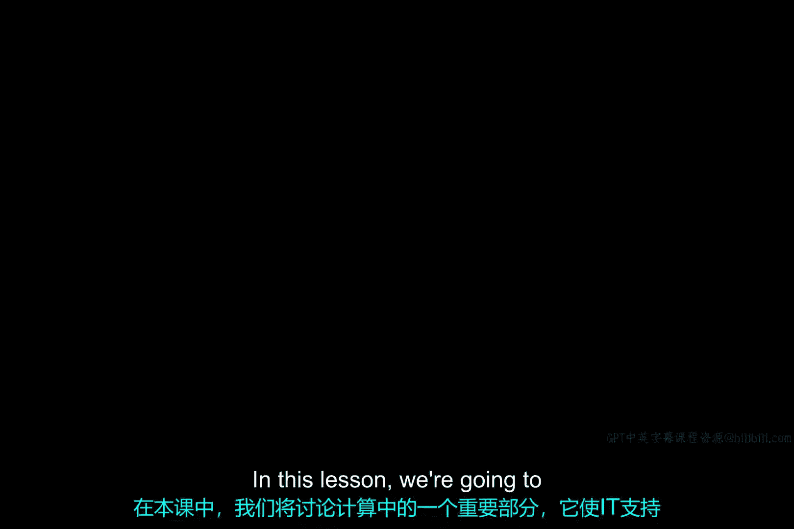
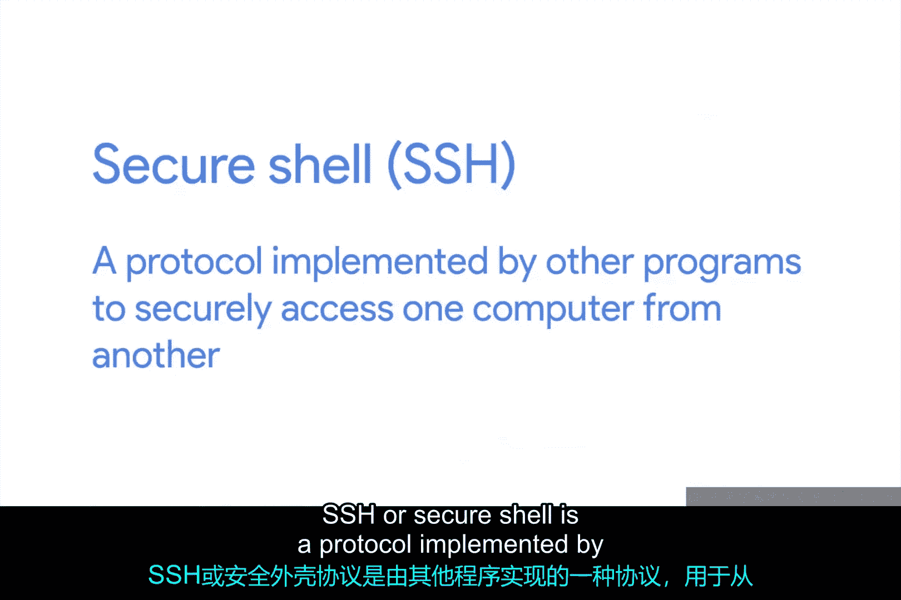
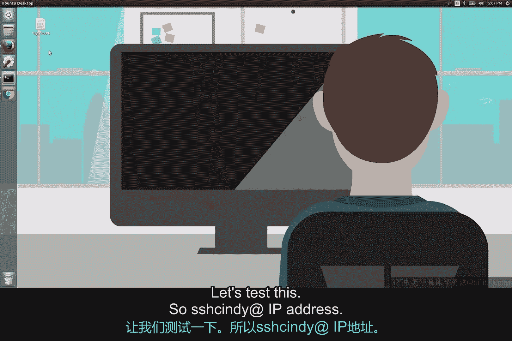
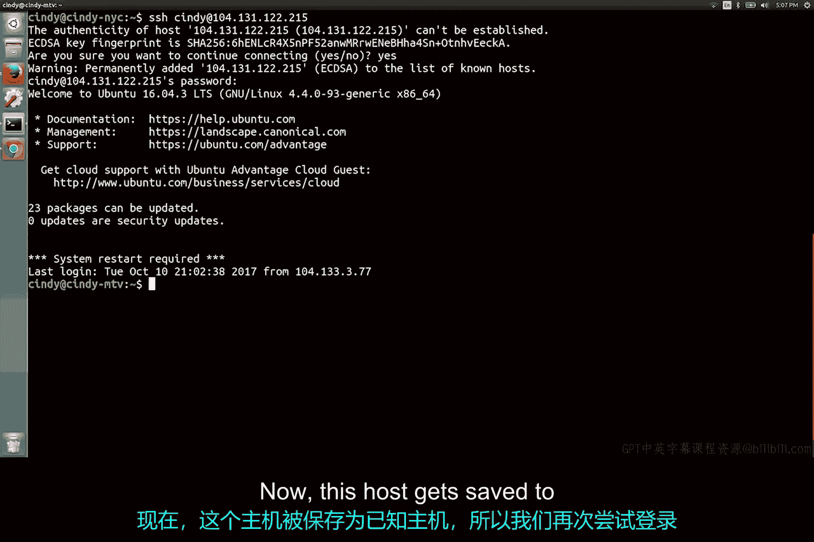
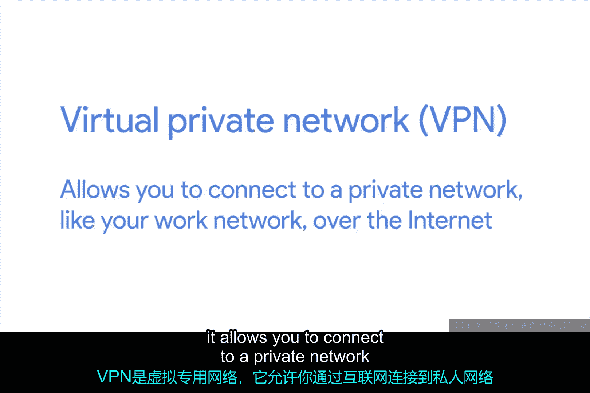

# 189：远程连接与SSH 🔗



在本节课中，我们将学习一个重要的计算概念——远程连接。这个概念能让IT支持工作变得更加便捷，实际上，它几乎能让所有人的工作都轻松不少。

想象一下这个场景：你正在去参加一个重要会议的路上，为这次演示准备了一整周，现在你准备好向高层展示你的成果了。但是等等，演示文稿在哪里？它不在你的笔记本电脑上，那会在哪里？结果是你把唯一的副本忘在家里的台式机上了。现在掉头回去拿已经太晚了，所以你只能坐在那里，等待着不可避免的尴尬时刻。

但是等一下，你突然想起来，你的笔记本电脑和台式机之间设置了远程连接。你利用这个连接登录到家中的电脑。就像你正坐在家里一样，你能够从台式机上获取文件，并将其复制到笔记本电脑上。然后，你成功地完成了一场精彩的演示。

再考虑另一个场景：你在商店买了一台电脑，但它出现了很多问题。商店有一个电脑服务台可以帮你解决问题，但现在已经下班，商店关门了。你急需解决电脑问题，那么你有什么选择？幸运的是，商店提供24/7的在线技术支持。现在，你无需等到实体店再次开门，就可以联系到在线技术人员，让他们通过远程连接帮助你解决问题。

远程连接让IT支持角色的工作变得容易得多，因为它允许我们从世界任何地方管理多台机器。

## 什么是SSH？🔐

上一节我们介绍了远程连接的概念，本节中我们来看看实现安全远程连接的核心协议——SSH。

SSH，即安全外壳协议，是一种由其他程序实现的协议，用于安全地从一台计算机访问另一台计算机。要使用SSH，你需要在发起连接的计算机上安装SSH客户端，并在你试图连接的目标计算机上安装SSH服务器。



需要记住的是，当我们说SSH服务器时，并不是指另一台提供数据的物理机器。SSH服务器只是一个软件。在远程机器上，SSH服务器以后台进程的形式运行。它会持续检查是否有客户端试图连接，然后对连接请求进行身份验证。

在Linux系统中，最流行的SSH程序是OpenSSH。我们稍后会讨论如何使用流行的开源程序PuTTY在Windows机器上使用SSH。现在，我们先谈谈使用SSH时会发生什么。

## 如何使用SSH登录？💻

我们将向你展示一个通过SSH登录远程机器的示例。首先，要登录远程机器，我们必须在该计算机上拥有一个账户。我们还需要知道该计算机的主机名或IP地址。



让我们来测试一下。以下是连接命令的基本格式：
```bash
ssh username@hostname_or_ip_address
```
例如，输入 `ssh cindy@192.168.1.100`。

你可能会看到这样一条消息：“无法建立主机的真实性...”。这条消息只是说我们以前从未连接过这台机器，我们的SSH客户端无法真正验证我们是否连接到了想要连接的目标机器。但我们可以验证这是正确的机器，所以直接输入 `yes` 继续即可。



现在，这台主机将被保存为“已知主机”，这样我们下次尝试登录时就不会再看到这条消息了。

## SSH连接后的操作与身份验证 🔑

好了，现在我们通过SSH连接上了。我们输入的任何文本命令都会被安全地发送到SSH服务器。从这里开始，你甚至可以启动一个应用程序，让你看到图形用户界面，而不仅仅是直接在命令行中工作。你可以在补充阅读材料中了解更多相关信息。

正如之前所见，我们可以使用密码连接SSH。这种对远程机器进行身份验证的方式相当标准，但并不是超级安全。另一种方式是使用SSH认证密钥。

SSH密钥成对出现，称为私钥和公钥。你可以把它们想象成打开一个特殊保险箱的实际物理钥匙。你可以用一把钥匙锁上保险箱，但它打不开保险箱。另一把钥匙只能打开保险箱，但不能锁上它。这基本上就是公钥和私钥的工作原理：你可以用公钥锁住某些东西，但只能用私钥打开它，反之亦然。这确保了保险箱里的东西只有同时拥有公钥和私钥的人才能访问。

你将在我们的IT安全课程中学习公钥和私钥的技术细节。如果现在不理解也不用担心，以后会明白的。这就是SSH的基本工作原理，并不太可怕，对吧？

## 另一种安全连接方式：VPN 🌐

另一种可以安全连接到远程机器的方式是通过VPN。VPN是虚拟专用网络的缩写。它允许你通过互联网连接到专用网络，比如你的工作网络。



可以把它看作是一个更复杂、设置更多的SSH。它允许你访问共享文件服务器和网络设备等资源，就像你连接到了工作网络一样。剧透一下：我们同样会在IT安全课程中探讨VPN背后的技术细节。

## 总结 📝

本节课中我们一起学习了远程连接及其工作原理。我们探讨了SSH协议如何实现安全登录，以及公钥/私钥对的基本概念。我们还简要介绍了VPN作为另一种远程访问方式。在系统管理课程中，我们将进一步讨论Windows和Linux上流行的远程连接程序以及如何设置它们。