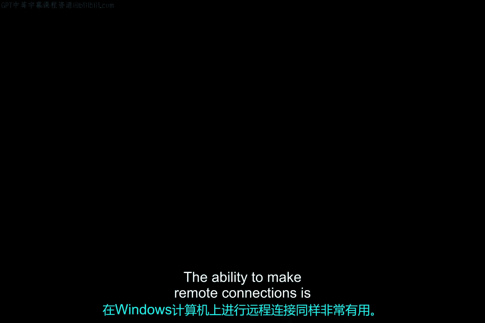
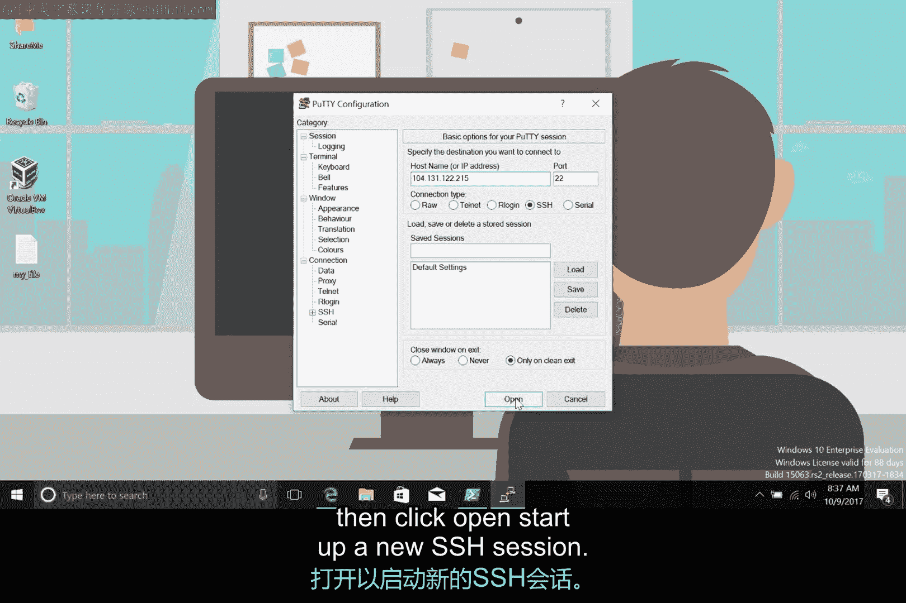
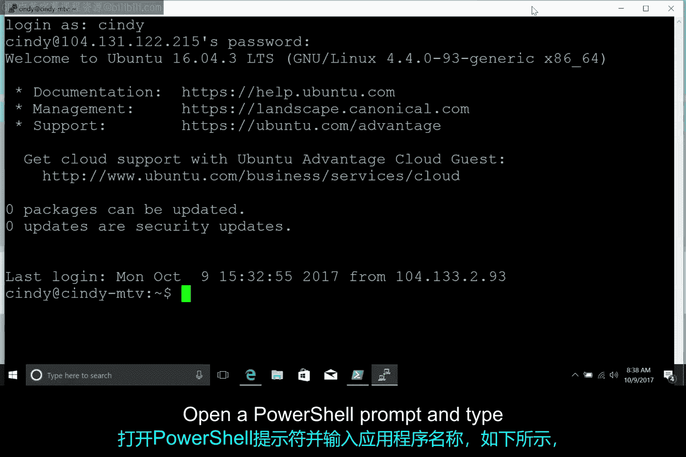
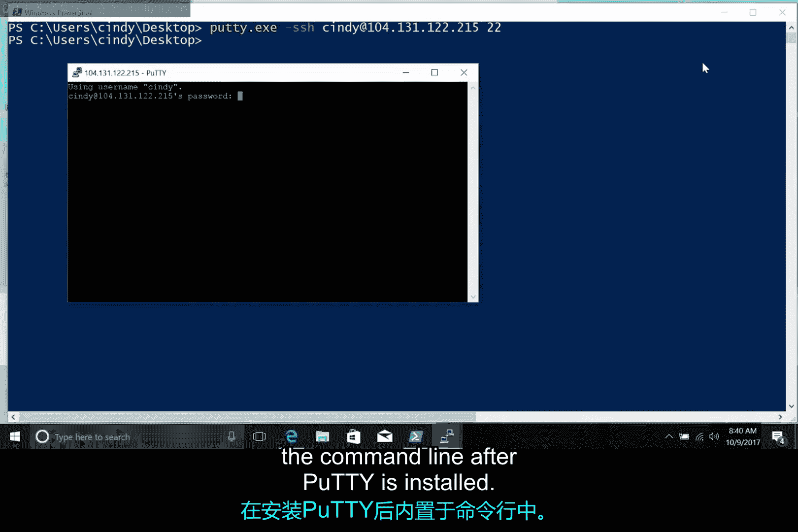
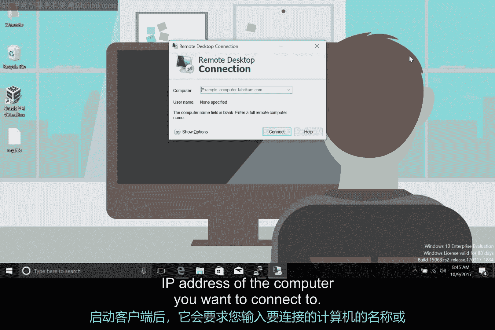

# 190：Windows上的远程连接 🔗

在本节课中，我们将学习如何在Windows计算机上建立远程连接。远程连接功能允许您从一台计算机访问和控制另一台计算机，这对于故障排除、文件管理或远程工作至关重要。我们将介绍两种主要工具：PuTTY（用于SSH连接）和远程桌面协议（RDP）。



## 远程连接工具概述

上一节我们介绍了远程连接的基本概念，本节中我们来看看在Windows系统上实现远程连接的具体工具。PuTTY是一个广泛使用的免费开源软件。

### 使用PuTTY进行SSH连接

PuTTY可用于通过多种网络协议建立远程连接，其中包括SSH（安全外壳协议）。您可以通过其官网下载完整的软件包（包含Microsoft安装程序，即MSI文件），或选择特定的可执行文件（如 `putty.exe`）来获取所需功能。

以下是启动和使用PuTTY图形界面（GUI）的基本步骤：



1.  启动PuTTY后，会出现一个窗口，显示连接的基本选项。
2.  注意**主机名**、**端口**和**连接类型**选项。默认端口为 `22`，这是SSH协议的默认端口；连接类型默认设置为SSH。
3.  输入您想要连接的目标计算机的主机名或IP地址。
4.  点击“打开”以启动新的SSH会话。

此时，您已通过SSH连接到远程计算机。



### 在命令行中使用PuTTY

除了图形界面，您也可以在命令行中使用PuTTY。以下是具体方法：

打开PowerShell提示符，输入应用程序名称 `putty`，并通过添加 `-ssh` 选项指定通过SSH连接。您还可以以 `user@IP地址` 的形式提供用户名和地址，并在末尾指定端口。



完整的命令格式如下：
```powershell
putty -ssh user@192.168.1.100 -P 22
```

此外，PuTTY安装后会在命令行中内置一个名为Plink（或PuTTY Link）的工具。您同样可以使用Plink来建立远程SSH连接。

### 使用远程桌面协议（RDP）

SSH非常有用，特别是当您需要从Windows计算机连接到远程基于Linux的操作系统时。对于连接到其他Windows计算机，微软提供了另一种方式：远程桌面协议（RDP）。Linux和macOS也有相应的RDP客户端。

RDP为用户提供了远程计算机的图形用户界面，前提是远程计算机已启用传入的RDP连接。一个名为Microsoft终端服务客户端（`mstsc.exe`）的程序用于创建到远程计算机的RDP连接。

您可以通过以下步骤在计算机上启用远程连接：

1.  打开“开始”菜单，右键点击“此电脑”，然后选择“属性”。
2.  选择“远程设置”。
3.  在面板的“远程桌面”部分选择一个选项。

允许他人远程连接到您的计算机会带来一些安全隐患，您应该只允许受信任的用户进行此操作。通常在商业环境中，此类设置由系统管理员为公司内连接到网络的计算机统一配置。

在远程计算机上允许连接并将您添加到允许访问的用户列表后，您就可以使用远程桌面客户端 `mstsc` 从网络上的任何其他位置连接到它。

您可以通过几种方式启动RDP客户端：

*   在“运行”框中键入 `MSTSC`。
*   在“开始”菜单中搜索“远程桌面连接”。

启动客户端后，它会要求输入您要连接的计算机的名称或IP地址。Windows RDP客户端也可以从命令行启动，您可以在其中指定更多参数，例如如果您想使用管理员凭据连接到远程计算机，可以添加 `/admin` 参数。

## 总结



本节课中我们一起学习了在Windows系统上建立远程连接的两种主要方法。我们首先介绍了使用PuTTY通过SSH协议进行命令行远程连接，包括其图形界面和命令行的使用方法。接着，我们探讨了用于Windows计算机间图形化远程控制的远程桌面协议（RDP），涵盖了如何启用RDP服务以及如何使用客户端进行连接。掌握这些工具将极大地帮助您进行远程系统管理和技术支持。