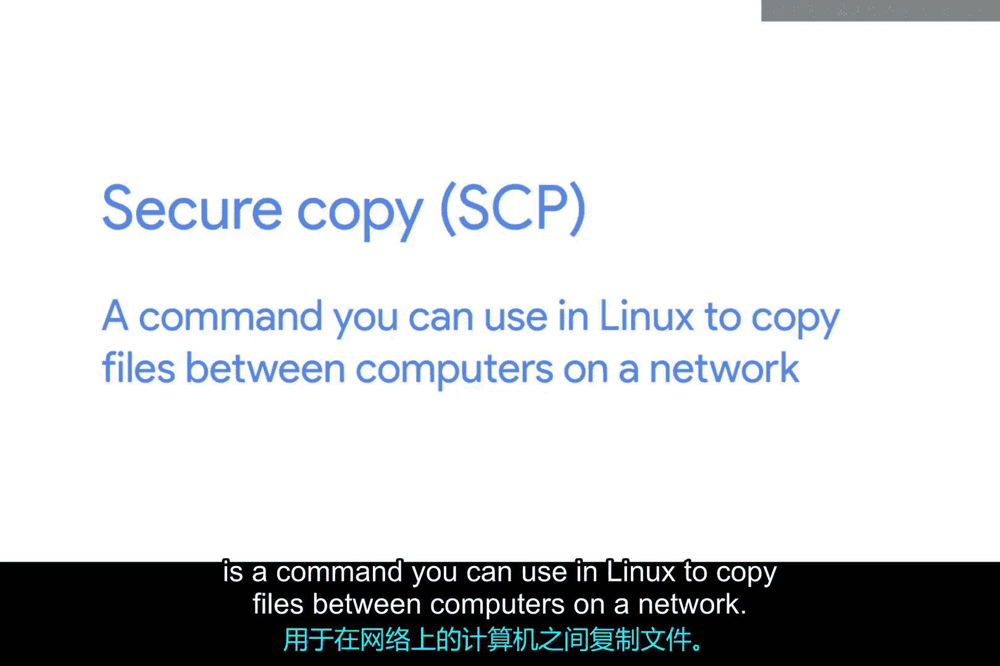

# 191：远程连接与文件传输

在本节课中，我们将学习一种通过网络远程连接来安全传输文件的方法。这种方法对于在不同计算机之间共享文件非常有用。

## 概述

你是否曾尝试向同事发送文件？你使用什么方法？是通过电子邮件附件发送，还是将文件复制到U盘再进行传输？文件传输的方式有很多种。本节我们将讨论一种利用远程连接进行传输的方法。

## 使用SCP进行安全文件复制



上一节我们介绍了远程连接的基本概念，本节中我们来看看如何利用这种连接进行文件传输。

SCP，即安全复制，是Linux系统中一个用于在网络上的计算机之间复制文件的命令。它利用SSH协议来传输数据。正如你可以通过SSH连接到一台机器一样，你也可以通过这种方式发送文件。

让我们通过一个例子来看看它的实际应用。假设我们想将文件从自己的计算机复制到另一台计算机上。

以下是执行此操作的基本命令格式：
```bash
scp [本地文件路径] [用户名]@[主机名]:[远程目标路径]
```

具体操作步骤如下：

1.  打开终端或命令行界面。
2.  输入SCP命令，指定要传输的本地文件路径、目标计算机的用户账户、主机名以及远程计算机上的目标路径。
3.  命令执行后，系统会提示你输入目标计算机的登录密码。
4.  输入正确的密码后，文件传输便会开始。

传输完成后，你可以登录到目标计算机验证文件是否已成功复制过去。


SCP命令是在网络中的计算机之间复制文件的超级实用工具。如果你需要了解更多关于该命令的详细信息，可以通过查看其手册页来获取：
```bash
man scp
```

## 总结

本节课中，我们一起学习了如何使用SCP命令通过网络进行安全的远程文件传输。我们了解了其基本命令格式和操作步骤，认识到它是基于SSH协议工作的，是系统管理员和IT支持人员工具箱中的一个重要工具。