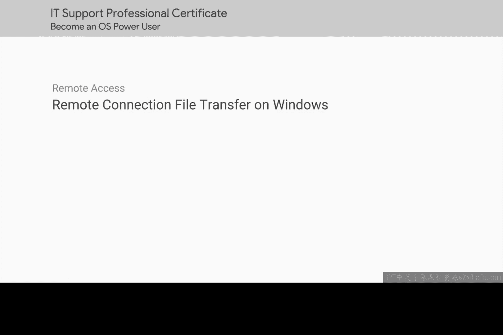
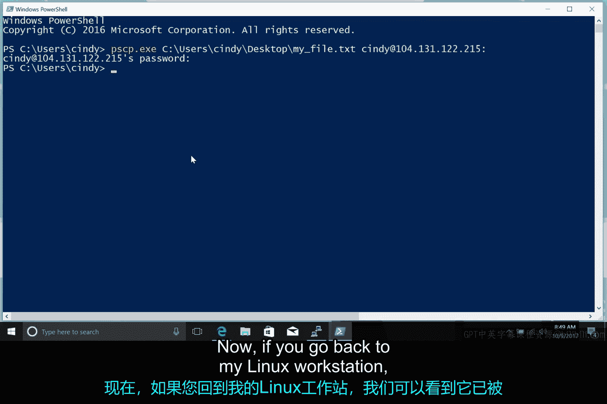
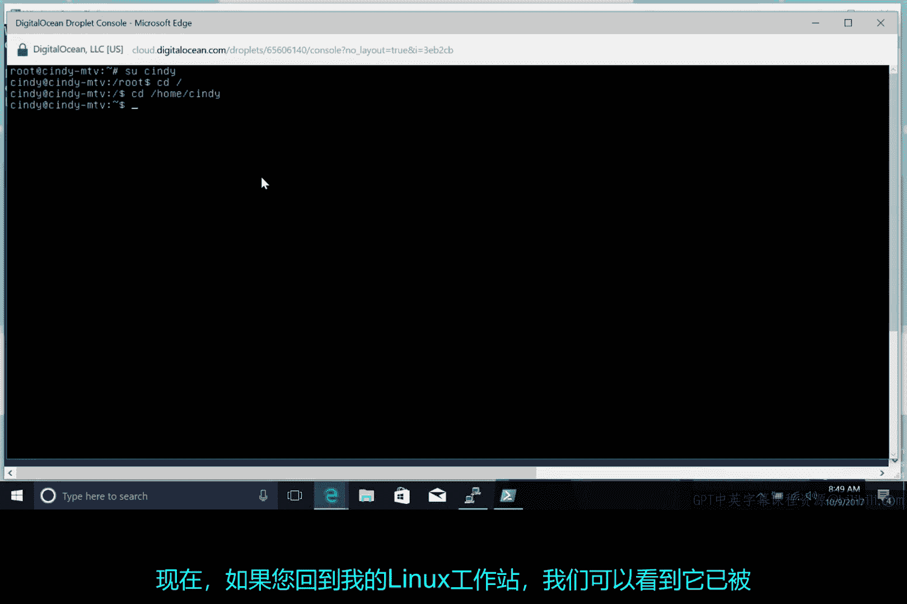
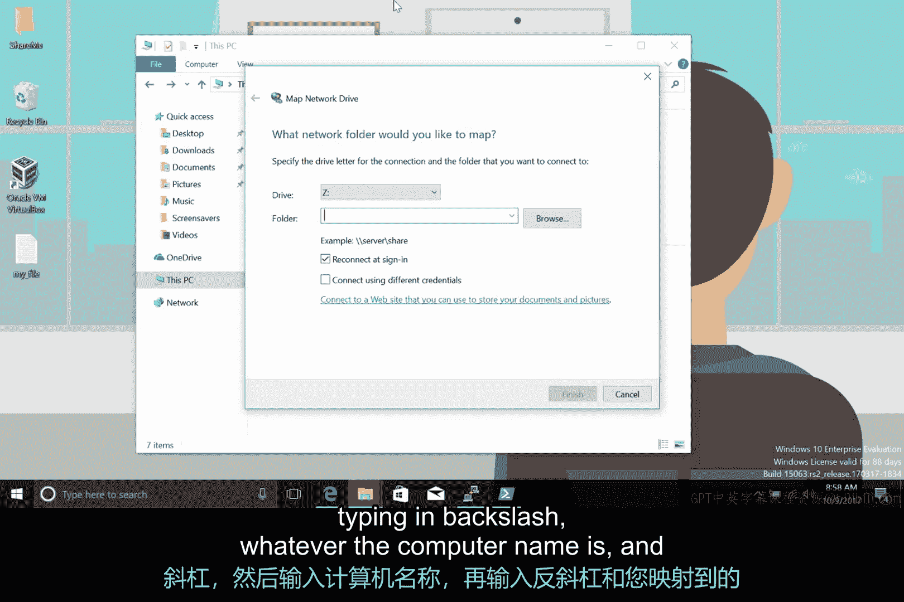
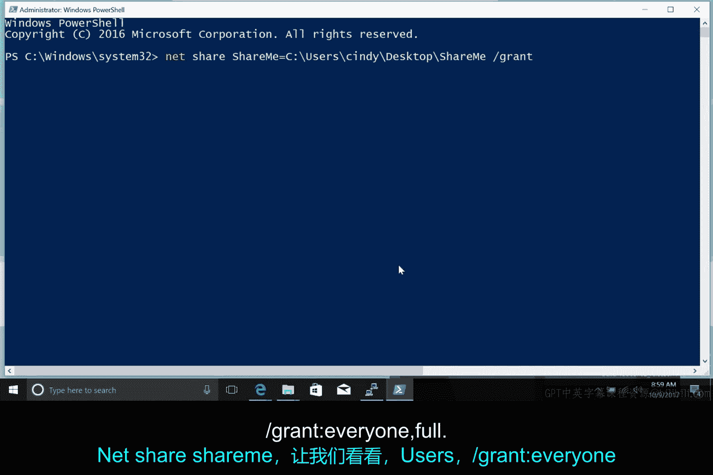
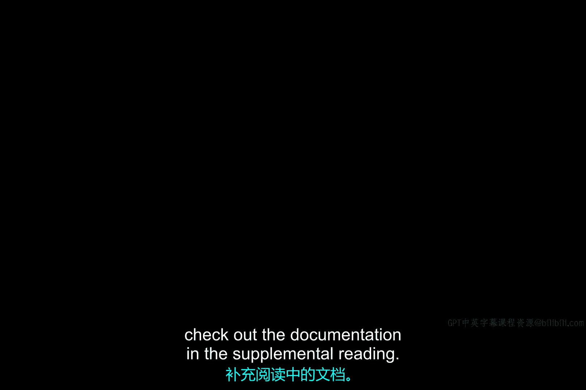

# 192：Windows上的远程连接与文件传输



在本节课中，我们将学习如何在Windows计算机上通过网络共享文件和数据。我们将介绍两种主要方法：使用PuTTY工具进行安全的命令行文件传输，以及利用Windows内置的共享文件夹功能。

## 使用PuTTY的PSCP工具传输文件

上一节我们介绍了远程连接的基础知识，本节中我们来看看如何在Windows和Linux系统之间传输文件。PuTTY程序支持SCP协议，其软件包中包含一个名为PuTTY安全复制客户端（PSCP）的工具。

你可以使用PSCP以与Linux `scp`命令非常相似的方式来复制文件。让我们来看一个例子。

**命令格式**：
```
pscp.exe [源文件路径] [用户名]@[远程主机地址]:[目标路径]
```





例如，从Windows桌面复制一个文件到Linux工作站：
```
pscp.exe C:\Users\用户名\Desktop\myfile.txt user@192.168.1.100:/home/user/
```

执行后，你可以在Linux工作站上验证文件是否已成功复制。

使用PuTTY或SCP传输文件有时可能比较耗时，特别是当你需要向多台机器传输文件时。作为一种替代方案，Windows提供了一种内置的文件共享机制。

## 使用Windows共享文件夹

Windows内置的共享文件夹功能，其作用正如其名：你告诉Windows你想要共享一个文件夹给特定的人或组，然后将文件放入其中。被你共享了该文件夹的任何人都可以访问这些文件。

在Windows中共享文件夹非常简单。以下是操作步骤：

以下是具体步骤：
1.  右键单击你想要共享的文件夹。
2.  将鼠标悬停在“授予访问权限”或“共享”选项上。
3.  选择“特定用户”。
4.  在弹出的窗口中，添加你想要共享文件夹的单个用户或组。
5.  点击“共享”完成设置。

这里甚至有一个选项可以将“Everyone”（所有人）添加到共享权限中，这可能很方便，但安全性不高。

一旦你共享了文件夹，就可以从其他计算机访问它。以下是访问方法：

以下是两种访问共享文件夹的方法：
*   **映射网络驱动器**：打开“此电脑”，进入“计算机”选项卡，使用“映射网络驱动器”选项将文件夹直接映射到你的计算机。
*   **直接访问**：在另一台计算机的“运行”框中（按 `Win + R`），输入 `\\[计算机名]\[共享文件夹名]` 即可直接访问。

## 使用命令行共享文件夹

你可能会有兴趣知道，你也可以使用命令行来共享文件夹，这通过 `net share` 命令实现。



`net share` 命令可以完成与图形界面共享工作流相同的操作，你需要指定希望授予哪些用户何种权限。

假设你想授予网络上所有人对一个名为“ShareMe”的文件夹的完全控制权限。你可以在具有管理员权限的PowerShell提示符中执行以下命令：

**命令示例**：
```
net share ShareMe=C:\Path\To\ShareMe /GRANT:Everyone,FULL
```

用户可以使用我们之前讨论过的相同方法来访问这个共享文件夹。

`net share` 命令也可以在没有任何参数的情况下执行，以列出计算机上当前共享的文件夹。



**列出共享文件夹**：
```
net share
```

如果你想了解更多关于 `net share` 命令及其功能的信息，请查阅补充阅读材料中的文档。

---



本节课中我们一起学习了在Windows环境下进行网络文件传输的两种核心方法。我们首先介绍了如何使用PuTTY套件中的PSCP工具在Windows和Linux系统之间进行安全的命令行文件复制。接着，我们探讨了Windows内置的共享文件夹功能，包括如何通过图形界面和 `net share` 命令来设置和管理文件夹共享，以及如何从网络上的其他计算机访问这些共享资源。掌握这些技能对于IT支持人员高效管理跨平台文件交换至关重要。