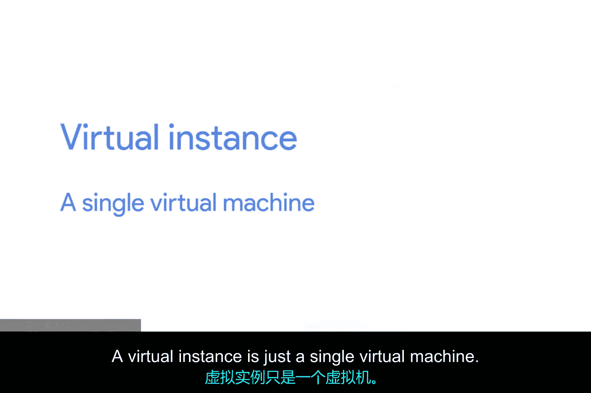
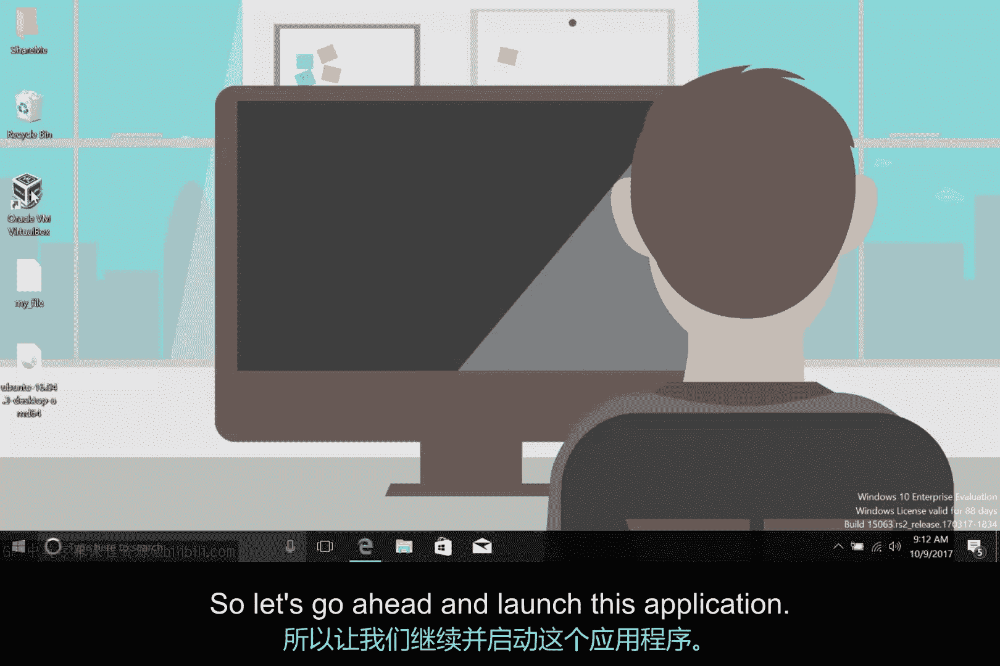
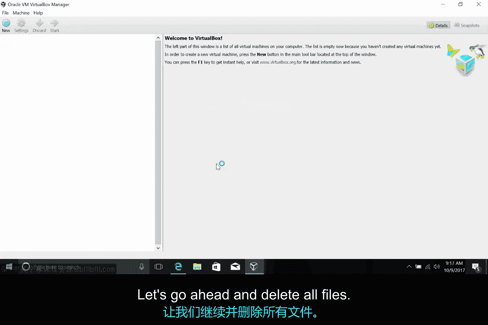

# 193：虚拟机管理教程 🖥️

在本节课中，我们将学习如何安装、管理和移除虚拟机实例。虚拟机是一种在物理计算机上模拟出的独立操作系统环境，它允许我们在同一台机器上运行多个不同的操作系统。

## 概述

之前我们已经简单讨论过虚拟机。在快速评估中，我们也一直在使用虚拟机。本节课程将指导你完成虚拟机实例的安装、管理和移除过程。我们将使用流行的开源虚拟化软件VirtualBox来管理虚拟机实例。

## 安装虚拟机实例

首先，我们来看看如何安装一个虚拟机实例。我已经从Ubuntu官网预先下载了一个系统镜像并保存在桌面上，但我需要安装它。

以下是安装步骤：

1.  点击VirtualBox主界面的“新建”按钮来创建一个新的虚拟机。
2.  为虚拟机命名，并选择操作系统的类型和版本。我将保持默认设置。
3.  系统会询问要为该虚拟机分配多少内存。1GB对我来说足够了，所以我将保持这个设置并继续。
4.  接下来，系统询问要为虚拟机分配多少硬盘空间。我将保持默认的10GB并点击“创建”。
5.  我们将保持其他选项的默认值，直接完成创建。

现在，在我的虚拟机列表中，我可以点击“启动”来运行它。系统会提示我选择一个启动介质，这类似于从装有操作系统镜像的U盘启动。我只需选择之前下载的镜像文件，安装过程就会开始。

## 管理虚拟机资源

上一节我们介绍了如何安装虚拟机，本节中我们来看看如何管理它的资源。如果我们决定为操作系统分配超过1GB的内存，在物理机上我们需要购买并安装更多内存条。但由于我们使用的是虚拟机，修改设置非常简单。

要修改分配给虚拟机的硬件资源，我们只需右键点击虚拟机，然后选择“设置”。在这里，我们可以更改内存分配以及其他设置。虽然我们不会详细讨论每个设置的具体含义，但你可以看到修改虚拟机实例是多么简单。

## 移除虚拟机实例

最后，如果我们决定不再使用这个虚拟机了怎么办？如果这是一台物理机器，我们需要考虑如何存放或回收硬件。但对于虚拟机，我们只需要右键点击并选择“移除”。

这时，系统会询问我们是希望删除所有文件（包括虚拟机安装本身），还是仅将其从虚拟机列表中移除。让我们选择删除所有文件。这样，虚拟机就被彻底移除了。

## 总结

本节课中，我们一起学习了虚拟机管理的基础操作。我们使用VirtualBox软件，完成了从创建、配置到删除一个Ubuntu虚拟机实例的全过程。你学会了如何为虚拟机分配资源，以及如何轻松地移除不再需要的实例。如果你想深入了解VirtualBox或其他虚拟化软件的使用，请务必查阅补充阅读材料。