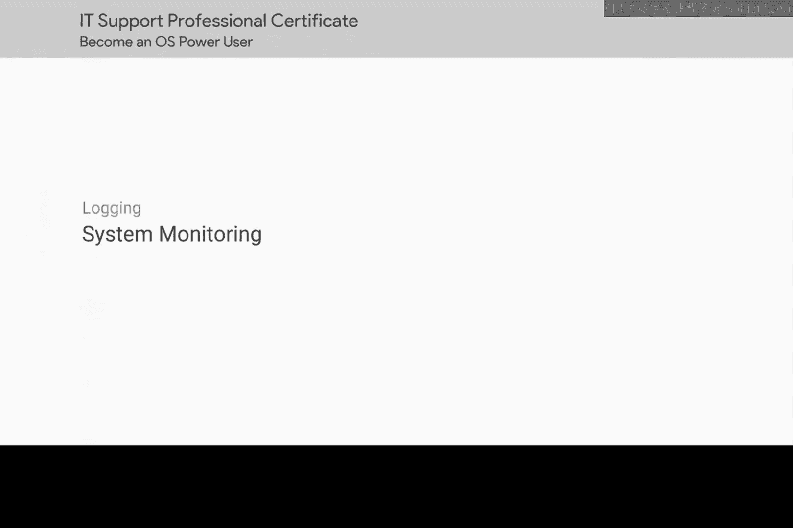
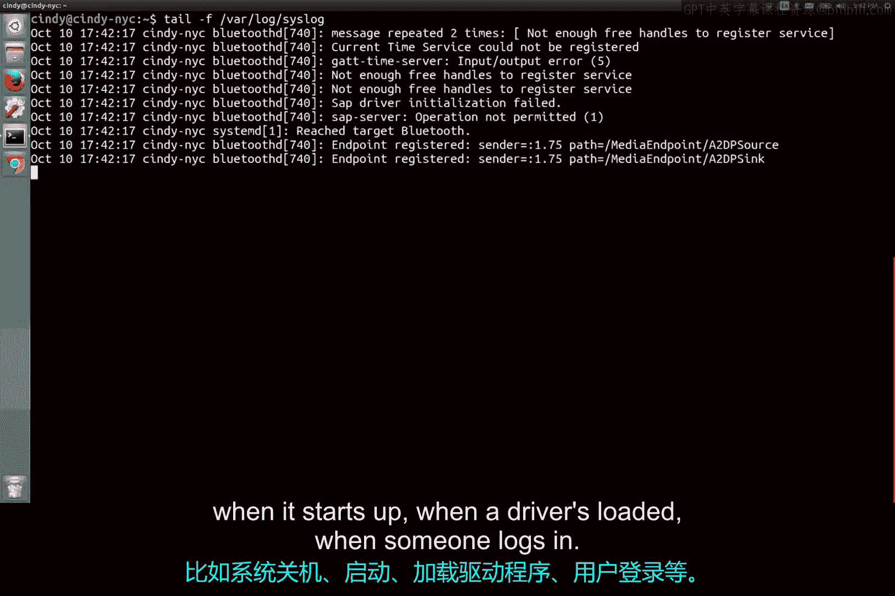
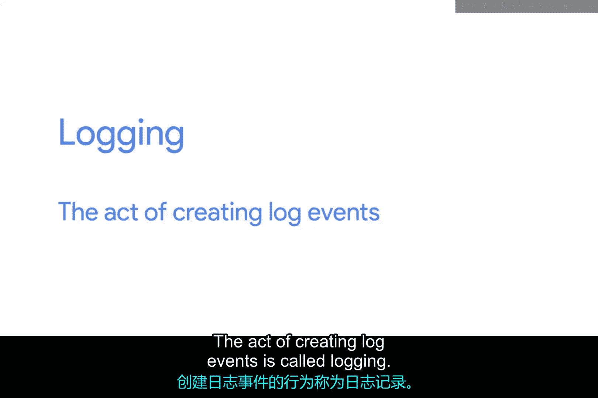

# 194：系统监控

在本节课中，我们将要学习系统监控的核心概念——日志。日志是计算机系统记录事件的“日记”，是IT支持人员进行故障排查时不可或缺的信息来源。我们将了解日志是什么、包含什么内容，以及如何在Windows和Linux操作系统中找到并解读它们。

## 什么是日志？📝

还记得我们课程第一单元《技术支持基础》中介绍过的日志概念吗？日志就像是计算机的日记，它记录了系统中发生的各种事件。

那么，日志会记录什么样的事件呢？几乎是一切事件。例如，系统何时关机、何时启动、何时加载了驱动程序、何时有用户登录，所有这些事件都可以被写入日志。

## 日志的详细程度

日志的记载非常详细。它会告诉你事件发生的精确时间、事件的触发者以及其他更多信息。在接下来的课程中，我们将查看一些日志片段示例，以便更好地理解如何阅读日志。

创建日志事件的行为被称为“日志记录”。你的系统在默认配置下就能很好地完成事件日志记录工作。

## 日志记录服务

在大多数系统中，都有一个服务在后台运行，持续地将事件写入日志。这些系统是可定制的，因此你可以记录任何你想要的特定字段，但默认情况下，它会记录所有必要信息。

在本节课结束时，你将学会在Windows和Linux操作系统中，所有重要日志的存放位置。你还将学会如何阅读日志，以及在处理日志时常用的故障排查方法。

## 日志在IT支持中的重要性

当你从事IT支持工作时，需要收集尽可能多的数据来排查问题。日志能告诉我们许多重要信息，例如发生的错误、所做的更改等等。它们是可靠的信息来源。

---

**本节课总结**

本节课中，我们一起学习了系统监控的基础——日志。我们了解到日志是系统事件的详细记录，对于故障排查至关重要。我们探讨了日志的内容、记录方式，并预告了后续将学习如何在Windows和Linux系统中定位和解读日志。掌握日志分析是IT支持人员的一项核心技能。