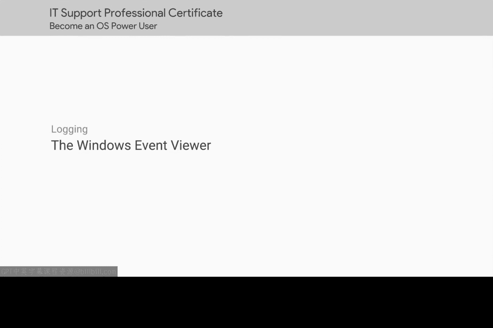
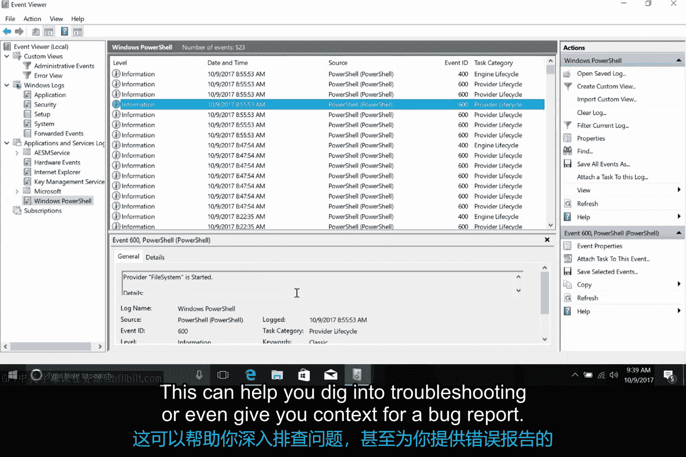

# 195：Windows事件查看器 🖥️

在本节课中，我们将学习Windows操作系统中的一个重要工具——事件查看器。事件查看器记录了计算机上发生的各种事件，类似于我们记录生活事件的日记。无论是排查游戏崩溃、登录问题，还是单纯想了解系统运行状况，事件查看器都是一个极佳的起点。

## 启动事件查看器

你可以通过两种方式启动事件查看器：
1.  从“开始”菜单中搜索并打开。
2.  在“运行”对话框中输入 `eventvwr.msc` 并回车。

## 理解界面布局

启动后，事件查看器默认显示近期重要事件的摘要。但通常我们更关心具体的问题，因此让我们关注左侧窗格中的事件分组。

## 自定义视图

事件查看器会记录大量系统信息，有时难以从海量数据中快速找到关键信号。自定义视图功能可以解决这个问题。

以下是创建自定义视图的步骤：
1.  在左侧窗格中点击“自定义视图”。
2.  在右侧“操作”窗格中点击“创建自定义视图”。
3.  在弹出的“筛选器”选项卡中，勾选“错误”和“严重”级别。
4.  将“记录时间”下拉菜单改为“最近1小时”。
5.  在“事件日志”中，仅选择“Windows日志”。
6.  点击“确定”，并为新视图命名。
7.  再次点击“确定”。

完成后，你将在“自定义视图”下看到一个新条目，其中仅显示符合你筛选条件的事件。

## 主要日志类别

在左侧导航窗格中，你还会看到另外两个主要日志类别：**Windows日志**和**应用程序和服务日志**。

### Windows日志

Windows日志类别包含通常应用于整个操作系统的事件日志。例如：
*   **系统日志**：是排查驱动程序启动失败等问题的好起点。
*   **安全日志**：可用于调查谁访问过计算机。

### 应用程序和服务日志

此类别包含跟踪单个应用程序或操作系统组件事件的日志，而非Windows日志那样的系统范围事件。例如，如果你遇到PowerShell问题，查看“应用程序和服务日志”下的PowerShell日志将是很好的第一步。

## 解读事件详情

无论属于哪个类别，事件查看器中给定日志的每一行都代表一个事件。每个事件都包含按列分组的信息，例如：
*   **级别**：表示事件的严重程度，从低到高依次为：信息、警告、错误、严重。
*   **日期和时间**：事件发生的具体时间。

选择某个事件后，你可以在事件查看器底部窗格中看到更详细的信息。这些信息有助于深入排查问题，甚至为提交错误报告提供上下文。

## 总结与建议

本节课中，我们一起学习了Windows事件查看器。它是IT支持专家的一个超级有用的工具，能提供关于系统上任何软件或硬件可能遇到的问题的详细数据。

不过，其中信息量巨大，因此请善用其**自定义视图和筛选功能**。更重要的是，不要犹豫，多动手探索这个工具，熟悉其界面。你会在其中找到乐趣并学到很多。

接下来，我们将进入Linux日志的奇妙世界。