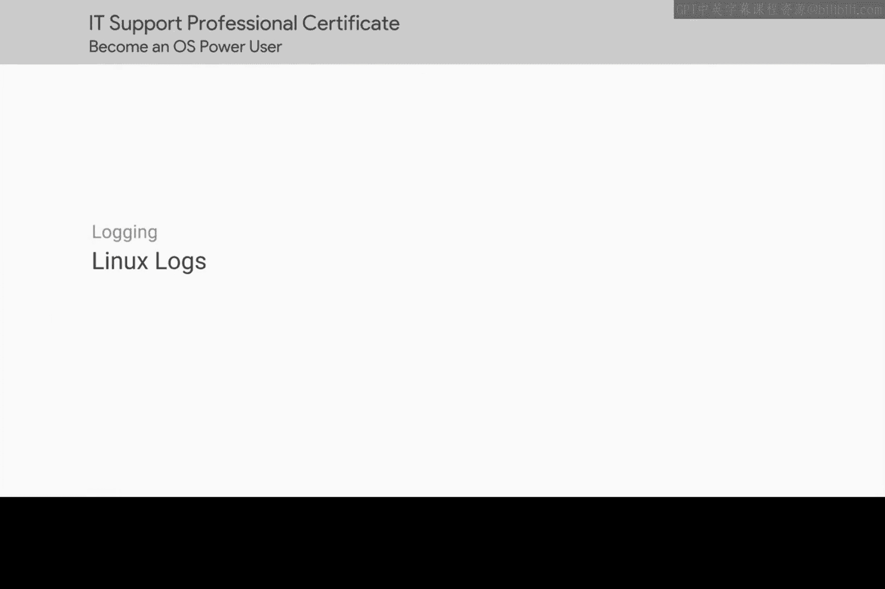

# 196：日志文件基础

在本节课中，我们将要学习Linux系统中日志文件的基础知识。日志是记录系统事件的重要工具，对于故障排查和系统监控至关重要。

## 日志文件的位置与作用

上一节我们介绍了系统目录结构，本节中我们来看看日志文件的具体位置和作用。

Linux系统的日志文件存储在 `/var/log` 目录中。`/var` 目录代表“变量”，意味着该目录存放的是经常变化的文件。日志文件的内容正是持续更新的。

使用 `ls` 命令查看 `/var/log` 目录时，可能会看到许多文件，这看起来有些令人望而生畏。但不必担心，每个日志文件都根据其文件名存储特定的信息。

以下是您会经常查看的一些常见日志文件：

*   **`/var/log/auth.log`**：授权和安全相关的事件记录在此。
*   **`/var/log/kern.log`**：内核消息记录在此。
*   **`/var/log/dmesg`**：系统启动消息记录在此。如果您在启动时遇到问题，这是查找信息的好地方。

## 综合日志与日志管理

逐一打开每个日志文件来查找事件信息可能会有些繁琐。幸运的是，系统也存在一些综合了其他日志文件信息的日志文件。其缺点是这些文件通常非常庞大。

如果您对问题可能出在哪里有比较清晰的判断，那么选择更小、更具体的日志文件可能更合适。

在您的系统上，几乎记录所有事件的日志文件是 `/var/log/syslog`。默认情况下，`syslog` 唯一不记录的是身份验证事件。在排查用户机器问题时，`/var/log/syslog` 通常包含关于您系统最全面的信息，因此这应该是您的首选。

## 日志轮转与集中式日志

日志文件会输出大量事件，因此它们会占用机器上大量的存储空间。我们通常只想查看系统上的最新事件，而不需要让所有这些信息塞满我们的磁盘。

幸运的是，我们的系统也擅长清理日志文件，以便为新日志腾出空间。它们使用一种称为“日志轮转”的机制来实现这一点。在Linux中，用于轮转日志的实用程序叫做 `logrotate`。

您可能需要调查一个月前发生的事件，因此您可以更改日志轮转设置，以确保不会删除那么久远的事件。我们不会详细讨论如何操作日志轮转，但您可以在补充阅读材料中了解更多信息。

我们一直在单台机器的背景下讨论日志记录。但如果您发现自己需要管理许多系统，并希望能在单一中心位置解析它们的日志，您可以使用一种称为“集中式日志记录”的方法。我们不会讨论具体如何实现，但如果您有兴趣设置集中式日志服务器，请查看下一份补充阅读材料。

## 解析日志条目格式

好了，关于日志是什么已经说得够多了，现在让我们实际查看一些真实的日志条目。

这看起来可能非常复杂，但别担心，我们不需要阅读全部内容。下一课将教您如何使用日志进行故障排除。现在，我们只解析 `syslog` 中的一行内容，看看它说了什么。

日志条目的第一个字段是事件发生的时间戳，这很直观。但根据日志的不同，您可能会看到不熟悉的时间格式，例如一长串数字，如 `1501538594`。

以这种格式出现的时间戳被称为 **Unix时间** 或 **纪元时间**。起初，您可能会对此感到困惑。为什么要用这种方式表示时间？Unix纪元到底是什么？

**Unix纪元时间** 用于表示时间。它是自 **1970年1月1日午夜（UTC）** 以来经过的秒数。这个日期被选为Unix系统计算机锚定其时间概念的“零时”。这意味着 `1501538594` 这个数字代表的是 **2017年7月31日，星期一，太平洋标准时间**。

为什么是1970年1月1日午夜？这个日期是Unix的生日，还是标志着其他重大事件？实际答案要简单得多。贝尔实验室的Unix原始工程师选择它只是因为方便。所以，如果您看到这样的时间戳，不必感到意外。

时间戳之后的下一个字段是事件发生所在机器的主机名。

接下来是日志事件所指的服务或进程。

最后是发生的事件描述本身。

## 总结

本节课中我们一起学习了Linux日志系统的基础知识。我们了解了日志文件存储在 `/var/log` 目录，认识了 `auth.log`、`kern.log`、`dmesg` 和 `syslog` 等关键日志文件及其作用。我们还探讨了日志轮转机制如何管理日志文件大小，并简要提及了集中式日志记录的概念。最后，我们学习了如何解析日志条目的基本结构，包括时间戳、主机名、服务名和事件描述，特别是理解了Unix纪元时间的含义。下一课，我们将学习如何运用这些日志进行实际的故障排查。