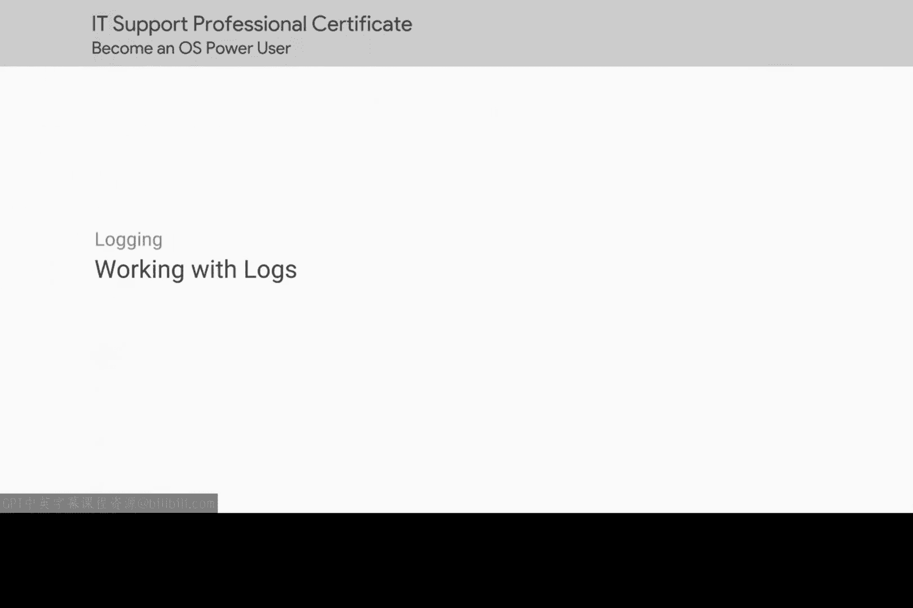
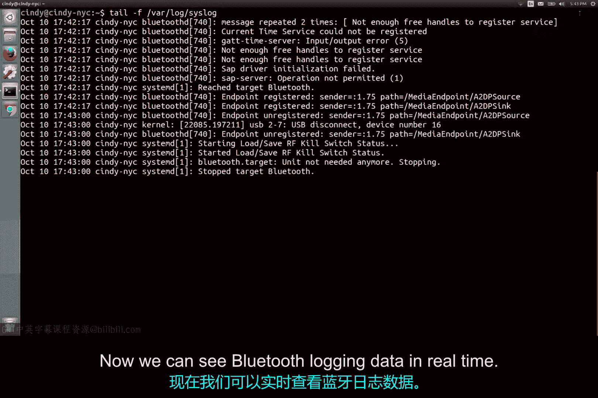

# 197：日志工作 🔍

在本节课中，我们将学习如何利用系统日志来调查计算机问题。日志是记录系统活动和事件的文件，通过分析日志，我们可以快速定位并解决各种故障。

## 概述 📋

上一节我们介绍了日志的基本概念和重要性。本节中，我们来看看如何实际运用日志信息来排查系统问题。

## 场景引入 💻

假设你在IT支持岗位工作。一位用户报告说，他的电脑一直保持开机状态，但最近醒来时发现电脑已自动关机。你应该怎么做？

你可以选择整夜不眠，紧盯电脑，甚至不敢去洗手间或眨眼，等待电脑再次关机。或者，在一个理智且正常的世界里，你决定直接查看系统日志。我们选择后者。

那么，从哪里开始呢？

## 日志分析技巧 🛠️

起初，日志可能看起来非常混乱和令人生畏。我们将讨论查看日志的技巧，但请放心，你永远不需要逐行阅读日志。

以下是分析日志时可以使用的几种方法：

### 1. 进行特定搜索

查看日志时，首先要做的是搜索特定内容。但如果你发现某个应用程序出现问题，却不知道从哪里开始查找呢？

幸运的是，我们的系统以相当标准的方式记录信息。如果一个应用程序出现大量错误，你认为可以搜索什么？没错，就是“error”这个词。如果你发现特定应用程序有问题，你认为还可以搜索什么？如果你猜是应用程序名称，那就对了。

通过这种方式，你已经能够过滤日志，查找你可能遇到的特定问题。

让我们看看实际操作。这里我们可以看到包含“error”一词的日志结果。

### 2. 按时间戳调查

如果需要调查在特定时间发生的问题，你可以通过检查该时间前后的时间戳来实现。通过这种方式，你可能会找到导致问题的根源，或者至少更接近问题的本质。

### 3. 从顶部或底部开始查看

当你最终找到可能有助于发现问题的重要日志部分时，通常希望从顶部或底部开始查看输出。

假设你看到很多错误。这些错误中的每一个都可能是由根本问题引起的。如果你解决了根本问题，就能修复连锁错误。看看这个例子：

日志中充满了错误，但如果我们向上滚动，可以看到引发所有其他错误的那个错误。如果我们修复它，那么其他问题很可能也会得到解决。

另一方面，如果你在日志中没有看到任何问题迹象，你可能希望从底部开始工作，直到找到线索。你的系统可能运行正常，但当你向下滚动阅读输出时，会看到一个可能与你的问题相关的日志条目。

### 4. 实时检查日志

你可以使用的另一种故障排除策略是实时检查日志。假设每次启动特定应用程序时，它都会突然执行某些操作并关闭。当然，你可以在事后检查日志并跟踪时间，或者你可以实时查看日志。

为此，我们可以使用在早期课程中学到的一个命令。让我们看看这意味着什么。我们将使用 `tail -f` 命令跟踪系统日志文件，并将其保持在打开的窗口中。然后，我们将关闭蓝牙以显示它正在记录的事件。

现在，我们可以实时看到蓝牙记录的数据。看，我们已经完成了一个完整的循环。我告诉过你，这些命令会派上用场。

## 总结 📝

本节课中，我们一起学习了如何利用日志进行故障排除。使用这些简单的日志策略将帮助你在整个IT支持专家的职业生涯中解决问题。日志将是你面对没有明显线索的问题机器时最好的朋友之一。与日志对话，倾听那甜美日志声音告诉你的信息，你将很快发现问题所在。