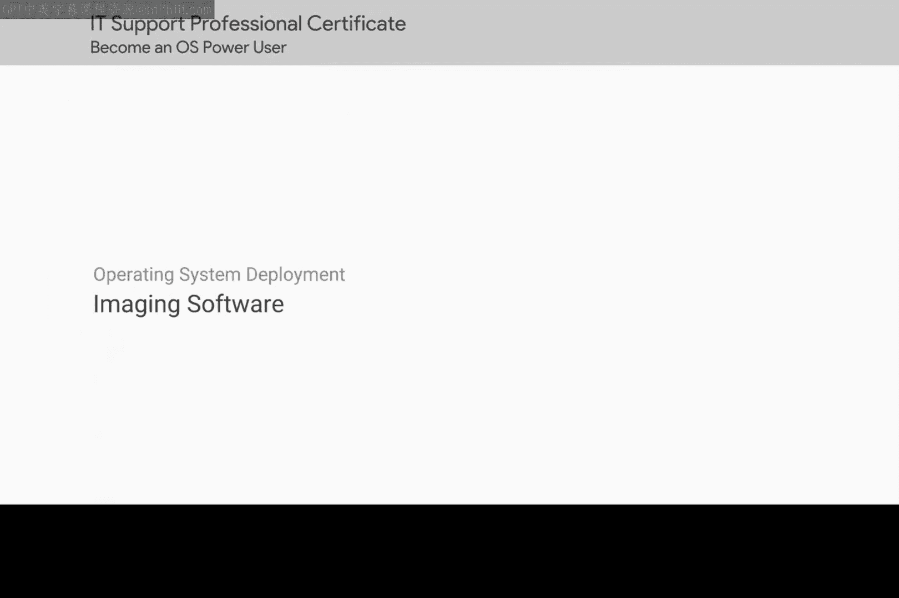

# 198：映像软件 📀

在本节课中，我们将学习如何为多台计算机高效部署操作系统。我们将了解映像软件的概念及其在IT支持工作中的重要性。

上一节我们学习了如何为自己安装操作系统。但在IT支持岗位上，你需要为其他人安装操作系统。

使用单个U盘安装操作系统，就像我们在本课程早期所做的那样，会非常耗时，尤其是在需要为多台机器操作时。幸运的是，在IT领域，我们使用出色的工具来简化工作。

请记住，**映像**一台机器意味着用另一台机器的**映像**来格式化该机器。这包括从操作系统到设置的所有内容。

在本节中，我们将简要介绍一些可用于为机器创建映像并帮助更轻松地部署操作系统的选项。

以下是几种常见的映像部署方法：

*   **网络引导（PXE）**：计算机通过网络启动并从服务器加载操作系统映像。
*   **磁盘克隆**：使用专用软件（如Clonezilla）将一台计算机的整个硬盘驱动器复制到另一台计算机。
*   **系统准备工具（Sysprep）**：在创建映像之前，从Windows系统中删除特定于计算机的信息（如SID），以便将其部署到多台计算机。
*   **配置管理工具**：使用如Ansible、Puppet或Chef等工具，通过代码自动配置操作系统和应用程序。

这些工具和方法的核心目的是实现自动化，其基本工作流程可以概括为：

**准备主镜像 -> 捕获镜像 -> 通过网络或存储介质部署到目标计算机**

本节课中我们一起学习了映像软件的基本概念及其在批量部署操作系统时的优势。通过使用网络引导、磁盘克隆和配置管理等工具，IT支持专业人员可以显著提高工作效率，避免重复性的手动安装工作。