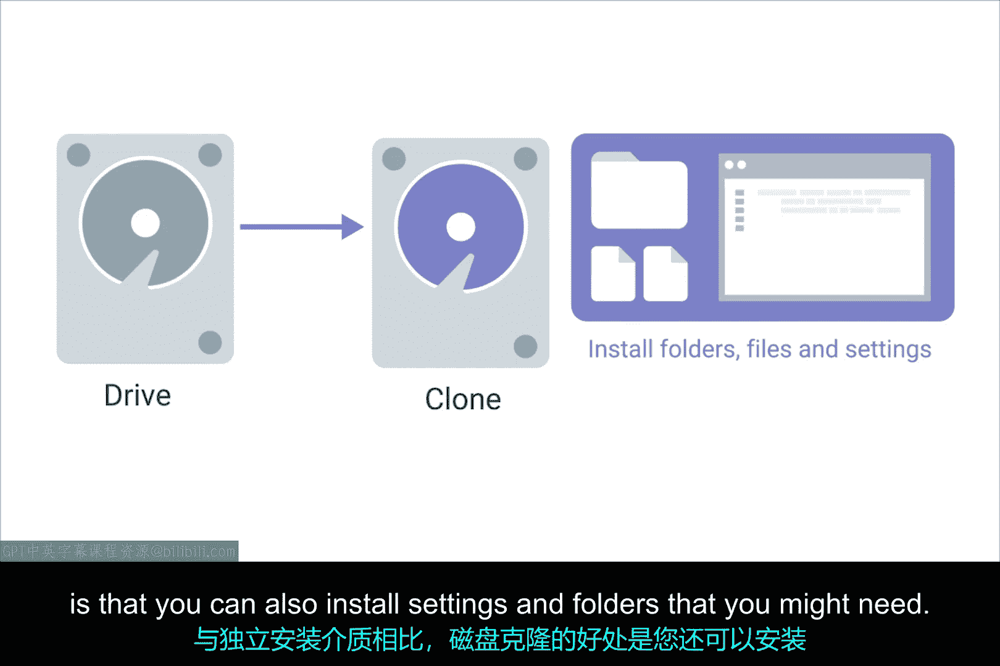
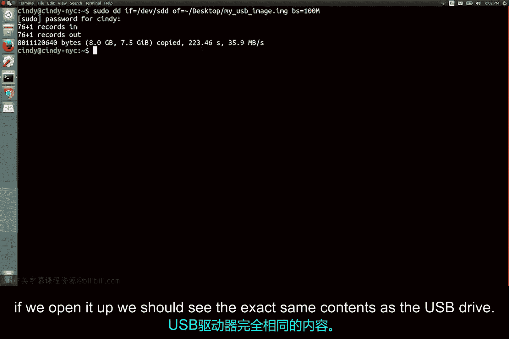
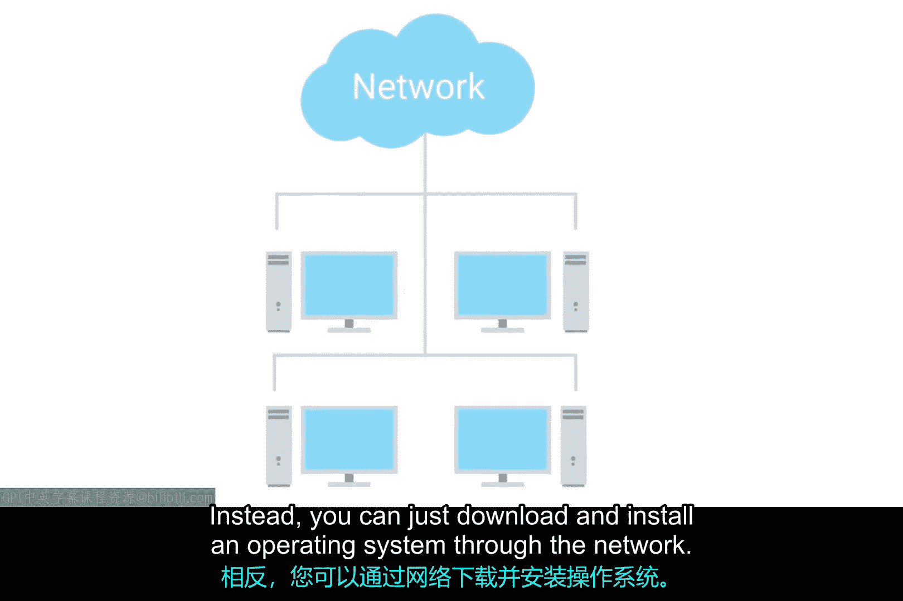
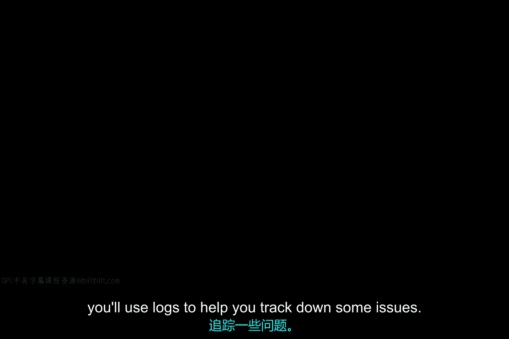

# 199：操作系统部署方法 🖥️

在本节课中，我们将要学习两种主要的操作系统部署方法：磁盘克隆和网络部署。我们将了解它们的工作原理、使用的工具以及在实际工作环境中的最佳实践。

## 磁盘克隆工具 💾



上一节我们介绍了操作系统部署的基本概念，本节中我们来看看一种具体的部署方法：磁盘克隆。

磁盘克隆工具可以创建整个磁盘的副本。它允许你备份当前机器或设置一台新机器。与独立的安装介质相比，磁盘克隆的优势在于，你可以同时安装所需的设置和文件夹。

以下是市面上众多磁盘克隆工具中的两个例子：
*   **Clonezilla**：一款开源软件，可用于备份和恢复单台或多台机器。
*   **Symantec Ghost**：一款流行的商业映像工具。

## 磁盘克隆实践 🔧

了解了可用的工具后，我们来看看磁盘克隆的具体操作方式。

使用磁盘映像时，许多工具提供了不同的克隆方法。其中一种选择是**磁盘到磁盘克隆**。这种方法需要将一台外部硬盘驱动器连接到你要克隆的机器上。

你可以将HDD或SSD等硬盘连接到一种称为**外部硬盘坞**的设备中。这些设备是很好的IT工具，外形有点像烤面包机。连接好外部硬盘后，你就可以使用任何你选择的磁盘克隆工具了。

接下来，我们将展示一个磁盘克隆如何工作的快速示例。我们将使用Linux命令行工具 **`dd`** 来复制文件。`dd` 是一个轻量级工具，也用于克隆驱动器。当然，你可以使用任何工具来克隆磁盘，但现在我们只用 `dd` 来演示。

假设我们要复制连接到笔记本电脑的USB驱动器，并将其保存为一个映像文件。

首先，我们需要确保该驱动器已卸载。然后运行 `dd` 命令。你不需要知道 `dd` 的工作原理就能使用这个命令（实际上，你应该查看最后的补充阅读材料以了解更多关于此工具的信息）。

命令如下：
```bash
dd if=/dev/sdd of=~/Desktop/usb_backup.img
```
这个命令表示：我将复制 `/dev/sdd`（即USB驱动器）的内容，并将其保存到桌面上的一个名为 `usb_backup.img` 的映像文件中。



映像文件保存后，如果我们打开它，应该能看到与USB驱动器完全相同的内容。你也可以对更大的磁盘（如硬盘）使用 `dd`，其工作方式相同。

## 网络部署 🌐

除了本地克隆，另一种为机器安装映像的方法是从网络直接获取映像。



如今，许多操作系统制造商都提供**网络启动部署**。这意味着不再需要依赖独立的安装介质。相反，你可以直接通过网络下载并安装操作系统。

如果你想使用自己的映像，而不是计算机内置的网络启动选项，也有其他方法可以实现。我们在此不讨论具体细节，但它们需要一些自动化设置才能运行。

## 硬件标准化考量 🏢

无论你管理的是笔记本电脑、台式机、Windows操作系统还是Linux操作系统，如果你负责公司的操作系统部署工作，都需要考虑硬件标准化的某些方面。

想象一下，如果你的公司有各种不同的笔记本电脑，需要安装不同的驱动程序，维护起来会非常繁琐。通常，尝试在公司内标准化所使用的硬件类型是一个好主意，这可以使部署操作系统的工作变得更轻松。

---



本节课中我们一起学习了两种关键的操作系统部署方法。我们探讨了使用如Clonezilla、Ghost和 `dd` 等工具进行磁盘克隆的实践步骤，以及通过网络进行部署的现代方法。最后，我们强调了在企业环境中进行硬件标准化以简化部署和维护流程的重要性。