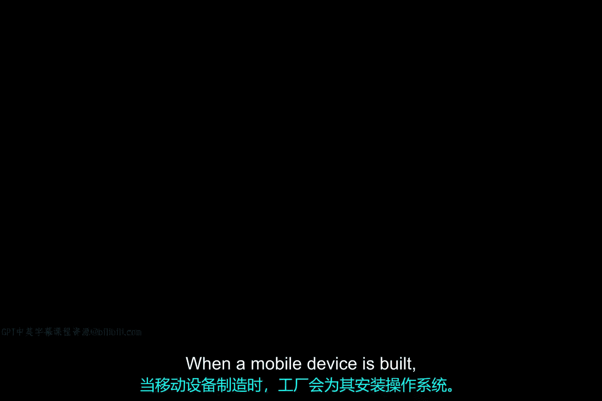
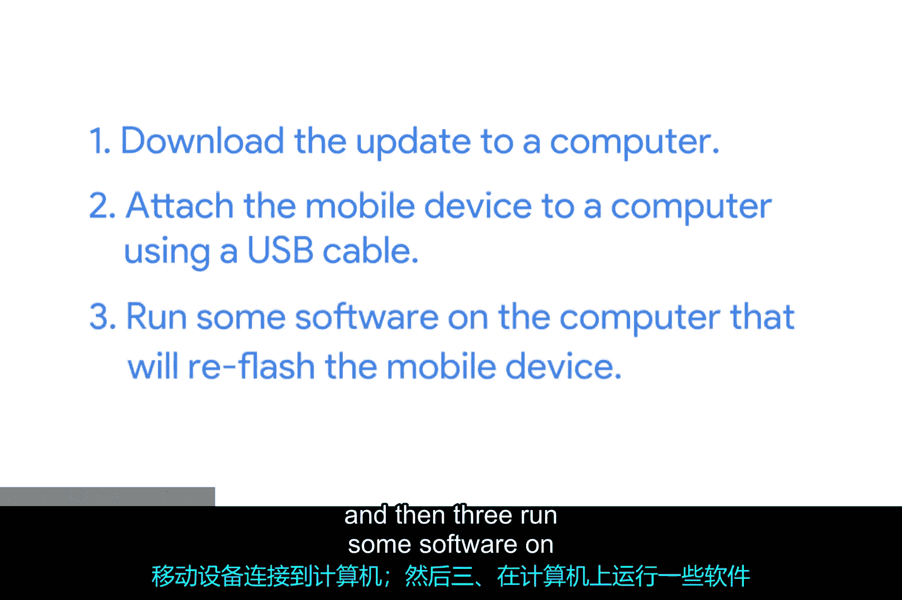
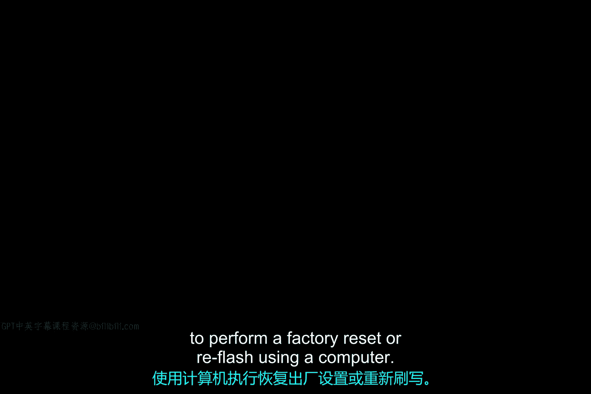

# 200：移动设备重置与映像

在本节课中，我们将学习移动设备重置与映像的核心概念，包括工厂重置和重新刷写操作系统。你将了解这些操作的目的、执行时机、注意事项以及具体步骤。

## 工厂重置

上一节我们介绍了移动设备的基本概念，本节中我们来看看工厂重置。当一台移动设备出厂时，工厂会为其安装操作系统。工厂重置操作会将设备恢复到出厂时的原始状态。

作为IT支持专家，你将经常需要对移动设备执行工厂重置。

以下是执行工厂重置的常见场景：
*   在将设备重新分配给另一位最终用户之前。
*   在将设备送修之前。
*   作为对运行异常的设备进行故障排除的最后手段。

请注意，工厂重置会清除设备上的所有数据、应用程序和个性化设置。

确保你不想丢失的任何内容都已备份或同步到云端。我们将在未来的视频中介绍移动设备的同步与备份。

另一个重要提醒是注意扩展存储。像SD卡或USB驱动器这类扩展存储设备可能包含个人或专有数据。

在连接扩展存储的情况下执行工厂重置，可能会误删你希望保留的数据。更糟糕的是，许多设备的工厂重置操作可能不会清除扩展存储的内容。你肯定不希望将仍附有个人或专有数据的设备重新分配用途或报废。

最后一点，对于Android和iOS设备，你需要主账户的凭据才能执行工厂重置。这是为了防止被盗设备被轻易重置并转售。

## 操作系统更新与重新刷写

上一节我们介绍了工厂重置，本节中我们来看看操作系统更新。随着时间的推移，移动设备制造商会发布设备操作系统的更新。这些更新通常通过无线方式或OTA进行推送。

**OTA更新**是指由移动设备自身下载并安装的更新。

但有时你可能需要使用计算机来安装操作系统更新。

以下是可能需要使用计算机的场景：
*   某些移动设备（如健身追踪器和医疗设备）可能没有移动网络或Wi-Fi网络接口来连接互联网。
*   移动设备可能无法启动，或者没有足够好的数据连接来自行下载更新。

在这些情况下，你可以从计算机上**重新刷写**或覆盖设备的操作系统。

但操作时必须小心。请仔细阅读设备关于重新刷写的说明。对于某些设备，重新刷写会保留设备上的最终用户数据。但对于其他设备，最终结果将类似于工厂重置。具体细节因设备而异。

以下是基本的重新刷写步骤：
1.  将更新文件下载到计算机。
2.  使用USB数据线将移动设备连接到计算机。
3.  在计算机上运行特定软件，对移动设备进行重新刷写。

在补充阅读材料中，你会找到如何从计算机恢复iOS和Android设备的说明。对于其他类型的设备，请参考设备制造商的文档，了解如何使用计算机执行工厂重置或重新刷写。

## 总结

本节课中我们一起学习了移动设备重置与映像。我们了解了工厂重置的定义、应用场景和重要注意事项，特别是数据备份和扩展存储的处理。我们还探讨了通过OTA更新和通过计算机重新刷写操作系统的方法，以及后者的适用场景和基本步骤。掌握这些知识对于有效管理和维护移动设备至关重要。