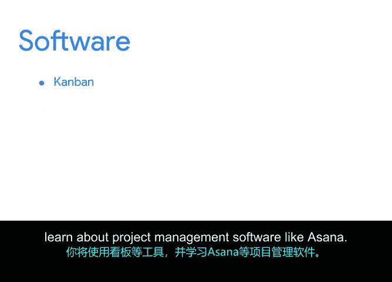

# 001：项目管理基础课程

## 概述

在本节课中，我们将要学习项目管理的基本概念，了解谷歌项目管理证书课程的结构与目标，并认识课程的核心教学团队。无论你是否有相关经验，本课程都将帮助你建立坚实的项目管理基础。

---

## 欢迎与课程介绍

我们非常高兴你来到这里。我是埃米利奥，谷歌负责任创新团队的项目经理。我正式欢迎你参加谷歌的项目管理证书课程。

让我们从一个简单的练习开始。请花一点时间，回想一下你生活中完成过的不同任务。

例如：
*   你策划过婚礼或生日派对。
*   你提交过年度纳税申报表。
*   你从一个州搬迁到另一个州。
*   或许你是每年负责组织家庭年度聚会的家庭成员。

无论你是否相信，通过完成这些任务，你已经培养了各种技能，这些技能将帮助你在任何组织或自己的业务中成为一名成功的项目经理。

通过谷歌的这个项目管理课程，我们整合了一系列课程、活动、测验和练习，旨在教授你项目管理的基础知识。当然，它也将帮助你找到工作或在职业生涯中取得进步。

---

## 个人经历分享：发现项目管理

我是如何开始我的项目管理职业生涯的？在大学期间，我总是倾向于那些更注重实践和行动导向、而非纯理论的事情。我希望在我从事的任何职业中都能产生影响。

因此，我大学毕业后的第一份工作是在加利福尼亚州洛杉矶担任西班牙语和领导力教师。我在学校指导学生领导团队的主要目标是识别、动员和激励学生领袖。

经过两年的教学，我意识到，当我为如何完成一个大项目构建愿景时，或者当我努力将不同团队围绕一个共同目标团结起来时，我感到最有活力。那时我意识到，我已经拥有了许多核心的项目管理技能，并且我可以在商业世界中专注于发展和提升这些技能。

我很感激能在这里见证你旅程的开始。当我最初开始思考我的职业生涯时，我甚至没有考虑过项目管理。这是一个直到我进入商业世界、并了解到市场多么需要那些有条理、行动导向、勤奋且具有战略思维的人才时，才知道存在的职业。

我希望在本课程结束时，你能像我一样对项目管理职业的前景感到兴奋。

---

## 什么是项目管理？

现在，让我们深入探讨。我们将从一个重要的问题开始：**项目管理究竟是什么？**

**项目管理是应用知识、技能、工具和技术来满足项目要求并实现预期成果的过程。**

很可能你在日常生活中已经在某种程度上进行着项目管理，只是自己并未意识到。在本课程中，你将学习如何磨练这些技能，成为一名真正优秀的项目经理。

项目管理的一个绝妙之处在于，它跨越许多行业和公司类型，并且不需要深厚的技术知识。这意味着你迄今为止获得的任何工作或生活经验，都将有助于你培养这些技能，从而在项目管理职业生涯中取得成功。

---

## 课程目标与结构

世界各地有许多像你一样的人，希望学习技能以获得项目管理职位。无论你来到这里的原因是什么，我们都很高兴你的加入。

本课程基于一个信念：扎实的项目管理基础可以帮助任何人开启一段出色的项目经理职业生涯。

本课程包含六门与行业相关的课程，重点关注以下主题：
*   项目管理基础
*   目标、目的和交付成果
*   风险管理
*   团队动态
*   项目管理方法论
*   数据驱动决策等

每门课程都由个人轶事、阅读材料、测验和案例研究组成。你可以按照自己的节奏学习课程，跳过你可能已经了解的部分，并在需要复习时再次观看视频。

你将进行大量的实践学习：
*   你将制定项目计划和时间表。
*   你将学习如何管理预算并满足项目相关人员的需求。
*   你将学习不同的项目管理方法，如敏捷、Scrum和瀑布模型。
*   你将使用看板等工具，并了解Asana等项目管理软件。

你还将培养你的软技能，其中一些你可能已经具备。别担心，即使你还不确定如何发掘它们，我们也将探索哪些技能可以转移到项目管理角色中。

最重要的是，本课程将帮助你为一份新工作做好准备。

---

## 职业支持与教学团队

但我们更进一步。当你完成本课程后，你将有机会与谷歌及其他旨在招聘项目管理专业人才的顶尖雇主分享你的作品。最棒的部分是，你将拥有可以与他们分享的专业工作示例，以展示你所学到的知识。

在学习过程中，你将听到像我这样的谷歌员工的分享。我们将分享关于我们如何成为项目经理的个人故事，以及我们的项目管理基础如何开启了我们的职业生涯。我们还将分享我们每天的工作内容，并为你提供求职面试的建议。

我们为你准备了一个真正出色的课程讲师团队。准备好认识他们了吗？

以下是课程的核心教学团队：
*   **乔安妮**：云安全项目高级项目经理。她是第2课的讲师，我们将学习如何为成功项目奠定基础。
*   **罗娜**：谷歌云高级项目经理。她是第3课“项目规划：整合一切”的讲师，我们将学习全面项目规划的重要性、识别关键里程碑和依赖关系、记录项目计划、制定时间表、预算和风险管理。
*   **埃莉塔**：谷歌高级工程项目经理。她是第4课“项目执行：运行项目”的讲师，我们将学习有效沟通、管理风险、理解团队动态、使用数据辅助决策以及跟踪进度。
*   **苏**：谷歌支持平台技术项目经理。她是第5课“敏捷项目管理”的讲师，我们将深入了解敏捷项目管理，包括其原则和实践、敏捷转型的收益与成本、敏捷团队的动态，以及运行冲刺和发布的过程。
*   **丹**：谷歌研究部项目经理。他非常高兴能担任第6课“现实世界中的项目管理应用”的讲师，我们将把你在此证书课程中积累的所有知识、技能和理解，应用到一个高级项目场景中。

准备好开始了吗？让我们出发吧！

---

## 总结

本节课中，我们一起学习了项目管理的基本定义，了解了谷歌项目管理证书课程的总体框架、学习目标以及强大的讲师团队。我们认识到，项目管理技能广泛存在于生活经验中，本课程旨在系统化地培养这些技能，为你开启项目管理职业生涯铺平道路。接下来，我们将深入探索项目管理的具体基础知识。