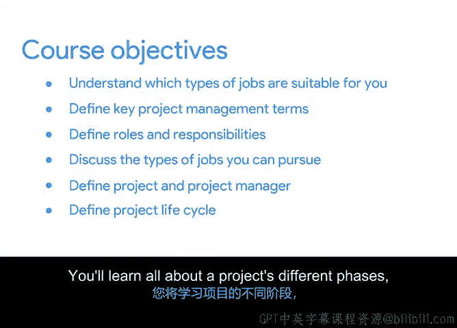

# 002：课程一介绍

在本节课中，我们将深入了解课程的具体内容，帮助你明确哪些类型的工作适合你这样的学习者。我们将介绍一些关键的项目管理术语、初级项目经理的角色与职责，并探讨完成本课程后你可以追求的职业方向。

## 什么是项目与项目经理？

上一节我们预览了整个课程计划，本节中我们来看看项目的核心定义以及项目经理的角色。

一个**项目**是指为创造独特的产品、服务或成果而进行的**临时性**工作。它拥有明确的**开始**和**结束**时间。

**项目经理**是负责规划、组织、指导项目资源以实现特定目标的个人。他们需要具备一系列技能来确保项目成功。

## 项目管理核心技能

以下是成为一名成功项目经理所需的核心技能。这些技能通常在你过往的经历中已经有所积累。

*   **组织能力**：有效管理任务、时间和资源。
*   **沟通能力**：清晰地向团队成员、利益相关者传达信息。
*   **解决问题的能力**：识别障碍并找到解决方案。
*   **领导力**：激励团队并引导项目方向。

## 项目生命周期与方法论

接下来，我们将探讨项目从开始到结束的全过程，以及执行项目的不同方式。

项目生命周期通常包含几个连续的阶段。以下是每个阶段的主要任务：

*   **启动**：定义项目目标、范围和关键利益相关者。
*   **规划**：制定详细的项目计划，包括时间表、预算和资源分配。
*   **执行**：协调人员和资源以完成项目计划。
*   **监控**：跟踪项目进展，确保其按计划进行。
*   **收尾**：交付项目成果，进行总结评估。

对于如何完成这些阶段的任务，存在不同的项目管理方法论。选择哪种方法取决于项目的具体需求。

*   **瀑布式**：一种线性、顺序的方法，每个阶段必须在下一阶段开始前完成。公式可表示为：`阶段A完成 -> 阶段B开始`。
*   **敏捷式**：一种迭代、增量的方法，项目被分解为一系列小周期（冲刺），允许灵活应对变化。

## 组织结构与文化的影响

最后，我们将了解不同的组织环境如何影响项目管理工作的开展。

组织的结构（如职能型、项目型、矩阵型）和文化（如等级森严或扁平开放）会深刻影响项目经理的权限、沟通方式和资源获取途径。理解这些背景对于有效管理项目至关重要。

---

本节课中，我们一起学习了项目与项目经理的基本定义，探讨了成功所需的核心技能，梳理了项目生命周期的各个阶段及不同的管理方法论（如瀑布式和敏捷式），并了解了组织结构与文化对项目管理的影响。这些基础知识将为你后续的深入学习奠定坚实的起点。