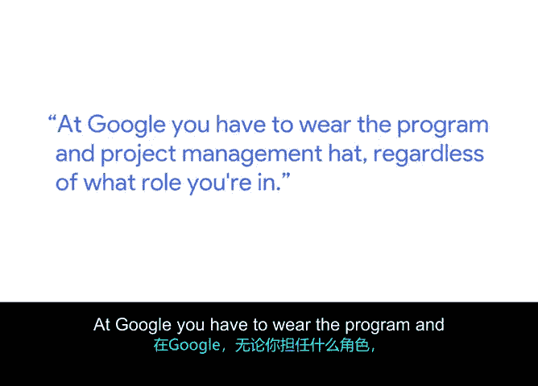
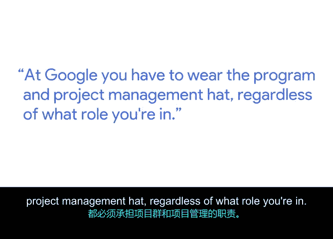
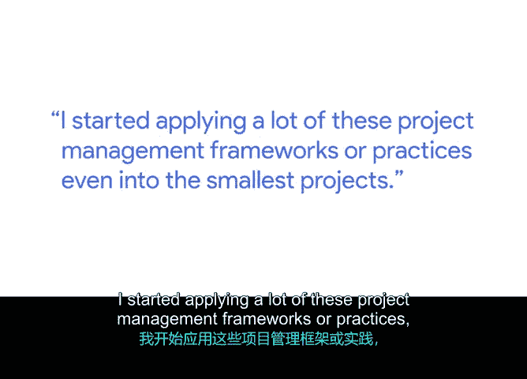
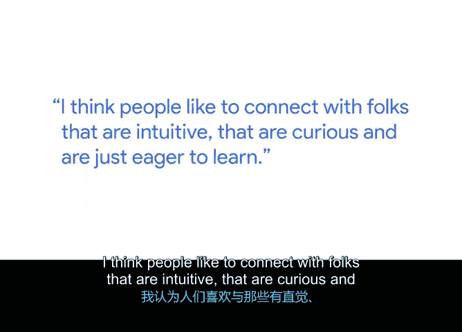

# 010：吉尔伯特谈项目管理技能在工作中的应用 🎯

在本节课中，我们将跟随谷歌人才拓展专家吉尔伯特的分享，了解项目管理技能如何在不同职业角色中发挥关键作用，以及如何通过日常实践来培养这些能力。

---

我叫吉尔伯特，是谷歌的一名人才拓展专家。“人才”可以有多重含义。它可能指那些从未想过自己能在谷歌工作的人。我们团队的部分职责，就是识别那些谷歌或其他公司在过去可能不会主动联系或考虑聘用的人才，并帮助他们完成面试流程。

“人才”也可能指那些已经对谷歌的机会感兴趣，或过去曾表达过兴趣的候选人。我们的工作是吸引他们，并在整个面试过程中提供支持。

如今在谷歌，无论你担任什么职位，都需要具备项目与计划管理的思维和能力。这在我的工作中体现得尤为明显。

在我的岗位上，我不得不实践多种技能，例如与利益相关者沟通、管理预算，以及在我职责范围内的许多不同项目中管理项目时间线。一个具体的例子是为来访谷歌园区的大学生组织活动，让他们聆听嘉宾演讲，了解我们从事的项目以及职业发展中的各种角色。可以想象，这可能是一个复杂的项目。

我大学毕业后的第一份工作与现在的工作完全无关。我曾是一家大型零售商的助理经理。实际上，我在那份工作中学到的许多技能，都转化并支持了我现在的工作，并帮助我取得了成功。这些技能包括：能够与人交谈并进行艰难的对话、管理预算、管理资源以及管理时间。这些在零售环境中尤为重要。

我开始将许多项目管理框架或实践，应用到最小的项目中。也许这与我未来三个月的目标有关，并据此制定项目计划。当时我是唯一的利益相关者，也是唯一审阅这些文件的人。但能够这样做的实践，确实对我帮助很大。因此，当我在谷歌需要为一个涉及多个利益相关者、多个时间线和相互竞争的优先级的项目做同样的事情时，这对我来说已经是第二天性了，因为我甚至在我的日常生活中也应用了它。

我认为，在我应对冒名顶替综合症或缺乏自信、开始运用这些技能的过程中，最大的支持之一就是**实践**。你可以在个人生活、职业生活以及两者之间的任何事情中以多种不同的方式进行实践。这在我作为项目和计划经理提升技能的过程中非常重要。

但我想说，通过加入这门课程并开始学习，你已经迈出了第一步。我认为这同样重要，即不要让恐惧或害怕失败阻碍你获得新的机会。

第二点是，不要害怕寻求帮助。我认为人们通常愿意帮助你、支持你。所以，你能做的最重要的事就是主动联系，不要害怕提问，不要害怕进行一次信息访谈，去征求简历建议，向那些可能已经在你希望进入的职位或领域工作的人寻求建议。主动联系他们，向他们提问。我认为人们喜欢与那些有直觉力、充满好奇心并且渴望学习的人建立联系。

因此，如果你能利用好这两点，我相信无论你做什么，都会取得成功。

---

本节课中，我们一起学习了吉尔伯特如何将项目管理技能从零售业应用到科技公司，并强调了**实践**和**主动求助**这两个核心策略对于培养项目管理能力和职业发展的重要性。记住，从小事开始应用项目管理思维，并勇敢地建立连接，是迈向成功的关键步骤。