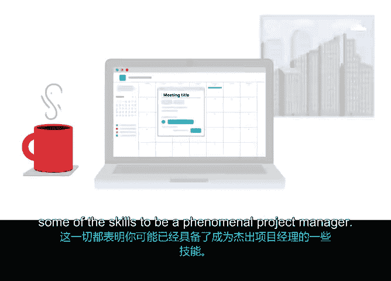

# 011：项目管理基础总结 🎯

在本节课中，我们共同学习了项目管理的基础概念、核心要素以及如何将现有技能转化为项目管理优势。现在，让我们对第一模块的内容进行回顾与总结。

## 模块回顾

上一节我们介绍了项目管理的广泛应用与核心定义，本节中我们来系统梳理已学到的关键知识。

我们首先探讨了项目管理的本质：它是应用**知识、技能、工具与技术**以满足项目要求并达成预期成果的过程。

随后我们了解到，项目管理几乎存在于所有行业与公司中，因此您正在学习的是一项极具实用性和普适性的认证。

我们也明确了项目的定义：项目是一项**独特的、临时性的**工作，经过周密规划以实现特定目标。希望您现在已熟悉这个概念：每个项目都有明确的**时间、成本、范围**和**专用资源**。

## 核心技能与职业转换

我们涵盖了一些宽泛的概念和关键术语，这些将帮助您成为一名成功的项目经理。我们还讲解了在求职时如何有效地进行职位搜索。

我们讨论了如何将过去的经验转化为论述要点，以说明您为何能成为成功的项目经理。我们谈到，您可以将以往工作中的技能转移到新的项目管理角色中，这将使您脱颖而出。

例如，无论是处理待办事项清单，还是为亲人的生日派对制定预算，都表明您可能已经具备成为一名出色项目经理的部分技能。但如果您觉得尚未掌握，也无需担心，我们的课程将从零开始。

## 课程目标与展望

到本课程结束时，您不仅将获得技能，还将积累经验和知识，从而找到理想的工作角色——无论是合同工作、实习还是一般的项目管理职位——您将能够判断什么是最适合您的选择。

在继续前进的过程中，我希望鼓励您持续思考未来可能喜欢从事的工作类型。

我们也不要忘记关于项目管理最令人振奋的消息：几乎每个人都需要项目经理。这个职位需求旺盛，并且仍在持续增长。

## 总结与鼓励

好了，我们覆盖了相当多的内容，而这仅仅是个开始。希望您到目前为止享受这门课程，因为接下来的内容会更加有趣。

即将到来的是您的第一次计分作业，我相信您会表现出色。请记住，从容应对，放松心态。相信自己，您能做到。

如果您对某个答案不确定，随时可以复习笔记和阅读材料，或回看部分视频内容。

祝您好运，我们很快再见。