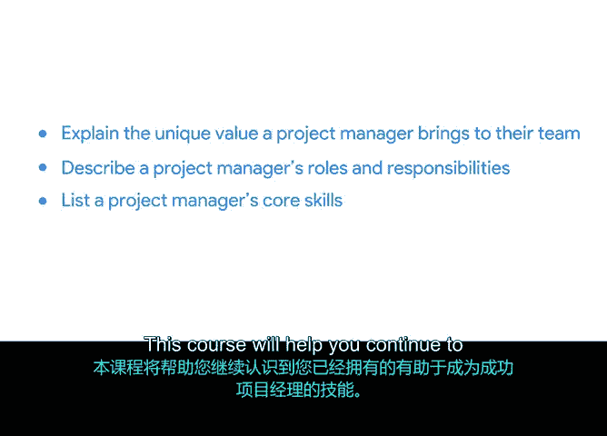

# 012：成为高效项目经理

在本节课中，我们将深入探讨项目经理的角色与价值。我们将学习项目经理如何为团队带来独特贡献，明确其职责范围，并列举成为一名成功项目经理所需的核心技能。

## 课程回顾

上一节我们介绍了项目管理作为职业道路的可能性，讨论了本课程如何通过项目管理认证帮助你推进职业目标，并学习了项目管理的基础知识，例如如何定义项目及其不同组成部分。我们还回顾了不同的项目管理职业、角色及其职责。

## 深入理解项目经理角色

本节中，我们将更深入地理解项目经理的角色。在本模块结束时，你将能够解释项目经理为其团队带来的独特价值，描述项目经理的角色与职责，并列举其核心技能。

本课程将帮助你继续识别那些已有的、能助你成为成功项目经理的技能。它也将帮助你识别为迎接新职业生涯可能需要学习的新技能。

以下是项目经理的核心职责概述：

*   **价值创造者**：项目经理通过协调资源、管理风险并确保项目目标与业务战略一致，为团队和组织创造明确价值。
*   **团队领导者**：项目经理负责组建团队、分配任务、激励成员并营造协作高效的工作环境。
*   **流程管理者**：项目经理运用专业方法论（如**敏捷**或**瀑布模型**）来规划、执行、监控并最终成功交付项目。

## 核心技能解析

要胜任上述职责，项目经理需要具备一系列核心技能。以下是关键技能分类：

*   **组织与规划能力**：这包括制定详细的项目计划、设定里程碑、管理时间线以及使用工具（如**甘特图**）进行可视化跟踪。
*   **沟通与协调能力**：项目经理必须是优秀的沟通者，能够清晰地向利益相关者传达信息、积极倾听团队反馈并有效解决冲突。
*   **分析与解决问题的能力**：当项目遇到障碍时，项目经理需要能够分析根本原因、评估各种解决方案并做出明智决策以推动项目前进。

本节课中，我们一起学习了项目经理的核心角色、职责以及必备技能。理解这些是迈向高效项目管理的第一步。在接下来的课程中，我们将具体探索如何应用这些知识和技能来启动和规划实际项目。