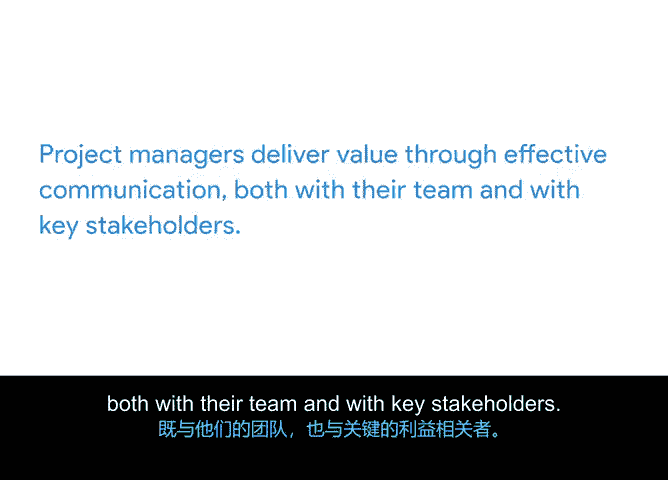

# 013：项目经理的价值 💼

在本节课中，我们将学习项目经理的定义，并详细探讨他们如何通过三种核心方式为团队和组织创造价值。

---

在课程的前期，我们介绍了项目管理这一领域。我们讨论了项目管理如何跨越不同行业和各种规模的公司，从大型企业到小型组织。现在，让我们来定义项目经理的角色，并描述他们如何为团队和组织增添价值。

让我们从定义开始。项目经理**引导项目从开始到结束，并作为团队的向导**，在每一步都运用其出色的组织和人际交往技能。正如之前所学，项目经理通常遵循一个流程，包括**规划与组织、管理任务、预算和控制成本**，以确保项目在批准的时间框架内完成。我们将在整个课程中深入探讨这些主题。你现在需要知道的是，项目经理在其组织中扮演着至关重要的角色。

项目经理主要通过**优先级排序、任务委派和有效沟通**这三种关键方式为团队和组织创造价值。下面我们来逐一解析。

首先，我们来讨论优先级排序。

项目经理通过有效**对完成项目所需的任务进行优先级排序**来创造价值。他们是帮助团队成员识别并将大型任务分解为更小步骤的专家。有时，项目经理可能不确定应优先处理哪些任务以确定对项目成功最关键的部分。他们会与团队和利益相关者沟通，收集信息并制定计划。**利益相关者**是指那些对项目的完成和成功感兴趣并受其影响的人，例如组织的领导者。

你可能在过去任何类型的项目（无论是个人还是职业项目）中都使用过优先级排序。任务有不同的优先级。例如，假设你决定租一间房子并计划重新粉刷房间。你已经选好了油漆，并渴望开始工作。虽然可能很想立即开始粉刷，但你需要优先处理诸如铺设防尘布以保护地板和家具、在房间边缘贴上美纹纸胶带等任务。这些预备步骤至关重要，必须在粉刷之前完成。而其他相关步骤，比如为电灯开关选择新的面板，可以在流程后期进行，或者如果时间或资金不足，甚至可以完全从项目中剔除。当你选择在打开油漆罐之前处理好这些预备步骤时，你就是在为项目的任务或步骤进行优先级排序。你也增加了对自己新粉刷的房间感到满意的可能性。

职业项目的过程与此类似。当你有效地对重要任务进行优先级排序时，你就为你的团队和你自己争取到了更好的项目成果。

接下来，我们来讨论任务委派。

项目经理通过**将任务分配给最能完成工作的个人**来为团队和组织增添价值。让我们再回到粉刷房子的例子。粉刷多个房间可能是一个耗时的项目，因此你可能会请几个朋友来帮忙完成。也许其中一位朋友有专业的粉刷经验。考虑到这一点，你可能会请她处理项目中更具挑战性的部分，比如粉刷天花板或精细的装饰线条。你也可能安排她在另一位朋友粉刷墙壁之前先粉刷装饰线条。通过将任务委派给具备相应技能的人并合理安排任务顺序，你就是在将团队优势的知识应用于项目规划中。这很有道理，对吧？

最后，我们来谈谈有效沟通。

项目经理通过**与团队和关键利益相关者进行有效沟通**来传递价值。这指的是保持**透明**，即坦诚地分享计划和想法，并使信息易于获取。项目经理定期与团队保持联系，了解工作进展，并帮助识别团队成员可能需要支持的领域。

在我们的粉刷房子例子中，这可能涉及定期与你的朋友们确认，询问他们是否有足够的油漆或用品来完成他们的任务。定期检查意味着你会在油漆罐用完之前知道是否需要购买更多油漆，从而确保项目按计划进行。

除了与团队成员保持联系，项目经理还定期与团队外部的人员（如关心项目成果的公司领导）保持沟通。例如，你可能会联系你的房东以获得粉刷许可，并告知你将进行此项工作的日期。尽管房东没有直接参与项目的执行，但结果会影响她的财产，因此让她知情非常重要。

如果没有你的项目管理技能，你可能会在项目进行到一半时用完油漆，你的墙壁可能在未铺设防尘布保护地板的情况下被粉刷，而你的房东可能会对你的计划感到措手不及。所以，有你来确保项目平稳高效地进行是一件好事。

---

本节课中，我们一起学习了项目经理的定义，并解释了项目经理如何通过**优先级排序、任务委派和有效沟通**这三种核心方式来为组织交付价值。接下来，你将听到一位谷歌真实项目经理的职业发展路径。他们的旅程非常精彩，我们迫不及待地想与你分享。