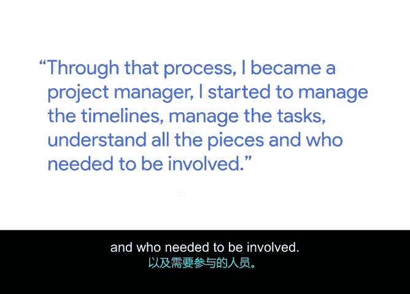
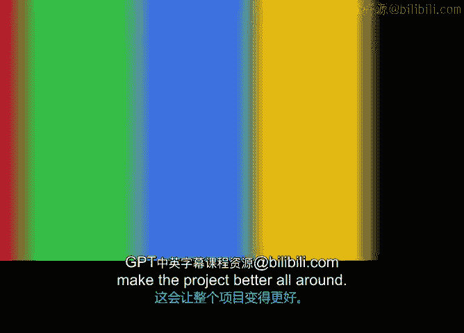

# 014：成为项目经理之路

## 概述
在本节课程中，我们将跟随谷歌高级项目经理朱安妮，了解她如何从一名业务系统分析师成长为项目经理。我们将探讨她的个人背景、职业转型路径，以及她对于项目经理工作中人际互动重要性的见解。

---

我的名字是朱安妮。我是谷歌的一名高级项目经理。我是第一代华裔美国人。

在我年幼时，我和家人来到了美国。在我的成长过程中，我的父母工作非常努力，因此我有很多时间独自度过。

基本上，我必须自己照顾自己，比如计划我的餐食、完成作业、处理家务。因此，我觉得我的一部分项目管理技能正是源于这种必须时刻保持条理的生活经历。

我成为项目经理的道路，实际上始于一名业务系统分析师。我的工作是撰写或收集客户需求。

并将这些需求转化为工程师能够理解的文档，以便他们进行实施。通过这个过程，我转型成为了一名项目经理。我开始管理时间线、管理任务。

理解项目的所有组成部分以及需要哪些人员参与。

就这样，你拥有了一名项目经理。我认为，担任项目经理最有趣的部分确实是与人合作。

你有机会结识各种各样的人，了解不同的个性。有时，你还需要前往不同的地方去见他们。但即使不需要出差，我认为，仅仅是😊。

结识新朋友并理解我们如何互动、人们如何互动和表现，这本身就非常迷人。我认为，如果你能建立关系。

专注于关系，并真正理解他们的风格、他们的出发点、他们的顾虑是什么。这将极大地改善你们的工作关系。

你可以用必要的方式与他们沟通。你可以用他们更容易接受的方式与他们合作。

而这将使整个项目变得更好。

---

## 总结
本节课中，我们一起学习了朱安妮从注重个人条理到成为专业项目经理的历程。她分享的核心经验是：**项目管理技能源于生活实践**，而成功的关键在于**建立并维护良好的人际关系**，通过理解与合作来推动项目前进。