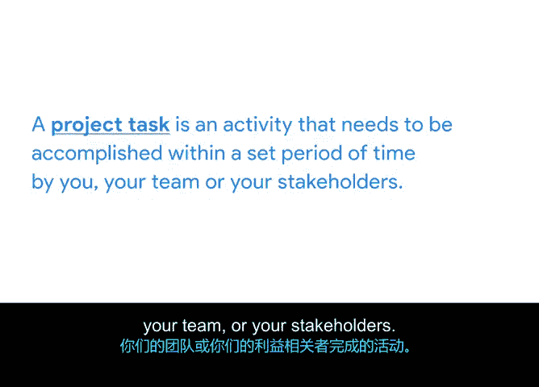

# 015：项目经理的关键角色与职责

欢迎回来。希望你喜欢上一个故事。对我来说，了解他人的职业道路总是很有帮助。或许你甚至注意到了他们的职业道路与你自己的某些相似之处，或者你受到了启发，想要追求项目管理的某个特定领域。

到目前为止，我们已经讨论了你将有资格胜任的项目管理角色类型以及如何寻找这些职位。早些时候，我们还讨论了项目经理为其团队和组织带来的价值。

现在，让我们更深入地了解项目经理的角色和职责。

## 项目经理的核心职责概述

在本节中，我们将学习项目经理如何将知识、技能、工具和技术应用于实际工作，以满足项目要求并达成预期成果。这主要通过一系列具体的职责来实现。

你之前已经了解到，项目管理是应用知识、技能、工具和技术来满足项目要求并实现预期成果的过程。那么，这具体是如何发生的呢？这就是项目经理的职责所在。项目经理通常遵循一个流程，包括**规划与组织**、**管理任务**、**预算与控制成本**以及其他因素，以确保项目在批准的预算和时间范围内完成。

让我们将这些职责分解为项目管理职位描述中可能出现的具体例子。

## 职责一：规划与组织

上一节我们概述了项目经理的总体职责，本节中我们首先来看看**规划与组织**。这项职责涉及在项目规划和执行过程中利用生产力工具和创建流程。

以下是属于规划与组织范畴的一些具体责任：
*   使用特定工具并制定流程，以改善团队间的信息共享。
*   创建计划、时间线、进度表和其他形式的文档来跟踪项目完成情况。
*   通常需要在项目的整个生命周期内维护这些文档。

## 职责二：预算与控制成本

在项目进行过程中，计划和预算的变更是不可避免的。这要求项目经理监控和管理预算，跟踪出现的问题和风险，并通过缓解这些问题和风险来管理质量。

实现这一点的一种方法是消除出现的意外障碍。这里的“障碍”指的是可能阻碍项目进展的事物。例如，如果你的团队成员缺乏完成任务所需的资源，你可能需要提前识别这个问题或障碍，将其上报给相关方，并努力争取资源，以便你的团队能够继续前进。

## 职责三：管理任务

项目经理角色的另一个重要部分是**管理任务**。项目任务是指需要由你、你的团队或相关方在规定时间内完成的活动。

跟踪任务是帮助管理团队工作量和确保任务完成的好方法。它也是向团队外部人员（如你的相关方）展示进展的有效工具。

当我在谷歌担任学生发展项目经理时，我们的目标之一是为那些在科技行业代表性不足的社区学生创造发展途径。我日常职责的一大部分涉及与两个独立的工程团队合作，创建我们的技术课程。

为了管理与这个项目相关的任务，我为每个团队创建了单独的项目跟踪表，其中概述了课程的愿景。这些跟踪表让两个团队都清楚交付时间线、工作的类别和子类别，以及分配给每项任务的团队成员。我还确保在每一步都向我们的相关方更新进展。

通过在项目生命周期中积极管理任务，我能够密切关注每个人的工作，并有效地通知相关方，从而使我们能够以最少的问题实现项目目标。

## 总结与过渡

做得好！现在你应该能够描述项目经理的角色和职责了。接下来，我们将讨论项目经理在扩展团队中的角色，包括如何与负责执行项目的人员协同工作。

在本节课中，我们一起学习了项目经理在**规划与组织**、**预算与控制**以及**任务管理**方面的核心职责。理解这些职责是成为一名有效项目经理的基础。